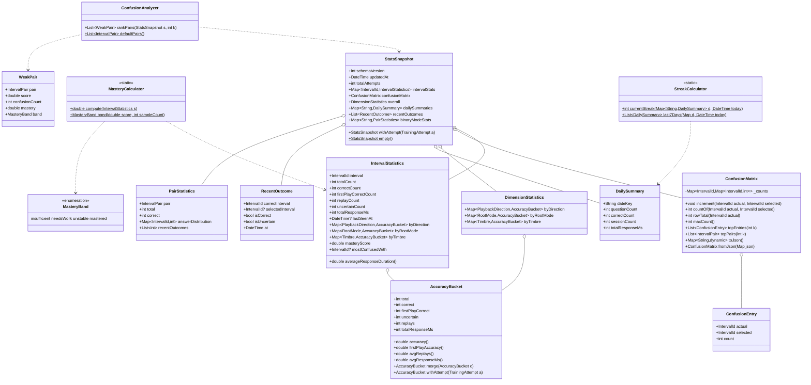
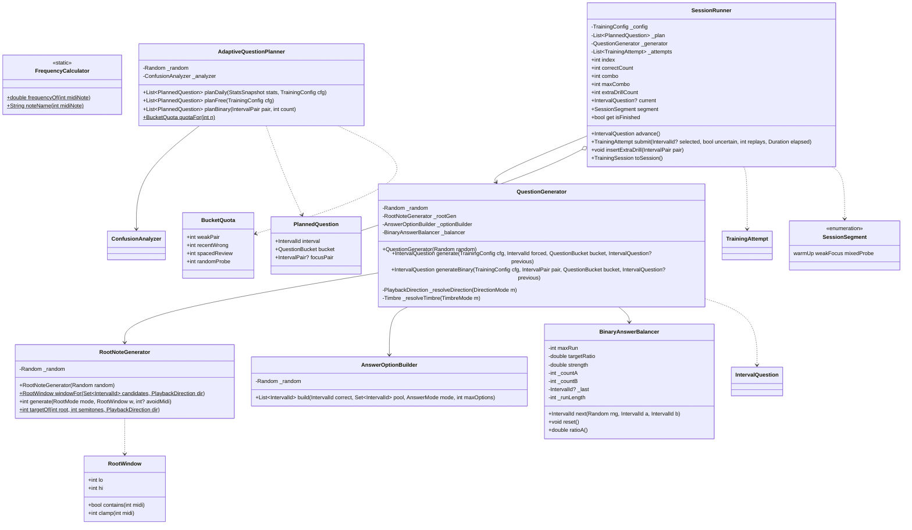
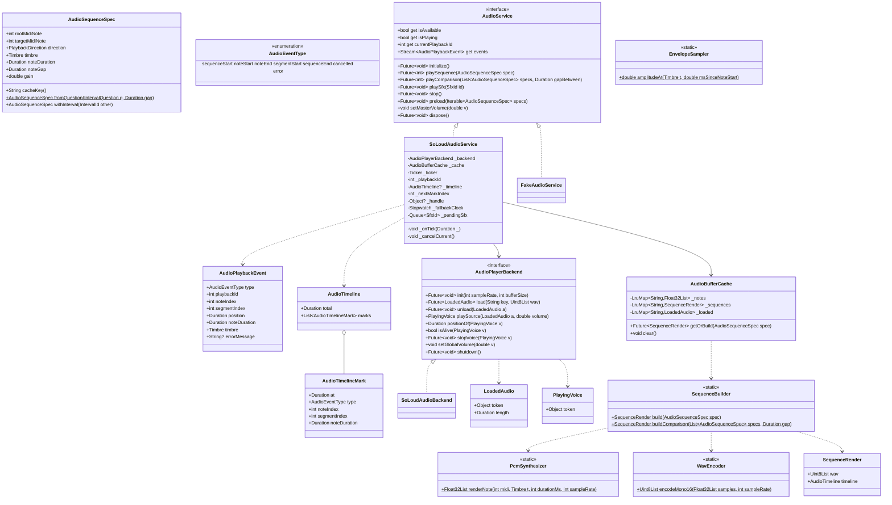
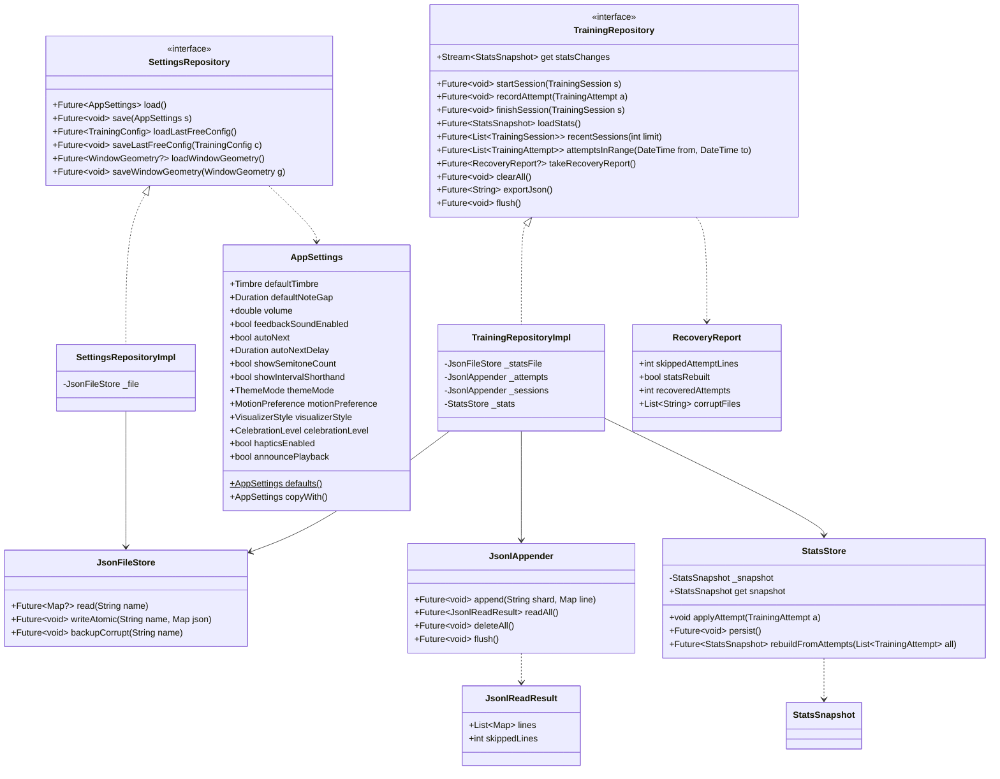
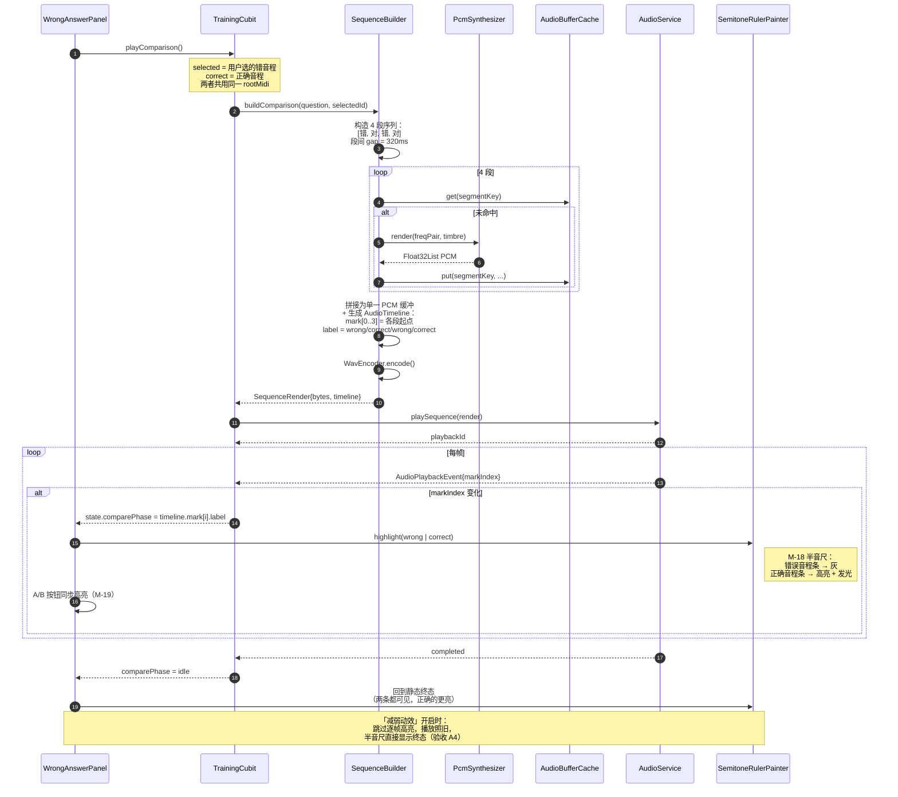
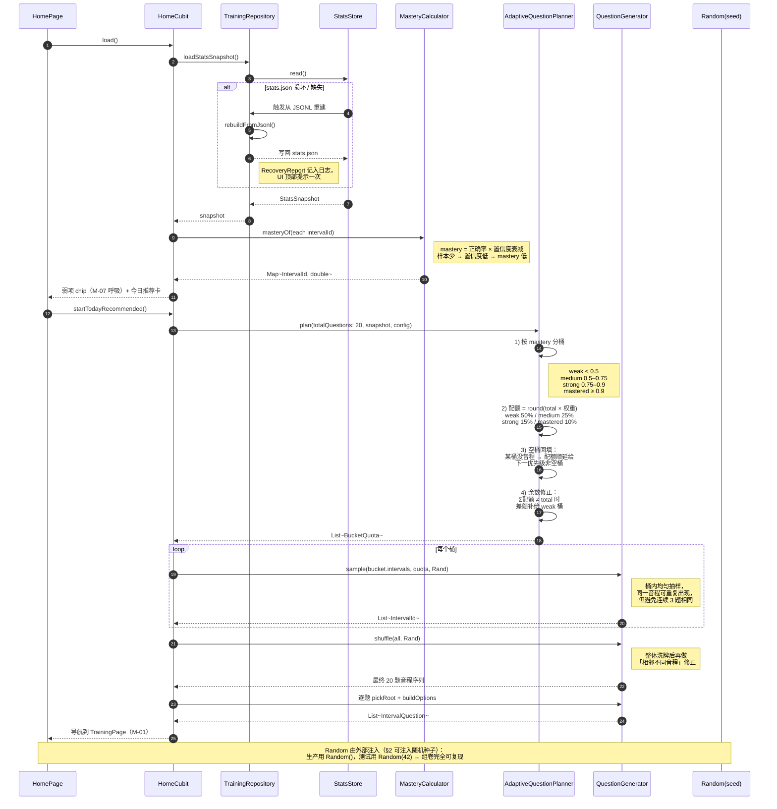
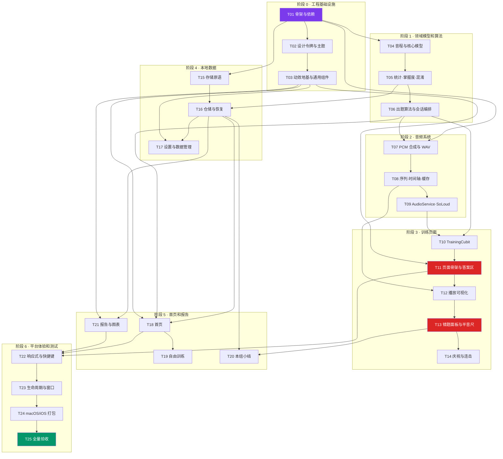

# 音程听辨训练 App —— 架构设计与任务分解

| 项    | 值                                                             |
| ---- | ------------------------------------------------------------- |
| 文档类型 | 系统架构设计 + 任务分解（Engineer 实施蓝图）                                  |
| 上游输入 | `docs/原始开发规范（PDF提取）.txt`（功能圣经）、`docs/PRD-体验设计规范.md` v1.0（体验层） |
| 目标平台 | Android / Windows / macOS / iOS                               |
| 工具链  | Flutter 3.44.8 / Dart 3.12.2 / Material 3                     |
| 撰写人  | 高见远（架构师）                                                      |
| 版本   | v1.0                                                          |
|      |                                                               |

> **阅读约定**
>
> 1. 本文与上游冲突时：**原规范功能约束 > PRD 体验规范 > 本文**。本文只做技术实现决策。
> 2. 所有接口签名、公式、常量均为**实现值**，工程师照抄即可，不要自行发挥。
> 3. 本文不写业务代码实现体；接口签名、伪代码、公式是本文的最细粒度。

---

## 0. 工程约定（本机环境坑，必读）

### 0.1 pub 镜像（强制）

本机代理拦截 `pub.dev`（CONNECT tunnel 502），**直连会让 flutter 命令无限期挂起**。仓库已提供 `tool/flutter_env.sh`：

```bash
export PUB_HOSTED_URL=https://pub.flutter-io.cn
export FLUTTER_STORAGE_BASE_URL=https://storage.flutter-io.cn
export DEVELOPER_DIR=/Library/Developer/CommandLineTools
```

**任何 flutter / dart 命令前必须先 source：**

```bash
source tool/flutter_env.sh && flutter pub get
source tool/flutter_env.sh && flutter analyze
source tool/flutter_env.sh && flutter test
```

> 已验证：`flutter_soloud 4.1.4` / `flutter_bloc 9.1.1` / `equatable 2.1.0` / `path_provider 2.1.6` / `flutter_animate 4.5.2` / `window_manager 0.5.2` / `share_plus 13.3.0` / `file_selector 1.1.0` 均可从镜像 200 拉取。

### 0.2 Xcode 许可未接受（本机硬限制）

本机装有 Xcode 但**未执行 `sudo xcodebuild -license accept`**（只有用户本人能做）。因此 `tool/flutter_env.sh` 把 `DEVELOPER_DIR` 指向 CommandLineTools 以避免 flutter 探测 Xcode 时阻塞。

**直接后果（架构假设，全文按此设计）：**

| 能力                                | 本机可否验证                  |
| --------------------------------- | ----------------------- |
| `flutter analyze`                 | ✅ 可                     |
| `flutter test`（含 widget / golden） | ✅ 可                     |
| `flutter build apk`               | ⚠️ 取决于 Android SDK，未确认  |
| `flutter build windows`           | ❌ 不可（macOS 主机）          |
| `flutter build macos`             | ❌ 不可（需完整 Xcode + 已接受许可） |
| `flutter build ios` / `ipa`       | ❌ 不可（同上 + 无签名证书）        |
| `pod install`（iOS/macOS 依赖）       | ❌ 不可                    |

→ **iOS / macOS 本期只交付「工程配置 + 打包脚本 + 文档」，不交付经过验证的构建产物。** 见 §9。

### 0.3 禁用 `google_fonts`（硬性）

`google_fonts` 运行时联网下载字体。本机网络受限，且原规范要求「不依赖网络」→ **全项目禁止引入 `google_fonts`**。

字体策略（PRD §2.3 要求 Inter + tabular figures；PRD §7 表 #5 拍板「只内置 Inter 的 Latin 子集，中文全部走系统字体 fallback」）：

| 方案                                       | 说明                                                                                   | 本期采用                                     |
| ---------------------------------------- | ------------------------------------------------------------------------------------ | ---------------------------------------- |
| A. 内置 Inter Latin 子集                     | 放 `assets/fonts/Inter-{Regular,Medium,SemiBold,Bold}.ttf`，pubspec 声明 `family: Inter` | ⏸ **PRD 目标态**，但字体文件本机无法下载（网络受限），需用户提供后启用 |
| B. 系统字体 + `FontFeature.tabularFigures()` | `fontFamily: null`，靠 `fontFeatures` 实现等宽数字                                           | ✅ **本期默认交付**                             |

> **A 与 B 的切换成本 = 1 行常量 + 4 行 pubspec**。工程师按 B 实现并保证 A 随时可切；一旦用户提供 `Inter-*.ttf`，只需把 `kLatinFontFamily` 改为 `'Inter'` 并在 `pubspec.yaml` 声明 `fonts:` 段，**其余代码零改动**。这既满足 PRD §7#5 的目标态，又不让本期交付卡在无法下载的资源上。  
> 两方案的中文策略**完全一致**（系统字体 fallback），因此中文观感不受影响；差异仅在拉丁数字/字母的字形。

实现要求：`lib/app/theme/typography.dart` 暴露常量

```dart
/// 若 assets/fonts/ 中放入 Inter 则改为 'Inter'，其余代码无需改动
const String? kLatinFontFamily = null;
const List<String> kFontFamilyFallback = <String>[
  'PingFang SC', 'Noto Sans CJK SC', 'Microsoft YaHei UI', 'Heiti SC',
];
```

所有 `AppText.numeric*` 样式**必须**带 `fontFeatures: [FontFeature.tabularFigures()]`。

### 0.4 脚本目录约定：统一用 `tool/`

PRD §7 表 #4 写的是 `scripts/build_macos.sh`，本文档统一改为 **`tool/build_macos.sh`**。理由：仓库既有的 `tool/flutter_env.sh` 已经在 `tool/` 下，所有构建脚本第一行都要 `source "$(dirname "$0")/flutter_env.sh"`，同目录可以用相对路径、不需要跨目录猜测。

> **这是纯目录命名差异，不改变 PRD 的任何行为约定。** 工程师以本文档 §9 的路径为准。

### 0.5 已完成的环境准备（不要重复做）

- 工程骨架已由 `flutter create --org com.eartrain --project-name interval_ear --platforms=android,windows,ios,macos .` 生成
- `android/` `ios/` `macos/` `windows/` 四端目录已存在
- `lib/main.dart` 仍是默认计数器模板 → T01 覆盖它
- `test/widget_test.dart` 是默认模板 → T01 删除它

---

## 1. 实现方案与技术选型

### 1.0 核心技术难点

| #  | 难点                                                        | 应对                                                                                    |
| -- | --------------------------------------------------------- | ------------------------------------------------------------------------------------- |
| D1 | 四端（Android/Windows/macOS/iOS）**听感完全一致**，且不依赖平台 MIDI、不依赖网络 | 波形在**纯 Dart 层**合成为字节级相同的 mono 16-bit 44.1kHz WAV；播放引擎选用四端共用同一份 C++ DSP 的 SoLoud（§1.2） |
| D2 | 动效必须与音频**逐音符同步**（PRD §3.4 明令禁止 `Timer` 猜时间）               | 整段序列渲染为**单个 WAV 缓冲**，事件由引擎**真实播放位置**轮询产生（§1.3）                                        |
| D3 | 可视化不得泄露音高/音程宽度（PRD §3.1 P0）                               | 可视化数据源 = **确定性合成参数**，绝不使用实时 FFT（§1.4）                                                 |
| D4 | 「炫」与「不影响训练效率」冲突                                           | PRD 的「舞台/考场」二分法落到代码：`MotionLevel` + `MotionGovernor` + 考场区阻塞时长上限（§1.8）                |
| D5 | 出题不得因音区/时长/音量泄露答案                                         | 「公共根音窗口」算法 + 逐音峰值归一 + 固定音符时长（§5.4）                                                    |
| D6 | 本地数据不能因一条脏记录导致 App 起不来                                    | 聚合态 JSON 原子替换 + 明细 JSONL 逐行容错（§1.5）                                                   |
| D7 | 音频引擎是 FFI 原生插件，`flutter test` 里加载不了                       | `AudioService` 抽象接口 + `FakeAudioService`；所有 domain/synth 层为纯 Dart（§8.5）               |

---

### 1.1 状态管理：`flutter_bloc` 的 Cubit（唯一一套）

**决策**：全项目只用 `flutter_bloc ^9.1.1` 的 `Cubit`。DI 用 `flutter_bloc` 自带的 `RepositoryProvider`（同包，不额外引入 `provider`）。

**理由**

- 原规范第三章点名「flutter_bloc 的 Cubit 或结构清晰的 ChangeNotifier」，且**明令「不要同时引入多套状态管理」**。
- Cubit 的 state 是**不可变值对象**（`Equatable` + `copyWith`），天然适合本项目大量的"状态快照 → 动画"场景（`AnimatedSwitcher` / `BlocListener` 判断状态跃迁），也便于 golden test 固定状态。
- `Cubit` 只有方法调用没有 Event 样板，比 `Bloc` 轻，比 `ChangeNotifier` 更可测（`emit` 序列可断言）。
- `BlocProvider` 天然提供 scope 生命周期（离开训练页自动 `close()` → 触发 `AudioService.stop()`）。

**被否方案**

| 方案                            | 否决理由                                        |
| ----------------------------- | ------------------------------------------- |
| `provider` + `ChangeNotifier` | 可变状态，难以断言 emit 序列；与 Cubit 并存违反"不要多套"        |
| Riverpod                      | 未在验证包列表内；引入新心智模型，收益不足以覆盖成本                  |
| `get_it` 做 DI                 | 全局单例可测性差；`RepositoryProvider` 已够用（依赖只有 4 个） |
| `Bloc`（带 Event）               | 本项目无需事件溯源/去抖/事件转换，纯样板负担                     |

**Cubit 清单**（7 个）：`SettingsCubit`（App 级，`main` 处 Provide）、`HomeCubit`、`TrainingCubit`（普通识别 + 二选一共用，通过 `TrainingConfig.answerMode` 分支）、`FreeTrainingCubit`、`SessionSummaryCubit`、`ReportCubit`、`AboutCubit`（无，合并进 Settings）。

> 约定：**`TrainingCubit` 不得超过 400 行**。业务规则下沉到 domain 的 `SessionRunner`（纯 Dart 状态机），Cubit 只做「domain 状态 → UI 状态」映射 + 副作用编排（播音频、写仓储）。这是原规范"不要把全部逻辑堆在一个 Cubit 中"的落地方式。

---

### 1.2 ★ 音频引擎：`flutter_soloud` + 纯 Dart 合成（最关键决策）

#### 1.2.1 分层结论

```
┌──────────────────────────────────────────────────────┐
│ 纯 Dart 合成层（无 Flutter 依赖，100% 可单测）          │
│  KeyboardVoice(多谐波)  PluckedVoice(Karplus–Strong)  │
│  → Float32List 单音 PCM                                │
│  → SequenceBuilder（拼接/混音/归一）→ Float32List 序列  │
│  → WavEncoder（44 字节 RIFF 头）→ Uint8List WAV        │
└──────────────────────────────────────────────────────┘
                        ↓ Uint8List
┌──────────────────────────────────────────────────────┐
│ 播放后端 AudioPlayerBackend（抽象）                     │
│  SoLoudAudioBackend —— flutter_soloud 4.1.4           │
└──────────────────────────────────────────────────────┘
                        ↓ handle + position
┌──────────────────────────────────────────────────────┐
│ AudioService（抽象接口）+ SoLoudAudioService（实现）    │
│  时间线事件生成 / 防重叠 / 取消 / 缓存 / 生命周期        │
└──────────────────────────────────────────────────────┘
```

**关键洞察：四端听感一致性来自"波形在 Dart 层就已经字节相同"，而不是来自播放器。** 播放器只需忠实播放 PCM。这把跨平台风险从"DSP 差异"降级为"播放器是否忠实"，后者用 SoLoud 可控。

#### 1.2.2 为什么选 `flutter_soloud 4.1.4`

| 维度     | 结论                                                                                                                |
| ------ | ----------------------------------------------------------------------------------------------------------------- |
| 四端支持   | pubspec 声明 `ffiPlugin: true` on **android / ios / macos / windows / linux**（+ web），单一 C++ 引擎，非"每端一个原生实现"          |
| 内存播放   | `loadMem(String virtualKey, Uint8List buffer, {LoadMode mode = LoadMode.memory})` —— **四端统一支持直接播内存 WAV，不需要落临时文件** |
| 播放位置   | `Duration getPosition(SoundHandle)` —— 这是 D2（视听同步）的关键 API                                                         |
| 取消/防重叠 | `play()` 返回 `SoundHandle`（**同步返回**）；`stop(handle)`；`getIsValidVoiceHandle(handle)`                                |
| 低延迟    | `init(lowLatency: true)`，Android 走 AAudio，iOS/macOS 走 CoreAudio，Windows 走 WASAPI                                  |
| 结束回调   | `AudioSource.allInstancesFinished` / `soundEvents` 流                                                              |
| 音量     | `setGlobalVolume(double)` / `setVolume(handle, double)`                                                           |
| SDK 约束 | Dart `>=3.11.0 <4.0.0`、Flutter `>=3.41.0` → 本机 3.12.2 / 3.44.8 ✅                                                  |

#### 1.2.3 被否方案

| 方案                  | 否决理由                                                                                                                                                              |
| ------------------- | ----------------------------------------------------------------------------------------------------------------------------------------------------------------- |
| **`just_audio`**    | Windows 支持依赖社区包 `just_audio_windows`（Media Foundation），**不支持自定义 `StreamAudioSource`** → Windows 上播内存 WAV 必须先落临时文件，与 Android/iOS 路径分叉，听感/延迟不可控；且无采样级 position 精度保证 |
| **`audioplayers`**  | `BytesSource` 的跨平台一致性历史上不稳定（Windows 端多次要求文件路径）；`getCurrentPosition()` 精度依赖各端原生实现；起播延迟比 SoLoud 高一个量级，对「连续点重播」体验伤害大                                                 |
| **`soundpool`**     | 面向 Android/iOS 短音效，**无 Windows / macOS 桌面支持**，直接出局                                                                                                                |
| **平台 MIDI / 系统合成器** | 原规范明令禁止                                                                                                                                                           |
| **预置 WAV 采样素材**     | 需要 37 音 × 2 音色 = 74 个采样文件，包体大；且原规范要求"不使用来源不明或存在版权问题的音频素材"，自行录制不现实                                                                                                 |

#### 1.2.4 风险与逃生路线（必须写进代码注释）

`flutter_soloud` 是 FFI 插件，需要每端原生编译（Windows 需 VS C++ 工具链、iOS/macOS 需 CocoaPods）。**若某端编译失败**：

- 合成层（Dart）与 `AudioService` 接口**完全不受影响**；
- 只需新增 `lib/core/audio/fallback_file_backend.dart` 实现 `AudioPlayerBackend`：把 WAV 写到 `getTemporaryDirectory()` 再用 `audioplayers` 的 `DeviceFileSource` 播放，`positionOf()` 退化为 `Stopwatch`；
- 变更范围 ≤ 1 个文件、≈150 行，`AppBootstrap` 里换一行注入。

> 这条逃生路线是**设计**，本期**不实现**，但必须在 `audio_player_backend.dart` 顶部写明。

---

### 1.3 ★ 单缓冲区渲染 + 位置驱动事件（同步方案）

#### 1.3.1 为什么整段序列渲染成一个 WAV

一道题的音频 = `[音1][间隔][音2]`（旋律）或 `[音1+音2 混音]`（和声）。

**方案对比**

| 方案                      | 旋律间隔精度                       | 和声同步                  | 防重叠            | 跨端一致 |
| ----------------------- | ---------------------------- | --------------------- | -------------- | ---- |
| 双播放器 / 两次 `play()` + 定时 | 受调度抖动影响（±20~80ms，Android 尤甚） | 两个 voice 起播不同相，和声会"糊" | 需管理 2 个 handle | ❌    |
| **单缓冲区（采用）**            | **采样级精确（±0 样本）**             | 缓冲区内直接相加，绝对同相         | 只有 1 个 handle  | ✅    |

**结论：和声用「单缓冲区混音」，不用双播放器。** 旋律的间隔也在缓冲区里用静音样本表达，不靠定时器。

**交替对比播放（原规范第六章）同理**：`错→对→错→对` 四段 + 段间静音，也渲染成**一个** WAV。这样 M-18 半音尺的高亮切换时机来自同一条时间轴，绝不可能失步。

#### 1.3.2 事件时间线

```dart
/// 由 SequenceBuilder 与波形同时产出，二者共享同一份参数，不可能不一致
class AudioTimeline {
  final Duration total;                 // 含 tailPadding
  final List<AudioTimelineMark> marks;  // 按 at 升序
}

class AudioTimelineMark {
  final Duration at;
  final AudioEventType type;   // noteStart / noteEnd / segmentStart
  final int noteIndex;         // 0=根音 1=目标音 -1=和声同响
  final int segmentIndex;      // 普通播放恒为 0；交替对比为 0..3
  final Duration noteDuration; // 供 M-18 扫光按"该音符实际时长"运行
}
```

#### 1.3.3 事件发射器

```
SoLoudAudioService.playSequence(spec):
  1. cancel previous  (stop(handle); _ticker.stop(); emit cancelled)
  2. wav, timeline = await cache.getOrBuild(spec)      // Isolate 合成
  3. source = await backend.load(key, wav)             // LRU 缓存 AudioSource
  4. handle = backend.playSource(source, volume)       // 同步返回
  5. _playbackId++ ; _ticker.start()
  每帧 tick:
     pos = backend.positionOf(handle)
     if pos 连续 5 帧未推进且 handle 仍存活 → 降级用 Stopwatch（打 warning 日志）
     while (nextMark != null && pos >= nextMark.at) emit(nextMark); advance
     if (!backend.isHandleAlive(handle) || pos >= timeline.total)
         emit(sequenceEnd); _ticker.stop()
```

- `Ticker` 直接 `Ticker(_onTick)..start()` 构造（不需要 `TickerProvider`），在 `dispose()` 中 `dispose()`。
- 每个事件都带 `playbackId`；UI 层**必须**丢弃 `event.playbackId != currentPlaybackId` 的事件 —— 这是"连续点重播"不错乱的根本保障。

#### 1.3.4 `AudioPlaybackEvent` 不含 MIDI 音高（纵深防御）

事件**故意不携带** `midiNote` / `frequency` 字段。反馈阶段 UI 要画音高轨道时，从 `IntervalQuestion` 自己取。这样即使某天有人在训练页误用了播放事件，也**物理上不可能**泄露答案。

---

### 1.4 ★ 音频可视化的数据来源：确定性合成参数（不用真实包络采样）

**决策：可视化幅度由纯函数 `EnvelopeSampler.amplitudeAt(timbre, tSinceNoteStart)` 计算，绝不读取实时 PCM / FFT。**

**理由（按重要性排序）**

1. **安全性（决定性理由）**：真实频谱**直接暴露基频** → 用户看柱状分布就能读出音高 → **这是产品事故，不是性能问题**。PRD §3.1 明确要求 m2 与 M7 在 `awaitingAnswer` 状态下逐像素一致。实时 FFT 物理上做不到这一点。
2. **可测试性**：PRD 要求把防泄露约束写成 **golden test**。确定性函数才能产出稳定的 golden 图像；实时 FFT 每次都不同。
3. **跨端一致**：SoLoud 虽提供 `AudioData` 可视化接口，但采样窗口大小、平滑系数在各端音频后端（AAudio / CoreAudio / WASAPI）缓冲区不同的情况下表现有差异，违反"四端一致"。
4. **性能**：省掉每帧一次 FFI 往返 + 256 点 FFT，考场区帧预算 ≤8ms 更容易达成。

**实现**（`lib/core/audio/synth/envelope.dart`，纯 Dart，与合成器共用同一份常量）：

```
envelope(timbre, t)  // t = 距该音符起音的毫秒数，返回 0..1
  keyboard: attack = 12ms 线性 0→1 ; 之后 exp(-t / 600)
  plucked : attack =  6ms 线性 0→1 ; 之后 exp(-t / 350)
  统一叠加"活性抖动"： × (1 + 0.06 × sin(2π × 1.2Hz × t))
  返回 clamp(0, 1)
```

> ⚠️ 注意：可视化包络的时间常数（600 / 350 ms）**故意与合成器真实衰减常数（1100 / 依赖 damping）不同** —— 可视化要"看起来对"，不要"物理上对"。二者是**两套独立常量**，不要为了"统一"而合并。这条写进 `envelope.dart` 注释。

`VisualizerDriver` 的输入只有三样：`AudioPlaybackEvent`（哪个音在响、响了多久）、`EnvelopeSampler`（幅度）、`Timbre`。**没有任何一样与音高相关。**

---

### 1.5 本地存储：JSON 原子替换 + JSONL 追加

**决策：双通道文件存储，不引 `shared_preferences`，不引数据库。**

| 文件                                | 内容                                                       | 写策略                           | 体积          |
| --------------------------------- | -------------------------------------------------------- | ----------------------------- | ----------- |
| `settings.json`                   | `AppSettings` + 上次自由训练配置 + 窗口尺寸                          | **临时文件原子替换**                  | < 2 KB      |
| `stats.json`                      | `StatsSnapshot`（每音程统计、混淆矩阵、维度统计、日汇总、最近 200 条结果环、二选一独立统计） | **临时文件原子替换**，增量更新后整写          | 恒定 40~80 KB |
| `attempts/attempts_YYYY-MM.jsonl` | 明细 `TrainingAttempt`，一行一条                                | **`FileMode.append` 追加**，永不重写 | 每题 ~230 B   |
| `sessions.jsonl`                  | `TrainingSession` 收尾记录                                   | 追加                            | 每组 ~180 B   |

**为什么明细用 JSONL 而不是大 JSON 数组**

- 追加写 O(1)，不需要每答一题就重写整个文件（一年 3 万条 = 7 MB，每题重写 7 MB 不可接受）
- **单行损坏只丢一行**，天然抗损坏，正好满足原规范"不要因为一条异常记录导致整个 App 无法启动"
- 按月分片，导出/清理都简单

**原子替换实现**（`JsonFileStore.writeAtomic`）

```
1. 写 <name>.json.tmp（完整写入 + flush）
2. File(tmp).rename(<name>.json)     // POSIX/NTFS 上同目录 rename 为原子操作
3. rename 失败（Windows 目标存在时会失败）→ 先 delete 目标再 rename，
   并在 delete 与 rename 之间保留 <name>.json.bak
```

**损坏恢复矩阵**（`CorruptionRecovery`）

| 情形                        | 处理                                                                   |
| ------------------------- | -------------------------------------------------------------------- |
| 文件不存在                     | 写入默认值，正常启动                                                           |
| JSON 解析失败                 | 重命名为 `<name>.corrupt-<ts>.json`，用默认值重建，记 `RecoveryReport`            |
| `schemaVersion` 更高（降级安装）  | 不解析，备份后用默认值重建                                                        |
| `schemaVersion` 更低        | 走 `Migrations.migrate(json, from, to)` 链式迁移                          |
| JSONL 某行解析失败              | **跳过该行**，`skippedLines++`，继续读后续行                                     |
| `stats.json` 损坏但 JSONL 完好 | 从 JSONL **全量重算** `StatsSnapshot`（`StatsStore.rebuildFromAttempts()`） |

最后一条很重要：**`stats.json` 只是缓存，JSONL 才是真相源（source of truth）**。这让聚合统计的任何 bug 都可恢复。启动时若检测到 `stats.corrupt` 或版本不匹配，自动重算，并按 PRD §5.3-#23 弹一次 Snackbar「检测到部分记录损坏，已恢复 N 条」。

**存储位置**：`path_provider.getApplicationSupportDirectory()` + `/interval_ear/`

- Windows: `%APPDATA%\com.eartrain\interval_ear\interval_ear\`
- macOS: `~/Library/Application Support/com.eartrain.intervalEar/interval_ear/`
- Android: `/data/data/com.eartrain.interval_ear/files/interval_ear/`
- iOS: `<App Sandbox>/Library/Application Support/interval_ear/`

---

### 1.6 路由：手写 `onGenerateRoute` + 自定义 `PageRoute`

**决策：Flutter 内置 Navigator 1.0，集中式 `AppRouter.onGenerateRoute`，不引 `go_router` / `package:animations`。**

**理由**

- 页面只有 9 个，无深链接、无 URL、无嵌套 shell 路由需求；`go_router` 的收益为负。
- PRD `M-01` 要求 **Container Transform**（卡片变形为整页 + Hero 共享元素）、`M-02` 要求 Shared Axis Z + 前置「成绩汇聚」240ms、`M-03` 桌面端要改成 Fade Through。这些都需要**完全掌控 `PageRoute.buildTransitions`**。`package:animations` 的 `OpenContainer` 封装度高但定制困难，且未在验证包列表内。
- 自写 3 个 `PageRouteBuilder` 子类共约 200 行，一次写完全项目复用。

**路由表**

| 常量                          | path               | 页面                       | 转场                                   |
| --------------------------- | ------------------ | ------------------------ | ------------------------------------ |
| `RouteNames.home`           | `/`                | `HomePage`               | —                                    |
| `RouteNames.training`       | `/training`        | `TrainingPage`           | `ContainerTransformPageRoute` (M-01) |
| `RouteNames.binaryTraining` | `/training/binary` | `BinaryTrainingPage`     | `ContainerTransformPageRoute`        |
| `RouteNames.sessionSummary` | `/summary`         | `SessionSummaryPage`     | `SharedAxisZPageRoute` (M-02)        |
| `RouteNames.freeTraining`   | `/free`            | `FreeTrainingConfigPage` | `SharedAxisXPageRoute` (M-03)        |
| `RouteNames.report`         | `/report`          | `ReportPage`             | `SharedAxisXPageRoute`               |
| `RouteNames.settings`       | `/settings`        | `SettingsPage`           | `SharedAxisXPageRoute`               |
| `RouteNames.about`          | `/about`           | `AboutPage`              | `SharedAxisXPageRoute`               |
| `RouteNames.weakPairs`      | `/weak`            | `WeakPairsPage`（"查看全部"）  | `SharedAxisXPageRoute`               |

> `MotionLevel.reduced/off` 时，`AppRouter` 统一改用 `FadeThroughPageRoute(150ms linear)`（PRD §3.10）。判断在 `onGenerateRoute` 内读 `MotionScope`，不在每个页面里判断。

---

### 1.7 主题：Material 3 + 6 个 `ThemeExtension`

**决策**：`ThemeData(useMaterial3: true)`，PRD §2 的全部 token 通过 `ThemeExtension` 注入，统一经 `context.tokens` 访问。

| Extension            | 内容                                                                                                       | 对应 PRD   |
| -------------------- | -------------------------------------------------------------------------------------------------------- | -------- |
| `AppSemanticColors`  | `success / error / warning / uncertain` × `{base, container, onContainer}`                               | §2.1 语义色 |
| `AppGradients`       | `brand / energy / calm / ambient`                                                                        | §2.1.3   |
| `AppElevations`      | `e0..e5`（浅色=彩色阴影列表；深色=内描边+外阴影）                                                                           | PRD §2.6 |
| `AppIntervalPalette` | 13 音程色 + glyph 枚举，`colorOf(IntervalId)` / `glyphOf(IntervalId)`                                          | §2.2     |
| `AppMotionTokens`    | 时长/曲线**原语** + **语义别名**                                                                                   | PRD §3.0 |
| `AppTextExtras`      | `answerButtonLabel / answerButtonLabelXL / numericDisplay / numericLarge / numericMedium / numericSmall` | PRD §2.3 |

`AppSpacing` / `AppRadius` / `AppBreakpoints` 是**编译期常量类**（不放 ThemeExtension，因为不随主题变化，走常量更省）。

音程 13 色**写成常量表**（PRD §2.2 明确要求"不要运行时计算 HSL"）。

**被否**：`ColorScheme.fromSeed` —— PRD 给了完整两套 29 个色值，种子色生成的结果与设计稿不一致；必须逐个手填 `ColorScheme(...)`。

---

### 1.8 动效基础设施

| 组件                                                                                            | 职责                                                                                                    |
| --------------------------------------------------------------------------------------------- | ----------------------------------------------------------------------------------------------------- |
| `MotionLevel { full, reduced, off }`                                                          | 三档                                                                                                    |
| `MotionLevelResolver`                                                                         | 纯函数：`resolve(preference, disableAnimations, governorOverride)`（可单测）                                   |
| `MotionScope`（InheritedWidget）                                                                | 全局广播当前 `MotionLevel`                                                                                  |
| `MotionGovernor`                                                                              | `SchedulerBinding.addTimingsCallback` 滑窗 60 帧；连续 3s p90 > 20ms 逐级降级；连续 10s p90 < 12ms 逐级恢复（每级间隔 ≥30s） |
| `context.motionLevel` / `context.mDur(d)` / `context.allowAmbient` / `context.allowParticles` | 统一读取入口                                                                                                |

**降级读取的唯一正确姿势**（写进共享知识，Code Review 必查）：

```dart
AnimatedContainer(
  duration: context.mDur(context.tokens.motion.answerPress),  // ✅
  // duration: const Duration(milliseconds: 90),              // ❌ 硬编码
)
if (context.allowParticles) ConfettiLayer(...),               // ✅
```

---

### 1.9 图表：全部自绘 `CustomPainter`，**不引入 `fl_chart`**

**决策：报告页折线/条形/环形、混淆矩阵、半音尺、音频可视化，全部自写 `CustomPainter`。**

**理由**

- PRD 对图表动画的要求已经超出任何图表库的能力边界：
  - `M-26` 条形图**逐柱 40ms stagger**、折线**用 `PathMetrics` 描边**再淡入面积渐变、数据点跟随描边进度依次弹出；
  - `M-27` 混淆矩阵**对角线波点亮**（`delay = (row+col) × 22ms`）+ 总时长压缩封顶 + hover 行列高亮；
  - `fl_chart 1.2.0` 只提供 `swapAnimationDuration/Curve` 的整体补间，**无法表达上述任何一条**。
- 13×13 混淆矩阵热力图 fl_chart 无对应图表类型，本来就要自绘。
- `M-18` 半音尺（本 App 的价值高点）必然自绘。
- 自绘 painter 可写 **golden test**；图表库的内部渲染难以稳定 golden。
- 少一个依赖，符合原规范"不要引入与 MVP 无关的重量级框架"。

**代价**：约 9 个 painter，合计 ~1200 行。可接受，且它们正是"极度精美"的载体。

**Painter 清单**：`SemitoneRulerPainter`(M-18) / `BreathHaloPainter`(M-08) / `SpectrumBarsPainter`(M-09) / `ParticlePainter`(M-09,M-15) / `BarChartPainter`(M-26) / `SparklinePainter`(M-26) / `RingProgressPainter`(M-25) / `ConfusionMatrixPainter`(M-27) / `IntervalGlyphPainter`(§2.2 13 种形状)。

**性能约定**：所有 painter 必须实现 `shouldRepaint` 精确比较；动画驱动用 `CustomPaint(painter: X(repaint: animationController))`（把 `Listenable` 传给 `CustomPainter` 基类），**禁止 `setState` 驱动重绘**。

---

### 1.10 其余选型速查

| 议题                   | 决策                                                                   | 理由 / 被否                                                                                                                                        |
| -------------------- | -------------------------------------------------------------------- | ---------------------------------------------------------------------------------------------------------------------------------------------- |
| 代码生成                 | **不用 `freezed` / `json_serializable` / `build_runner`**              | 模型仅 14 个；本机 pub 环境脆弱，多一条 codegen 依赖链就多一个卡死点；批量实现时手写 `copyWith/toJson/fromJson` 更可控、review 更直观。用 `equatable` 提供相等性                              |
| 值相等                  | `equatable ^2.1.0`                                                   | 手写 `==`/`hashCode` 易错                                                                                                                          |
| 触觉                   | Flutter 内置 `HapticFeedback`，包一层 `AppHaptics`                         | 不引 `vibration` 包；桌面端 no-op                                                                                                                     |
| 导出分流                 | 桌面 `file_selector`（`getSaveLocation`）；移动 `share_plus`（`shareXFiles`） | `share_plus` 在桌面的文件分享行为不一致；`file_selector` 在移动端没有"另存为"语义                                                                                       |
| 桌面窗口                 | `window_manager ^0.5.2`                                              | 最小窗口 900×640、macOS 隐藏标题栏（PRD §6.3）、记忆窗口尺寸。移动端**条件调用**（`if (PlatformCapabilities.hasWindowManager)`）                                            |
| 入场动画样板               | `flutter_animate ^4.5.2`                                             | 纯 Dart 无原生代码；只用于 `M-05/M-24/M-28` 这类 stagger 与 `M-32` shimmer。**核心动画（M-08/09/15/18/19/22/26/27）一律手写 `AnimationController`**，避免链式 API 表达不了精确时间轴 |
| Lottie               | **否决**                                                               | 无设计师产出的 json 资源；所有动效都是程序化的；徒增包体                                                                                                                |
| `shared_preferences` | **否决**                                                               | 已有 `settings.json`；不要两套存储                                                                                                                      |
| 日志                   | 自写 `AppLogger`（`dart:developer log` + level 过滤）                      | 不引 `logging`（虽然 soloud 传递依赖了它，但 App 层不直接用）                                                                                                     |

---

## 2. 完整文件清单

> 分层遵循原规范第三章 Feature-first：`app/`（外壳）· `core/`（横切）· `features/`（业务）。  
> **`features/*/domain/` 为纯 Dart，禁止 `import 'package:flutter/*'`**（`analysis_options.yaml` 中不做机器约束，Code Review 硬性检查）。  
> 视觉与动效组件按团队要求单独归入 `core/widgets/` 与 `core/motion/`。

### 2.1 `lib/` 清单（共 173 个文件）

#### 2.1.1 入口与应用外壳 `lib/app/` — 20 个

| 路径                                                          | 职责                                                                                                                          |
| ----------------------------------------------------------- | --------------------------------------------------------------------------------------------------------------------------- |
| `lib/main.dart`                                             | 入口：`WidgetsFlutterBinding.ensureInitialized()` → `AppBootstrap.run()`                                                       |
| `lib/app/app.dart`                                          | `IntervalEarApp`：`MultiRepositoryProvider` + `BlocProvider<SettingsCubit>` + `MotionScope` + `MaterialApp(onGenerateRoute)` |
| `lib/app/app_bootstrap.dart`                                | 组合根：建目录、初始化存储/仓储/音频、装配 `AppDependencies`、桌面窗口设置、失败降级                                                                        |
| `lib/app/app_dependencies.dart`                             | 依赖容器（不可变 struct），只被 `app.dart` 消费                                                                                           |
| `lib/app/app_lifecycle_handler.dart`                        | `AppLifecycleListener`：后台/窗口关闭 → `AudioService.stop()` + `flush()`                                                          |
| `lib/app/router/route_names.dart`                           | 路由名常量 + 各路由参数类型定义                                                                                                           |
| `lib/app/router/app_router.dart`                            | `onGenerateRoute`；按 `MotionLevel` 选择转场；未知路由兜底                                                                               |
| `lib/app/router/transitions/container_transform_route.dart` | `M-01` 卡片→整页变形                                                                                                              |
| `lib/app/router/transitions/shared_axis_route.dart`         | `M-02` Z 轴 / `M-03` X 轴（一个文件两个类）                                                                                            |
| `lib/app/router/transitions/fade_through_route.dart`        | 降级转场                                                                                                                        |
| `lib/app/theme/app_theme.dart`                              | 组装 light/dark `ThemeData`，挂载 6 个 extension                                                                                  |
| `lib/app/theme/color_schemes.dart`                          | PRD §2.1 两套完整 `ColorScheme`（逐字段手填）                                                                                          |
| `lib/app/theme/semantic_colors.dart`                        | `AppSemanticColors extends ThemeExtension`                                                                                  |
| `lib/app/theme/gradient_tokens.dart`                        | `AppGradients extends ThemeExtension`（§2.1.3）                                                                               |
| `lib/app/theme/elevation_tokens.dart`                       | `AppElevations extends ThemeExtension`（PRD §2.6 深浅两策略）                                                                      |
| `lib/app/theme/interval_palette.dart`                       | `AppIntervalPalette`：13 色常量表 + `IntervalGlyphShape` 映射（§2.2）                                                                |
| `lib/app/theme/typography.dart`                             | `TextTheme` + `AppTextExtras` + tabular figures + 字族回退（§0.3）                                                                |
| `lib/app/theme/spacing.dart`                                | `AppSpacing`（PRD §2.4）+ `AppBreakpoints`（PRD §6.1）                                                                          |
| `lib/app/theme/radius.dart`                                 | `AppRadius`（PRD §2.5）+ 组件圆角映射                                                                                               |
| `lib/app/theme/tokens_context_ext.dart`                     | `context.tokens` 统一访问器（§8.3）                                                                                                |

#### 2.1.2 核心横切 `lib/core/` — 78 个

**常量与工具 `core/constants` + `core/utils` — 10 个**

| 路径                                     | 职责                                                                                |
| -------------------------------------- | --------------------------------------------------------------------------------- |
| `core/constants/app_strings.dart`      | 全部中文文案（分组嵌套 `abstract final class`），为 i18n 预留                                     |
| `core/constants/app_config.dart`       | 音域 C3–C6、采样率、默认音符时长/间隔、题数区间、缓存容量等全局常量                                             |
| `core/constants/asset_paths.dart`      | 资源路径常量（字体、图标）                                                                     |
| `core/utils/deterministic_random.dart` | `Xorshift32Random implements Random`：跨端跨版本确定的伪随机（合成 + 出题共用）                       |
| `core/utils/result.dart`               | `sealed class Result<T>` = `Ok<T>` / `Err<T>` + `map/fold/getOrElse`              |
| `core/utils/failures.dart`             | `sealed class AppFailure`：`StorageFailure` / `AudioFailure` / `ValidationFailure` |
| `core/utils/app_logger.dart`           | 分级日志（`dart:developer`），release 下只保留 warning+                                      |
| `core/utils/duration_format.dart`      | `3.2s` / `4 分钟` / `1.8 次` 等展示格式化                                                  |
| `core/utils/iterable_extensions.dart`  | `firstWhereOrNull` / `sumBy` / `groupBy` / `shuffledWith(Random)`                 |
| `core/utils/math_utils.dart`           | `clampDouble` / `lerp` / `roundTo` / `safeDivide`                                 |

**音频 `core/audio` — 20 个**

| 路径                                         | 职责                                                               |
| ------------------------------------------ | ---------------------------------------------------------------- |
| `core/audio/audio_service.dart`            | ★ `abstract class AudioService` 接口（§3.4）                         |
| `core/audio/audio_sequence.dart`           | `AudioSequenceSpec` / `PlaybackDirection` / `SequenceKey`        |
| `core/audio/audio_playback_event.dart`     | `AudioPlaybackEvent` / `AudioEventType`（**不含音高**）                |
| `core/audio/audio_timeline.dart`           | `AudioTimeline` / `AudioTimelineMark`（§1.3.2）                    |
| `core/audio/audio_player_backend.dart`     | `abstract class AudioPlayerBackend` + 逃生路线注释（§1.2.4）             |
| `core/audio/soloud_backend.dart`           | `flutter_soloud` 实现（`init/loadMem/play/getPosition/stop`）        |
| `core/audio/soloud_audio_service.dart`     | ★ `AudioService` 实现：Ticker 位置轮询 → 事件、防重叠、取消、排队                   |
| `core/audio/sfx_catalog.dart`              | 反馈音定义（PRD §5.2：`sfxCorrect/sfxWrong/sfxComplete`）+ 互斥排队规则        |
| `core/audio/audio_lifecycle_observer.dart` | 生命周期/窗口关闭 → `stop()`                                             |
| `core/audio/synth/pcm_synthesizer.dart`    | 合成门面：`Float32List renderNote(midi, timbre, durationMs)`          |
| `core/audio/synth/keyboard_voice.dart`     | 多谐波 + 微失谐 + 逐谐波指数衰减（§5.5）                                        |
| `core/audio/synth/plucked_voice.dart`      | Karplus–Strong + 一阶全通分数延迟（§5.5）                                  |
| `core/audio/synth/envelope.dart`           | 合成用 ADSR/raised-cosine **与** 可视化用 `EnvelopeSampler`（两套常量，见 §1.4） |
| `core/audio/synth/normalizer.dart`         | 峰值归一 `0.82` + 和声混音后软限幅（§5.5）                                     |
| `core/audio/synth/sequence_builder.dart`   | ★ 单音 → 序列缓冲（旋律拼接 / 和声混音 / 交替对比拼接）+ **同时产出 `AudioTimeline`**      |
| `core/audio/synth/wav_encoder.dart`        | 44 字节 RIFF/WAVE 头（§5.5）                                          |
| `core/audio/synth/synth_isolate.dart`      | `Isolate.run` 封装（合成不阻塞 UI 线程）                                    |
| `core/audio/cache/lru_map.dart`            | 定容 LRU                                                           |
| `core/audio/cache/audio_buffer_cache.dart` | L1 单音 PCM / L2 序列 WAV+Timeline / L3 已 load 的 `AudioSource`       |
| `core/audio/fake_audio_service.dart`       | 测试与"音频不可用降级"共用的空实现（可发合成事件）                                       |

**存储 `core/storage` — 7 个**

| 路径                                      | 职责                                          |
| --------------------------------------- | ------------------------------------------- |
| `core/storage/storage_paths.dart`       | 应用支持目录解析 + 子目录创建                            |
| `core/storage/json_file_store.dart`     | 原子替换读写（§1.5）                                |
| `core/storage/jsonl_appender.dart`      | 追加写 + 逐行容错读 + 按月分片                          |
| `core/storage/schema.dart`              | `kSchemaVersion` 常量 + 各文件 schema 名          |
| `core/storage/migrations.dart`          | `Migrations.migrate(Map, from, to)` 链式迁移注册表 |
| `core/storage/corruption_recovery.dart` | 损坏检测/备份/重建 + `RecoveryReport`               |
| `core/storage/storage_failure.dart`     | 存储错误细分                                      |

**动效基础 `core/motion` — 12 个**

| 路径                                         | 职责                                                                                     |
| ------------------------------------------ | -------------------------------------------------------------------------------------- |
| `core/motion/motion_tokens.dart`           | `AppDuration` / `AppCurve` 原语 + `AppMotionTokens` 语义别名 ThemeExtension                  |
| `core/motion/motion_level.dart`            | `MotionLevel` / `MotionPreference` / `MotionLevelResolver`（纯函数，可单测）                    |
| `core/motion/motion_scope.dart`            | `MotionScope` InheritedWidget + `context.motionLevel/mDur/allowAmbient/allowParticles` |
| `core/motion/motion_governor.dart`         | 性能看门狗（PRD §3.10）                                                                       |
| `core/motion/staggered_entrance.dart`      | `M-05/M-24/M-28` 通用交错入场（含 delay 封顶与"仅前 8 项"规则）                                         |
| `core/motion/animated_number.dart`         | `M-25` 数字滚动（tabular，目标 0 时不滚）                                                          |
| `core/motion/digit_roll.dart`              | `M-22` 数字滚轮（上下滑切换）                                                                     |
| `core/motion/particle_system.dart`         | 对象池粒子引擎（发射角/初速/重力/自旋/寿命/上限）                                                            |
| `core/motion/particle_painter.dart`        | 粒子绘制（矩形/圆两种）                                                                           |
| `core/motion/path_draw_animation.dart`     | `PathMetrics` 描边动画（对勾 M-15、折线 M-26）                                                    |
| `core/motion/sweep_light.dart`             | 扫光带（M-18 条内扫光、M-32 shimmer 共用）                                                         |
| `core/motion/interruptible_animation.dart` | ★ 可被用户输入即刻打断的动画封装（PRD B-1 硬性边界）                                                        |

**平台适配 `core/platform` — 7 个**

| 路径                                         | 职责                                                                  |
| ------------------------------------------ | ------------------------------------------------------------------- |
| `core/platform/platform_capabilities.dart` | `isMobile/isDesktop/isMacOS/hasHaptics/hasWindowManager/hasMenuBar` |
| `core/platform/window_setup.dart`          | `window_manager`：最小 900×640、默认 1200×800、macOS 隐藏标题栏、记忆尺寸            |
| `core/platform/app_haptics.dart`           | 四档触觉封装 + `hapticsEnabled` 开关 + 桌面 no-op（PRD §5.1）                   |
| `core/platform/share_export.dart`          | 导出分流：桌面 `file_selector` / 移动 `share_plus`                           |
| `core/platform/app_shortcuts.dart`         | `Intent` 定义 + `primaryModifier` + 快捷键表（PRD §6.2）                    |
| `core/platform/shortcut_guard.dart`        | 焦点在 `EditableText` 时放行按键（原规范第十二章）                                   |
| `core/platform/system_ui_style.dart`       | 状态栏样式随主题、Android edgeToEdge                                         |

**通用组件 `core/widgets` — 32 个**

| 路径                                               | 职责                                                      |
| ------------------------------------------------ | ------------------------------------------------------- |
| `core/widgets/layout/breakpoints.dart`           | `Breakpoint` 解析 + `context.breakpoint`                  |
| `core/widgets/layout/responsive_scaffold.dart`   | compact/medium/expanded 三态骨架（底栏 / Rail / 双栏）            |
| `core/widgets/layout/content_max_width.dart`     | 内容最大宽度 + 水平内边距（PRD §6.1）                                |
| `core/widgets/layout/adaptive_nav.dart`          | `NavigationBar` / `NavigationRail` 切换                   |
| `core/widgets/layout/two_pane.dart`              | expanded 双栏（答题区 720 + 侧栏 320，gap 24）                    |
| `core/widgets/layout/desktop_title_bar.dart`     | macOS 隐藏标题栏下的自定义顶栏（左留 78px 红绿灯位）                        |
| `core/widgets/ambient_background.dart`           | `M-06` 整页辉光（单 `AnimationController` 只重建 `DecoratedBox`） |
| `core/widgets/glass_surface.dart`                | PRD §2.7 玻璃拟态 + 同屏 1 个 `BackdropFilter` 断言 + 降级为不透明     |
| `core/widgets/app_card.dart`                     | 标准卡（r=20/28，深浅两套海拔策略）                                   |
| `core/widgets/gradient_button.dart`              | `gradientBrand` 主按钮（含 `M-19` 边缘进度环插槽）                   |
| `core/widgets/pill_button.dart`                  | `r=full` tonal / outlined 按钮                            |
| `core/widgets/press_scale.dart`                  | `M-11` 按压缩放（0.965 / 回弹 `Cubic(0.34,1.28,0.64,1.0)`）     |
| `core/widgets/focus_ring.dart`                   | `M-13` 焦点环（仅键盘高亮模式显示，无位移）                               |
| `core/widgets/hover_lift.dart`                   | `M-12` 桌面 hover（提亮/描边/-2px/e1→e2）                       |
| `core/widgets/app_dialog.dart`                   | `M-34` 对话框                                              |
| `core/widgets/hold_to_confirm_button.dart`       | `M-35` 长按 0.8s 确认（含桌面 Enter 长按与连点两次备用路径）                |
| `core/widgets/app_snackbar.dart`                 | `M-31`                                                  |
| `core/widgets/app_tooltip.dart`                  | `M-33`（桌面 hover 500ms）                                  |
| `core/widgets/shimmer_skeleton.dart`             | `M-32`（120ms 内就绪则不显示）                                   |
| `core/widgets/section_header.dart`               | 分区标题 + 右侧动作                                             |
| `core/widgets/stat_tile.dart`                    | 数值 + 标签小卡                                               |
| `core/widgets/empty_state.dart`                  | 空态（静态，不做入场动画）                                           |
| `core/widgets/warning_banner.dart`               | PRD §5.3-#22 音频不可用常驻 banner                             |
| `core/widgets/tabular_text.dart`                 | 强制 tabular figures 的 `Text` 包装                          |
| `core/widgets/interval_glyph.dart`               | 13 种形状 `CustomPainter`（12/16/20/28 四档）                  |
| `core/widgets/interval_chip.dart`                | 音程 chip：glyph + 中文名 + 简称 + 半音数（强制满足 PRD §2.2.1 色盲规则）    |
| `core/widgets/interval_color_bar.dart`           | 4px 专属色带（首页薄弱卡、二选一按钮）                                   |
| `core/widgets/charts/chart_geometry.dart`        | 图表共用几何/刻度计算（纯函数，可单测）                                    |
| `core/widgets/charts/bar_chart.dart`             | `M-26` 水平条形图（逐柱 stagger）                                |
| `core/widgets/charts/sparkline_chart.dart`       | `M-26` 折线（PathMetrics 描边 + 面积渐变 + 数据点）                  |
| `core/widgets/charts/ring_progress.dart`         | `M-25` 环形进度（SweepGradient）                              |
| `core/widgets/charts/confusion_matrix_view.dart` | `M-27` 响应式：compact TOP 列表 / expanded 13×13 表格           |

#### 2.1.3 业务功能 `lib/features/` — 75 个

**`features/training/domain/` — 22 个（★ 纯 Dart，禁止 import Flutter）**

| 路径                                     | 职责                                                                              |
| -------------------------------------- | ------------------------------------------------------------------------------- |
| `entities/interval_id.dart`            | `enum IntervalId`（13 个）+ **持久化字符串 id**（`p1/m2/M2/.../P8`）                       |
| `entities/music_interval.dart`         | 值对象：`id / semitones / nameZh / shorthand / sortOrder / trainable / description` |
| `entities/interval_catalog.dart`       | 13 音程常量表 + `bySemitones()` / `all` / `trainable`                                |
| `entities/playback_direction.dart`     | `ascending / descending / harmonic`（**已解析**，非配置态）                               |
| `entities/direction_mode.dart`         | 配置态：`ascending/descending/harmonic/randomMixed`                                 |
| `entities/root_mode.dart`              | `fixed / limitedRandom / fullRandom` + 各自根音候选                                   |
| `entities/timbre.dart`                 | `keyboard / plucked`（UI 文案「合成键盘」「合成拨弦」）                                         |
| `entities/timbre_mode.dart`            | 配置态：`keyboard/plucked/random`                                                   |
| `entities/answer_mode.dart`            | `allIntervals / enabledOnly / binary`                                           |
| `entities/training_mode.dart`          | `daily / free / binaryDrill / extraDrill`                                       |
| `entities/question_phase.dart`         | `idle/preparing/playing/awaitingAnswer/feedback/finished`                       |
| `entities/interval_question.dart`      | ★ 原规范第八章模型                                                                      |
| `entities/training_attempt.dart`       | ★ 同上                                                                            |
| `entities/training_session.dart`       | ★ 同上                                                                            |
| `entities/training_config.dart`        | ★ 同上 + `validate()`                                                             |
| `entities/course_preset.dart`          | 原规范第十五章 7 个预置课程（只是 config 模板）                                                   |
| `entities/question_bucket.dart`        | `weakPair / recentWrong / spacedReview / randomProbe`（组卷来源标记）                   |
| `services/frequency_calculator.dart`   | `440 * 2^((midi-69)/12)`；`midiToName()`                                         |
| `services/root_note_generator.dart`    | ★ 公共根音窗口 + 越界保护 + 防泄露（§5.4）                                                     |
| `services/answer_option_builder.dart`  | 生成 `answerOptions`（多选 N 个 / 二选一 2 个），含选项顺序打散                                    |
| `services/binary_answer_balancer.dart` | ★ 二选一答案平衡（§5.5）                                                                 |
| `services/question_generator.dart`     | ★ `IntervalQuestion generate(...)`，**构造函数注入 `Random`**                          |

**`features/training/domain/`（续）— 4 个**

| 路径                                        | 职责                                  |
| ----------------------------------------- | ----------------------------------- |
| `services/adaptive_question_planner.dart` | ★ 50/25/15/10 组卷 + 三段映射（§5.2）       |
| `services/session_runner.dart`            | ★ 一组训练的纯 Dart 状态机（进度、连击、插入加练题、段落推进） |
| `repositories/training_repository.dart`   | 抽象接口                                |
| `repositories/settings_repository.dart`   | 抽象接口                                |

**`features/training/data/` — 9 个**

| 路径                               | 职责                                                                      |
| -------------------------------- | ----------------------------------------------------------------------- |
| `dto/json_codec_helpers.dart`    | 安全取值 `asInt/asString/asEnum/asDateTime`（缺字段/类型错 → 默认值）                  |
| `dto/interval_question_dto.dart` | ↔ `IntervalQuestion`                                                    |
| `dto/training_attempt_dto.dart`  | ↔ `TrainingAttempt`（JSONL 一行）                                           |
| `dto/training_session_dto.dart`  | ↔ `TrainingSession`                                                     |
| `dto/training_config_dto.dart`   | ↔ `TrainingConfig`                                                      |
| `dto/stats_snapshot_dto.dart`    | ↔ `StatsSnapshot`（含混淆矩阵嵌套 Map）                                          |
| `dto/app_settings_dto.dart`      | ↔ `AppSettings`                                                         |
| `stats_store.dart`               | ★ 聚合统计增量更新 + `rebuildFromAttempts()` 全量重算                               |
| `training_repository_impl.dart`  | 组合 `JsonFileStore` + `JsonlAppender` + `StatsStore`，暴露 `statsChanges` 流 |

**`features/training/data/`（续）+ `presentation/` — 25 个**

| 路径                                                           | 职责                                                                   |
| ------------------------------------------------------------ | -------------------------------------------------------------------- |
| `data/settings_repository_impl.dart`                         | 设置读写                                                                 |
| `data/export_service.dart`                                   | 汇总 settings + sessions + attempts + stats → 导出 JSON 字符串              |
| `presentation/training_cubit.dart`                           | ★ 编排：SessionRunner ↔ AudioService ↔ Repository（≤400 行）               |
| `presentation/training_state.dart`                           | 不可变状态（phase / question / progress / combo / feedback / replayCount…） |
| `presentation/training_page.dart`                            | 普通识别页（compact 单列 / expanded 双栏）                                      |
| `presentation/binary_training_page.dart`                     | ★ 二选一页（PRD §4.3）                                                     |
| `presentation/widgets/training_app_bar.dart`                 | 关闭/进度数字/暂停                                                           |
| `presentation/widgets/progress_segments.dart`                | `M-21` 分段进度条（5/10/5）                                                 |
| `presentation/widgets/combo_badge.dart`                      | `M-22` 连击徽章                                                          |
| `presentation/widgets/chapter_advance_chip.dart`             | `M-23` 阶段推进 chip                                                     |
| `presentation/widgets/replay_button.dart`                    | 重播 + `×N` 角标数字滚轮                                                     |
| `presentation/widgets/answer_button.dart`                    | `M-11~M-14` 多选答案按钮                                                   |
| `presentation/widgets/answer_grid.dart`                      | 2/3 列自适应 + textScaler>1.15 降 1 列                                     |
| `presentation/widgets/binary_answer_button.dart`             | 巨型二选一按钮（色带 + glyph + 半音数）                                            |
| `presentation/widgets/uncertain_button.dart`                 | 不确定按钮                                                                |
| `presentation/widgets/binary_header.dart`                    | 二选一身份区（`m6 ↔ M6`）                                                    |
| `presentation/widgets/training_side_panel.dart`              | expanded 侧栏（本组表现 / 快捷键 / 混淆走势）                                       |
| `presentation/widgets/shortcut_hint.dart`                    | 快捷键角标与提示                                                             |
| `presentation/widgets/exit_confirm_dialog.dart`              | PRD §5.3-#24 退出确认                                                    |
| `presentation/widgets/visualizer/audio_visualizer.dart`      | 按 `visualizerStyle` 分发                                               |
| `presentation/widgets/visualizer/visualizer_driver.dart`     | ★ 事件 + `EnvelopeSampler` → 绘制参数（**不接触音高**）                           |
| `presentation/widgets/visualizer/breath_halo_painter.dart`   | `M-08`                                                               |
| `presentation/widgets/visualizer/spectrum_bars_painter.dart` | `M-09`（26 根，单 painter）                                               |
| `presentation/widgets/visualizer/minimal_dots.dart`          | `M-10`                                                               |
| `presentation/widgets/visualizer/ripple_pool.dart`           | 涟漪环对象池（最多 4 层）                                                       |
|                                                              |                                                                      |

**`features/training/presentation/widgets/feedback/` — 9 个**

| 路径                              | 职责                                         |
| ------------------------------- | ------------------------------------------ |
| `feedback_controller.dart`      | 反馈阶段编排（含 B-1 阻塞 180ms 后可打断）                |
| `correct_feedback_layer.dart`   | `M-15`：描边扩散环 + 对勾描边 + 彩带（连击阈值）             |
| `wrong_feedback_panel.dart`     | `M-16/M-17`：compact 底部面板 / expanded 右栏原地展开 |
| `uncertain_feedback_panel.dart` | `M-20` 中性面板（复用结构）                          |
| `answer_compare_chips.dart`     | 「你的答案 / 正确答案」双 chip                        |
| `semitone_ruler.dart`           | ★ `M-18` 组件（生长/端点球/差值高亮/交替高亮）              |
| `semitone_ruler_painter.dart`   | ★ `M-18` 绘制（刻度/渐变条/虚线框/扫光）                 |
| `ab_compare_button.dart`        | `M-19` 交替对比按钮（边缘进度环）                       |
| `pitch_track_view.dart`         | 作答后音高轨道（C3–C6 线性映射，仅 feedback 阶段）          |

**`features/home/` — 8 个**

| 路径                                                 | 职责                                   |
| -------------------------------------------------- | ------------------------------------ |
| `presentation/home_cubit.dart` / `home_state.dart` | 首页数据（问候语、连续天数、今日进度、薄弱对 TOP、总正确率）     |
| `presentation/home_page.dart`                      | PRD §4.1                             |
| `presentation/weak_pairs_page.dart`                | 「查看全部」薄弱对列表                          |
| `presentation/widgets/greeting_header.dart`        | 问候语 + 连续天数                           |
| `presentation/widgets/daily_practice_card.dart`    | `gradientEnergy` 大卡（角度 5000ms 往返）    |
| `presentation/widgets/weak_interval_card.dart`     | 薄弱卡（色带 + 双 glyph + 掌握度条 + `M-07` 呼吸） |
| `presentation/widgets/quick_entry_card.dart`       | 自由训练 / 训练报告方卡                        |

**`features/free_training/` — 8 个**

| 路径                                                                   | 职责                            |
| -------------------------------------------------------------------- | ----------------------------- |
| `presentation/free_training_cubit.dart` / `free_training_state.dart` | 配置态 + 校验 + 预计时长               |
| `presentation/free_training_config_page.dart`                        | PRD §4.6                      |
| `presentation/widgets/course_preset_row.dart`                        | 7 个预设 chip（批量勾选 20ms stagger） |
| `presentation/widgets/interval_selector_grid.dart`                   | 13 音程 chip wrap（`M-29`）       |
| `presentation/widgets/config_segmented_tile.dart`                    | 方向/根音/音色/答案模式分段选择             |
| `presentation/widgets/config_slider_tile.dart`                       | 题数/间隔滑块（跨刻度触觉）                |
| `presentation/widgets/start_action_bar.dart`                         | 底部固定操作栏 + 校验文案                |

**`features/session_summary/` — 6 个**

| 路径                                                                       | 职责                               |
| ------------------------------------------------------------------------ | -------------------------------- |
| `presentation/session_summary_cubit.dart` / `session_summary_state.dart` | 结算数据                             |
| `presentation/session_summary_page.dart`                                 | `M-02` 结算页                       |
| `presentation/widgets/summary_badge.dart`                                | 唯一一处 `elasticOut`（PRD §3.0 全局限用） |
| `presentation/widgets/summary_stat_grid.dart`                            | 正确率/首播正确率/平均用时/最长连击              |
| `presentation/widgets/next_step_suggestion.dart`                         | 「下一步练这个」薄弱对推荐                    |

**`features/report/` — 15 个**

| 路径                                                     | 职责                                                                             |
| ------------------------------------------------------ | ------------------------------------------------------------------------------ |
| `domain/accuracy_bucket.dart`                          | `total/correct/firstPlayCorrect/uncertain/replays/totalResponseMs` + `merge()` |
| `domain/interval_statistics.dart`                      | ★ 原规范第八章模型 + 三个维度桶                                                             |
| `domain/confusion_matrix.dart`                         | ★ `actual → selected → count`（§4.1）                                            |
| `domain/dimension_statistics.dart`                     | 方向/根音模式/音色三维统计                                                                 |
| `domain/daily_summary.dart`                            | 每日题数/正确数（连续天数与近 7 天）                                                           |
| `domain/pair_statistics.dart`                          | 二选一模式独立统计（原规范第六章要求）                                                            |
| `domain/stats_snapshot.dart`                           | 聚合根                                                                            |
| `domain/mastery_calculator.dart`                       | ★ 掌握度公式（§5.1）                                                                  |
| `domain/confusion_analyzer.dart`                       | ★ 薄弱混淆对排序（§5.3）                                                                |
| `domain/streak_calculator.dart`                        | 连续训练天数（跨时区按本地日）                                                                |
| `domain/report_aggregator.dart`                        | 组装报告视图模型                                                                       |
| `presentation/report_cubit.dart` / `report_state.dart` |                                                                                |
| `presentation/report_page.dart`                        | PRD §4.5                                                                       |
| `presentation/widgets/kpi_card_grid.dart`              | `M-25` 四张 KPI                                                                  |
| `presentation/widgets/weekly_trend_card.dart`          | 近 7 天折线                                                                        |
| `presentation/widgets/interval_performance_list.dart`  | 各音程条形 + 展开详情                                                                   |
| `presentation/widgets/confusion_section.dart`          | `M-27` 混淆矩阵/TOP 列表                                                             |
| `presentation/widgets/dimension_breakdown.dart`        | 分类表现（8 项）                                                                      |

**`features/settings/` — 11 个**

| 路径                                                         | 职责                         |
| ---------------------------------------------------------- | -------------------------- |
| `domain/app_settings.dart`                                 | ★ 设置模型（原规范第十一章 + PRD 扩展项）  |
| `domain/visualizer_style.dart`                             | `halo/spectrum/minimal`    |
| `domain/celebration_level.dart`                            | `off/subtle/rich`          |
| `presentation/settings_cubit.dart` / `settings_state.dart` | App 级 Cubit（主题、动效、音量等即时生效） |
| `presentation/settings_page.dart`                          | PRD §4.7                   |
| `presentation/about_page.dart`                             | 关于（版本、合成音色声明、开源许可）         |
| `presentation/widgets/settings_group.dart`                 | 分组卡                        |
| `presentation/widgets/settings_switch_tile.dart`           | 开关项                        |
| `presentation/widgets/settings_choice_tile.dart`           | 单选项（弹出选择）                  |
| `presentation/widgets/visualizer_preview_tile.dart`        | 可视化实时预览（点一下听+看）            |
| `presentation/widgets/danger_zone.dart`                    | 清空数据（`M-35`）               |

---

### 2.2 `test/` 清单（共 41 个文件）

| 路径                                                | 覆盖点（原规范第十六章逐条对应）                                      |
| ------------------------------------------------- | ----------------------------------------------------- |
| `test/helpers/pump_app.dart`                      | `pumpApp()`：注入 Fake 依赖 + Theme + MotionScope          |
| `test/helpers/fake_audio_service.dart`            | 可手动推进事件的假音频服务                                         |
| `test/helpers/fake_repositories.dart`             | 内存版 Training/Settings Repository                      |
| `test/helpers/fixed_random.dart`                  | 固定序列 `Random`，让出题完全可预测                                |
| `test/helpers/stats_fixtures.dart`                | 构造统计数据的 builder                                       |
| `test/domain/frequency_calculator_test.dart`      | ① MIDI 音高与半音计算（A4=440、C4=261.6256）                    |
| `test/domain/interval_catalog_test.dart`          | 13 音程定义完整性、id 唯一、排序、字符串 id 稳定                         |
| `test/domain/root_note_generator_test.dart`       | ② 上/下行目标音生成 ③ **根音范围不越界** + **不同音程根音分布区间相同（防泄露）**     |
| `test/domain/question_generator_test.dart`        | ④ 和声音程生成、随机方向解析、选项构造、种子可复现                            |
| `test/domain/answer_option_builder_test.dart`     | 选项数量/包含正确答案/顺序打散                                      |
| `test/domain/binary_answer_balancer_test.dart`    | ⑤ **10000 次抽样 |ratio-0.5|<0.03 且无长度>3 游程**            |
| `test/domain/adaptive_question_planner_test.dart` | ⑥ 权重计算（50/25/15/10）+ 桶不足时的溢出 + 三段映射                   |
| `test/domain/session_runner_test.dart`            | 进度/连击/加练题插入/段落推进/提前退出                                 |
| `test/domain/confusion_matrix_test.dart`          | ⑦ 混淆矩阵更新、`actual→selected→count`、序列化                  |
| `test/domain/confusion_analyzer_test.dart`        | 薄弱对排序、空数据回退到默认 6 对                                    |
| `test/domain/mastery_calculator_test.dart`        | ⑧⑨⑩ 首播正确率 / 重播统计 / 掌握度（含样本收缩单调性、边界值）                  |
| `test/domain/streak_calculator_test.dart`         | 连续天数（跨日、断签、今日未练）                                      |
| `test/domain/course_preset_test.dart`             | 7 个预设的音程集合正确                                          |
| `test/audio/wav_encoder_test.dart`                | 44 字节头逐字段断言 + 与 dataSize 一致性                          |
| `test/audio/envelope_test.dart`                   | attack/decay 单调、边界、可视化包络 0..1                         |
| `test/audio/keyboard_voice_test.dart`             | 长度、峰值≤1、起止无爆音（首尾样本≈0）、确定性（两次调用字节相同）                   |
| `test/audio/plucked_voice_test.dart`              | 同上 + 基频估计（过零率）落在 ±2%                                  |
| `test/audio/normalizer_test.dart`                 | 峰值归一到 0.82、和声混音不削顶                                    |
| `test/audio/sequence_builder_test.dart`           | 旋律总长/间隔样本数、和声两音同起、交替对比 4 段、**Timeline 与波形一致**         |
| `test/audio/audio_timeline_test.dart`             | mark 顺序、和声 noteIndex=-1、tailPadding                   |
| `test/audio/audio_buffer_cache_test.dart`         | LRU 淘汰、命中率、key 唯一性                                    |
| `test/audio/lru_map_test.dart`                    | 定容淘汰顺序                                                |
| `test/data/json_file_store_test.dart`             | ⑫ 原子替换、tmp 残留清理、并发写                                   |
| `test/data/jsonl_appender_test.dart`              | 追加、按月分片、**坏行跳过并计数**                                   |
| `test/data/dto_serialization_test.dart`           | ⑪ 全部 DTO round-trip；**枚举用字符串 id 持久化**（改动枚举顺序不影响）      |
| `test/data/corruption_recovery_test.dart`         | ⑫ 空文件/截断 JSON/非法 UTF-8/版本过高 → 均能启动                    |
| `test/data/migrations_test.dart`                  | v1→v2 迁移链（预留一条 no-op 迁移作为骨架）                          |
| `test/data/stats_store_test.dart`                 | 增量更新 == 全量重算；`rebuildFromAttempts` 正确性                |
| `test/data/training_repository_impl_test.dart`    | 端到端：记录 20 题 → 统计正确 → 清空 → 导出                          |
| `test/widget/training_replay_test.dart`           | ⓐ 点击重播后 `replayCount` +1                              |
| `test/widget/training_correct_answer_test.dart`   | ⓑ 点击正确答案 → 进入正确反馈                                     |
| `test/widget/training_wrong_answer_test.dart`     | ⓒ 点击错误答案 → 显示对比播放入口                                   |
| `test/widget/training_uncertain_test.dart`        | ⓓ 点击「不确定」→ 记录 `isUncertain=true` 且 `isCorrect=false`  |
| `test/widget/training_next_question_test.dart`    | ⓔ 下一题正常生成                                             |
| `test/widget/shortcut_parity_test.dart`           | ⓕ **Space/1-9/0/U/Enter/Esc 与鼠标点击调用同一 Cubit 方法**      |
| `test/widget/binary_training_test.dart`           | 二选一页渲染 + 两按钮作答 + 单独统计                                 |
| `test/widget/settings_clear_data_test.dart`       | `M-35` 长按 0.8s 才触发清空                                  |
| `test/golden/no_answer_leak_golden_test.dart`     | ★ PRD §3.1 验收：m2 与 M7 在 `awaitingAnswer` 下渲染**逐像素一致** |
| `test/golden/semitone_ruler_golden_test.dart`     | `M-18` 终态渲染                                           |
| `test/golden/interval_glyph_golden_test.dart`     | 13 种 glyph 形状                                         |

---

## 3. 关键数据结构与接口

> Mermaid `classDiagram` 中泛型用 `~K,V~` 表示（等价于 `<K,V>`）。  
> 所有 `DateTime` 一律 **UTC 存储、本地展示**；持久化格式为 ISO 8601 字符串。  
> 所有枚举持久化用**显式字符串 id**，禁止用 `index`。

### 3.1 领域模型（原规范第八章）

```mermaid
classDiagram
    class IntervalId {
        <<enumeration>>
        p1 m2 M2 m3 M3 P4 TT P5 m6 M6 m7 M7 P8
        +String storageId
    }

    class MusicInterval {
        +IntervalId id
        +int semitones
        +String nameZh
        +String shorthand
        +int sortOrder
        +bool trainable
        +String description
    }

    class IntervalCatalog {
        <<static>>
        +List~MusicInterval~ all
        +List~MusicInterval~ trainable
        +MusicInterval of(IntervalId id)$
        +MusicInterval bySemitones(int n)$
        +IntervalId? fromStorageId(String s)$
    }

    class PlaybackDirection {
        <<enumeration>>
        ascending descending harmonic
    }
    class DirectionMode {
        <<enumeration>>
        ascending descending harmonic randomMixed
    }
    class RootMode {
        <<enumeration>>
        fixed limitedRandom fullRandom
    }
    class Timbre {
        <<enumeration>>
        keyboard plucked
        +String labelZh
    }
    class TimbreMode {
        <<enumeration>>
        keyboard plucked random
    }
    class AnswerMode {
        <<enumeration>>
        allIntervals enabledOnly binary
    }
    class TrainingMode {
        <<enumeration>>
        daily free binaryDrill extraDrill
    }
    class QuestionBucket {
        <<enumeration>>
        weakPair recentWrong spacedReview randomProbe warmUp
    }

    class IntervalQuestion {
        +String questionId
        +IntervalId correctInterval
        +int rootMidiNote
        +int targetMidiNote
        +PlaybackDirection direction
        +Timbre timbre
        +RootMode rootMode
        +List~IntervalId~ answerOptions
        +DateTime createdAt
        +QuestionBucket bucket
        +int semitones()
        +IntervalQuestion copyWith()
    }

    class TrainingAttempt {
        +String attemptId
        +String sessionId
        +String questionId
        +IntervalId correctInterval
        +IntervalId? selectedInterval
        +bool isUncertain
        +bool isCorrect
        +int replayCount
        +Duration responseDuration
        +PlaybackDirection direction
        +Timbre timbre
        +RootMode rootMode
        +int rootMidiNote
        +AnswerMode answerMode
        +QuestionBucket bucket
        +Duration feedbackDwell
        +DateTime createdAt
        +bool firstPlayCorrect()
    }

    class TrainingSession {
        +String sessionId
        +TrainingMode trainingMode
        +DateTime startedAt
        +DateTime? finishedAt
        +int totalQuestions
        +int completedQuestions
        +int correctCount
        +int uncertainCount
        +int extraDrillCount
        +int maxCombo
        +TrainingConfig configSnapshot
        +IntervalPair? focusPair
        +bool isFinished()
    }

    class TrainingConfig {
        +Set~IntervalId~ enabledIntervals
        +DirectionMode direction
        +RootMode rootMode
        +TimbreMode timbreMode
        +int questionCount
        +Duration noteGap
        +bool allowReplay
        +AnswerMode answerMode
        +Duration noteDuration
        +ValidationResult validate()
        +TrainingConfig copyWith()
    }

    class IntervalPair {
        +IntervalId a
        +IntervalId b
        +String key()
        +IntervalPair normalized()
    }

    class CoursePreset {
        +String id
        +String nameZh
        +Set~IntervalId~ intervals
        +TrainingConfig toConfig(TrainingConfig base)
    }

    MusicInterval --> IntervalId
    IntervalCatalog o-- MusicInterval
    IntervalQuestion --> IntervalId
    IntervalQuestion --> PlaybackDirection
    IntervalQuestion --> Timbre
    IntervalQuestion --> RootMode
    IntervalQuestion --> QuestionBucket
    TrainingAttempt --> IntervalId
    TrainingAttempt --> PlaybackDirection
    TrainingAttempt --> Timbre
    TrainingAttempt --> RootMode
    TrainingAttempt --> AnswerMode
    TrainingSession --> TrainingMode
    TrainingSession --> TrainingConfig
    TrainingSession --> IntervalPair
    TrainingConfig --> DirectionMode
    TrainingConfig --> RootMode
    TrainingConfig --> TimbreMode
    TrainingConfig --> AnswerMode
    CoursePreset --> TrainingConfig
```



### 3.2 统计模型（原规范第七、十章）



**混淆矩阵内部结构（原规范硬性要求 `actualInterval -> selectedInterval -> count`）**

```dart
// 内存
Map<IntervalId, Map<IntervalId, int>> _counts;

// JSON（键用 storageId，稀疏存储，count==0 不落盘）
{
  "M6": { "m6": 12, "P5": 2 },
  "m6": { "M6": 7 },
  "P4": { "P5": 9 }
}
```

> 对角线（`actual == selected`，即答对）**也记录**，因为 `M-27` 要用 success 色系画对角线。  
> `isUncertain == true` 的作答**不进混淆矩阵**（原规范："不确定不能算作普通错误猜测"），单独计入 `uncertainCount`。

### 3.3 出题与会话服务



### 3.4 ★ 音频服务接口



**接口契约（工程师必须遵守）**

| 方法               | 契约                                                                                               |
| ---------------- | ------------------------------------------------------------------------------------------------ |
| `playSequence`   | ① 先取消当前播放（emit `cancelled`）；② 返回**新的** `playbackId`；③ 合成在 Isolate 中完成，失败时 emit `error` 而**不抛异常** |
| `playComparison` | 4 段渲染进**一个**缓冲区；事件带 `segmentIndex 0..3`                                                          |
| `playSfx`        | 若 `isPlaying` 则入队，`sequenceEnd + 80ms` 后播；若期间已切题则丢弃（PRD §5.2 互斥规则 P0）                            |
| `stop`           | 幂等；emit `cancelled`；停 Ticker                                                                     |
| `events`         | **broadcast** 流；订阅者必须过滤 `playbackId`                                                             |
| `isAvailable`    | `initialize()` 失败时为 `false`，UI 显示 §5.3-#22 banner，**不阻断其他功能**                                    |
| `dispose`        | 停播放 → 停 Ticker → 关流 → `backend.shutdown()`                                                       |

### 3.5 仓储接口



---

## 4. 核心流程时序图

> 三张图覆盖本 App 最容易做错的三条链路。图中所有类名、方法名均与 §3 的 classDiagram 严格一致；工程师照着连线写调用即可。

### 4.1 单题完整生命周期（出题 → 播放 → 作答 → 判定 → 落盘 → 下一题）

这是全 App 最核心的循环。三个关键点：

1. **出题与播放解耦**：`QuestionGenerator` 只产出 `IntervalQuestion`（纯数据），不碰音频；`AudioService` 只认 `SequenceBuilder` 给的频率序列，不认音程语义。
2. **`awaitingAnswer` 期间 UI 拿不到音高**：`AudioPlaybackEvent` 里没有 MIDI/频率字段（§1.3 防泄露第二道防线）。
3. **落盘不阻塞 UI**：`recordAttempt` 是 fire-and-forget 的 JSONL 追加，UI 不 await。

```mermaid
sequenceDiagram
    autonumber
    participant UI as TrainingPage<br/>(Widget)
    participant Cubit as TrainingCubit
    participant Runner as SessionRunner
    participant Gen as QuestionGenerator
    participant Root as RootNoteGenerator
    participant Opt as AnswerOptionBuilder
    participant Seq as SequenceBuilder
    participant Audio as AudioService<br/>(SoLoud)
    participant Cache as AudioBufferCache
    participant Repo as TrainingRepository

    Note over UI,Repo: ── 阶段 A：进入训练页，初始化 ──
    UI->>Cubit: start(TrainingConfig)
    Cubit->>Repo: loadStatsSnapshot()
    Repo-->>Cubit: StatsSnapshot
    Cubit->>Runner: build(config, snapshot)
    Runner->>Gen: planSession(config, snapshot)
    Gen-->>Runner: List~IntervalQuestion~ (20题)
    Runner-->>Cubit: SessionSegment(questions)
    Cubit->>Audio: preload(sfxKeys)
    Cubit-->>UI: state = TrainingState.ready(q1)

    Note over UI,Repo: ── 阶段 B：出题（每题重复） ──
    Cubit->>Gen: nextQuestion()
    Gen->>Root: pickRoot(intervalId, direction, config.rootMode)
    Root->>Root: 音域保护 C3–C6，<br/>确保 root+semitones 不越界
    Root-->>Gen: rootMidi:int
    Gen->>Opt: buildOptions(correctId, mode, history)
    Note right of Opt: 二选一时调用<br/>BinaryAnswerBalancer<br/>保证左右分布均衡
    Opt-->>Gen: List~IntervalId~ (选项)
    Gen-->>Cubit: IntervalQuestion

    Note over UI,Repo: ── 阶段 C：合成并播放 ──
    Cubit->>Seq: buildQuestion(question, timbre, playMode)
    Seq->>Seq: FrequencyCalculator.midiToHz()<br/>×2 个音
    Seq->>Cache: get(cacheKey)
    alt 缓存命中
        Cache-->>Seq: Uint8List (WAV)
    else 缓存未命中
        Seq->>Seq: PcmSynthesizer.render()<br/>(Keyboard / Plucked)
        Seq->>Seq: 单缓冲混合：<br/>旋律=前后拼接 / 和声=逐样本相加
        Seq->>Seq: WavEncoder.encode()<br/>44100Hz/16bit/mono
        Seq->>Cache: put(cacheKey, bytes)
    end
    Seq-->>Cubit: SequenceRender{bytes, AudioTimeline}
    Cubit->>Audio: playSequence(render)
    Audio->>Audio: loadMem() + play()
    Audio-->>Cubit: playbackId:int

    loop Ticker 每帧轮询（仅播放中）
        Audio->>Audio: getPosition(handle)
        Audio-->>Cubit: AudioPlaybackEvent<br/>{playbackId, markIndex, progress}
        Cubit-->>UI: state.vizPhase 更新
        UI->>UI: 呼吸光环 / 频谱粒子重绘<br/>（数据来自 EnvelopeSampler，非 FFT）
    end
    Audio-->>Cubit: AudioPlaybackEvent(completed)

    Note over UI,Repo: ── 阶段 D：作答与判定 ──
    UI->>Cubit: submitAnswer(selectedId)  /  submitUncertain()
    Cubit->>Cubit: isCorrect = selectedId == question.intervalId
    Cubit->>Cubit: 构造 TrainingAttempt<br/>{questionId, selected, correct,<br/>elapsedMs, isUncertain}
    Cubit-)Repo: recordAttempt(attempt)
    Note right of Repo: 异步 JSONL 追加，<br/>UI 不 await
    Cubit-->>UI: state = answered(result)

    alt 答对
        UI->>UI: M-15 庆祝（阻塞 ≤180ms）
        UI->>Audio: playSfx(correct)
    else 答错
        UI->>UI: M-16 + M-17 错题面板入场（420ms）
        UI->>UI: 解锁真实音高 → 半音尺 M-18
    end

    Note over UI,Repo: ── 阶段 E：推进 ──
    UI->>Cubit: next()
    alt 还有题
        Cubit->>Gen: nextQuestion()
        Note right of Cubit: 回到阶段 B
    else 本组结束
        Cubit->>Repo: finishSession(TrainingSession)
        Repo->>Repo: JSONL 追加 session +<br/>增量更新 stats.json
        Cubit-->>UI: state = finished(summary)
        UI->>UI: 导航到 SessionSummaryPage（M-02）
    end
```

**工程师注意事项：**

|  # | 约定                                                                                          |          |          |           |                                          |
| -: | ------------------------------------------------------------------------------------------- | -------- | -------- | --------- | ---------------------------------------- |
|  1 | 阶段 C 的 `cacheKey` = \`timbre                                                                | playMode | rootMidi | semitones | direction\`。**不含题目 ID**，所以同一音程同一根音会命中缓存。 |
|  2 | `playbackId` 必须在 Cubit 侧比对：用户快速点「重播」会产生新 id，旧 id 的事件**必须丢弃**，否则可视化会闪。                       |          |          |           |                                          |
|  3 | 阶段 D 的 `recordAttempt` 用 `unawaited()`，但**必须** catch 异常并记 `AppLogger`，不能让写盘失败冒泡成红屏。         |          |          |           |                                          |
|  4 | 「不确定」按钮走 `submitUncertain()`，产生 `isUncertain=true` 的 attempt，**不进混淆矩阵**（§3.2），但计入总题数与掌握度分母。 |          |          |           |                                          |
|  5 | 阶段 E 的 `finishSession` 要 await，因为紧接着报告页要读 stats。                                            |          |          |           |                                          |

---

### 4.2 错题面板「交替对比播放」（错→对→错→对）

这是 PRD `M-19` + 原规范第六章「错误反馈」的核心。**必须是单缓冲一次性渲染**，不能用四次 `play()` 排队——否则各平台间隙抖动，节奏会散。



**为什么不是四次 play()：**

| 方案                      | 问题                                                            |
| ----------------------- | ------------------------------------------------------------- |
| 四次 `play()` 排队          | 每次 `loadMem`+`play` 有 3–15ms 不确定开销，四段累积后节奏可闻地不稳；Windows 上尤其明显 |
| 一次 `play()` 循环 4 次      | 无法在段间插入不等长 gap，也拿不到「现在是第几段」                                   |
| **单缓冲 + timeline（本方案）** | 节奏由采样点决定，**逐样本精确**；`markIndex` 由 `getPosition` 换算，跨平台一致       |

---

### 4.3 「今日推荐」自适应加权组卷

对应原规范第七章。**关键：加权是「配额制」而非「每题随机抽」**——先按 50/25/15/10 算出每桶应出几题，再在桶内抽样，最后整体洗牌。这样 20 题的实际分布严格符合比例，不会因为随机性出现「20 题里 18 题都是弱项」的挫败体验。



**边界情况（必须实现）：**

| 情况                | 行为                                                                   |
| ----------------- | -------------------------------------------------------------------- |
| 全新用户，零历史          | 所有音程 mastery = 0 → 全部落 weak 桶 → 退化为「课程预设第一章的音程内均匀出题」，**不是 13 个音程全上** |
| 用户只练过 3 个音程       | 未练过的音程 mastery=0 进 weak；已练的按实际分桶。空桶配额按步骤 3 顺延                        |
| 某桶音程数 < 配额        | 允许同一音程在一组内多次出现（桶内有放回抽样），但受「相邻不同」约束                                   |
| `total` 很小（如 5 题） | `round()` 后可能出现 0 配额；步骤 4 保证 weak 桶**至少 1 题**                        |

---

## 5. 算法规格（伪代码 / 公式）

> 本章是「功能正确性」的唯一裁决依据。所有公式的常量都必须落在 `lib/features/training/domain/algorithm_constants.dart` 里，**禁止散落魔法数字**。每条算法都给出对应的单测要求。

### 5.1 掌握度 Mastery（带置信度衰减）

**问题**：只用正确率会让「练了 2 题对 2 题」的音程 mastery = 1.0，直接跳进 mastered 桶再也不出现，这显然错。所以必须用样本量对正确率做衰减。

**公式：**

```
设某音程的统计：
  n       = 有效作答数（不含 isUncertain）
  c       = 正确数
  recent  = 最近 R 次作答的正确率（R = 10，不足 R 次则用全部）

  rawAccuracy   = n == 0 ? 0 : c / n
  confidence    = n / (n + K)                    // K = 5，Wilson 风格的平滑
  blendedAcc    = 0.4 × rawAccuracy + 0.6 × recent   // 近期表现权重更高
  mastery       = blendedAcc × confidence

约束：mastery ∈ [0, 1]
```

**常量：**

| 常量                    |     值 | 含义      | 为什么是这个值                                                        |
| --------------------- | ----: | ------- | -------------------------------------------------------------- |
| `kMasteryConfidenceK` |   `5` | 置信度平滑系数 | n=5 时 confidence=0.5，n=20 时 0.8，n=45 时 0.9。符合「练 20 题才算初步可信」的直觉 |
| `kRecentWindow`       |  `10` | 近期窗口    | 一组训练是 20 题，取一半作为「近期」                                           |
| `kRecentWeight`       | `0.6` | 近期权重    | 让用户的进步能较快反映到组卷上，同时保留历史惯性                                       |

**分桶阈值：**

```
mastery < 0.50            → weak
0.50 ≤ mastery < 0.75     → medium
0.75 ≤ mastery < 0.90     → strong
mastery ≥ 0.90            → mastered
```

**伪代码：**

```
function masteryOf(stats: IntervalStatistics) -> double:
    n = stats.totalAnswered - stats.uncertainCount
    if n <= 0: return 0.0

    rawAccuracy = stats.correctCount / n

    recentList = stats.recentOutcomes.takeLast(kRecentWindow)   // List<bool>
    recent = recentList.isEmpty ? rawAccuracy
                                : recentList.count(true) / recentList.length

    confidence = n / (n + kMasteryConfidenceK)
    blended    = (1 - kRecentWeight) * rawAccuracy + kRecentWeight * recent

    return clamp(blended * confidence, 0.0, 1.0)
```

**单测要求：**

| 用例                  | 期望                                                                 |
| ------------------- | ------------------------------------------------------------------ |
| n=0                 | mastery == 0.0，落 weak 桶                                            |
| n=2，全对              | mastery ≈ 1.0 × (2/7) ≈ 0.286 → **仍在 weak 桶**（这是本公式存在的意义）          |
| n=50，全对             | mastery ≈ 1.0 × (50/55) ≈ 0.909 → mastered                         |
| n=50，前 40 全对后 10 全错 | recent=0 → blended=0.4×0.8=0.32 → mastery≈0.29 → 掉回 weak（近期退步能被捕捉） |
| 边界                  | 输出恒在 [0,1]，无 NaN（n=0 时不做除法）                                        |

---

### 5.2 自适应加权组卷（50 / 25 / 15 / 10）

**权重来自原规范第七章。核心是配额制，见 §4.3。**

```
kBucketWeights = {
    weak:     0.50,
    medium:   0.25,
    strong:   0.15,
    mastered: 0.10,
}
```

**伪代码：**

```
function plan(total: int, snapshot: StatsSnapshot, config: TrainingConfig)
        -> List<BucketQuota>:

    // ── 1. 分桶（只在 config.enabledIntervals 范围内）──
    buckets = { weak: [], medium: [], strong: [], mastered: [] }
    for id in config.enabledIntervals:
        m = MasteryCalculator.masteryOf(snapshot.forInterval(id))
        buckets[bucketOf(m)].add(id)

    // ── 2. 初始配额 ──
    quota = {}
    for b in [weak, medium, strong, mastered]:
        quota[b] = round(total * kBucketWeights[b])

    // ── 3. 空桶回填（优先级顺序：weak > medium > strong > mastered）──
    //    某桶为空 → 它的配额顺延给「优先级最高的非空桶」
    for b in [mastered, strong, medium, weak]:        // 从低优先级开始释放
        if buckets[b].isEmpty and quota[b] > 0:
            receiver = firstNonEmptyBucket([weak, medium, strong, mastered])
            if receiver == null: return []            // 无任何可用音程，调用方报错
            quota[receiver] += quota[b]
            quota[b] = 0

    // ── 4. 余数修正（round 会让总和 ≠ total）──
    diff = total - sum(quota.values)
    if diff != 0:
        target = firstNonEmptyBucket([weak, medium, strong, mastered])
        quota[target] += diff

    // ── 5. weak 保底 ──
    if buckets[weak].isNotEmpty and quota[weak] == 0:
        donor = largestQuotaBucket(excluding: weak)
        quota[weak] += 1
        quota[donor] -= 1

    return buckets.map((b, ids) => BucketQuota(bucket: b, intervals: ids, count: quota[b]))
```

**抽样与洗牌：**

```
function composeQuestions(quotas, random) -> List<IntervalId>:
    picked = []
    for q in quotas:
        for i in 0 until q.count:
            picked.add(q.intervals[random.nextInt(q.intervals.length)])   // 有放回

    picked.shuffle(random)
    return avoidAdjacentRepeats(picked, random, maxRun: 2)

// 相邻去重：不允许连续 3 题同一音程
function avoidAdjacentRepeats(list, random, maxRun) -> List:
    for i in 2 until list.length:
        if list[i] == list[i-1] == list[i-2]:
            // 从 i+1..end 找一个不同的元素交换；找不到就放弃（音程池太小）
            j = indexWhere(list, from: i+1, test: x => x != list[i])
            if j != -1: swap(list, i, j)
    return list
```

**单测要求：**

| 用例                        | 期望                                   |
| ------------------------- | ------------------------------------ |
| total=20，四桶均非空            | 配额精确为 `[10, 5, 3, 2]`，总和 == 20       |
| total=20，只有 weak 非空       | `weak=20`，其余 0                       |
| total=20，weak 空、medium 非空 | weak 的 10 全部顺延给 medium → `medium=15` |
| total=5                   | 总和 == 5，且 weak ≥ 1                   |
| 全新用户（全 weak）              | 全部题目来自 `config.enabledIntervals`，不越界 |
| 固定 `Random(42)`           | 连续两次调用产出**完全相同**的题目序列                |
| 相邻约束                      | 结果中不存在连续 3 个相同 IntervalId（音程池 ≥ 2 时） |

---

### 5.3 根音生成 + 音域保护 + 防泄露

**三个必须同时满足的约束：**

1. **音域保护**：两个音都必须落在 `C3 (MIDI 48)` – `C6 (MIDI 84)` 内。
2. **随机性**：根音不能总是 C4，否则用户会用「绝对音高记忆」作弊。
3. **防泄露（P0）**：根音的选取**不能与音程大小相关**。若大音程总用低根音，用户能从第一个音的高低猜出音程——这是最隐蔽的泄露。

**音域窗口计算：**

```
kMinMidi = 48   // C3
kMaxMidi = 84   // C6

function rootWindow(semitones: int, direction: Direction) -> RootWindow:
    switch direction:
        case ascending:   // root, root + semitones
            lo = kMinMidi
            hi = kMaxMidi - semitones
        case descending:  // root, root - semitones
            lo = kMinMidi + semitones
            hi = kMaxMidi
        case harmonic:    // 同时发声，按上行处理
            lo = kMinMidi
            hi = kMaxMidi - semitones
    return RootWindow(lo, hi)          // 保证 lo <= hi，因为 semitones ≤ 12 < 36
```

**关键的防泄露设计——「统一窗口」策略：**

```
朴素做法（❌ 有泄露）：
    root = random(lo, hi)
    → semitones=12 时窗口是 [48,72]，semitones=1 时是 [48,83]
    → 大音程的根音平均更低，用户听第一个音就有线索

本方案（✅ 无泄露）：
    对所有音程使用同一个「公共安全窗口」作为主要采样区间：
        kSafeLo = kMinMidi              = 48
        kSafeHi = kMaxMidi - kMaxSemitones = 84 - 12 = 72
    上行时恒从 [48, 72] 采样；下行时恒从 [60, 84] 采样。
    → 根音分布与音程大小完全独立，第一个音不携带任何信息。
```

**伪代码：**

```
function pickRoot(semitones, direction, rootMode, random) -> int:
    switch rootMode:
        case fixedC4:
            base = 60
            // 下行且 60 - semitones < 48 时上移八度
            if direction == descending and base - semitones < kMinMidi:
                base += 12
            return base

        case randomRoot:
            // 统一安全窗口 —— 与 semitones 无关
            if direction == descending:
                lo = kMinMidi + kMaxSemitones   // 60
                hi = kMaxMidi                   // 84
            else:
                lo = kMinMidi                   // 48
                hi = kMaxMidi - kMaxSemitones   // 72
            return lo + random.nextInt(hi - lo + 1)

        case withinOctave:
            // 限定在 C4–B4 内取根音，便于初学者建立参照
            lo = 60; hi = 71
            if direction == descending and lo - kMaxSemitones < kMinMidi:
                lo = kMinMidi + kMaxSemitones
            return lo + random.nextInt(hi - lo + 1)
```

**频率换算（十二平均律）：**

```
kA4Midi = 69
kA4Hz   = 440.0

function midiToHz(midi: int) -> double:
    return kA4Hz * pow(2, (midi - kA4Midi) / 12.0)

// 校验：midiToHz(69) == 440.0，midiToHz(60) ≈ 261.6256（C4）
```

**单测要求：**

| 用例                           | 期望                                         |
| ---------------------------- | ------------------------------------------ |
| 所有 13 音程 × 3 方向 × 3 rootMode | 两个音的 MIDI 恒在 [48, 84]                      |
| `randomRoot` 上行，跑 10000 次    | 各 semitones 下根音的**均值差 < 0.5 半音**（统计学防泄露断言） |
| `midiToHz`                   | A4=440.0，C4≈261.6256，误差 < 1e-6             |
| `Random(7)` 固定种子             | 根音序列完全可复现                                  |

---

### 5.4 二选一答案均衡（Binary Balance）

**问题**：二选一模式下，若正确答案的左右位置随机，用户短期内可能连续 6 次都在左边，产生「位置偏好」误学习；若严格交替，用户又能预测。

**方案：滑动窗口配额 + 受控随机。**

```
function nextCorrectSlot(history: List<int>, random) -> int:   // 返回 0(左) 或 1(右)
    W = kBalanceWindow = 6
    window = history.takeLast(W)
    leftCount  = window.count(0)
    rightCount = window.count(1)

    // 1. 硬约束：不允许连续 3 次同一侧
    if history.takeLast(2) == [0, 0]: return 1
    if history.takeLast(2) == [1, 1]: return 0

    // 2. 软约束：窗口内偏差 ≥ 2 时强制纠偏
    if leftCount - rightCount >= 2: return 1
    if rightCount - leftCount >= 2: return 0

    // 3. 其余情况纯随机
    return random.nextInt(2)
```

**干扰项选择（二选一的「错误选项」不能乱给）：**

```
function pickDistractor(correctId, snapshot, random) -> IntervalId:
    // 优先选「用户最容易与之混淆的音程」，让训练更有针对性
    confused = ConfusionAnalyzer.topConfusedWith(correctId, snapshot, limit: 3)
    if confused.isNotEmpty and random.nextDouble() < kConfusionBias:   // 0.6
        return confused[random.nextInt(confused.length)]

    // 否则从「半音数相邻」的音程里选（天然易混）
    neighbors = [correctId.semitones - 1, correctId.semitones + 1]
        .where(inRange 0..12)
        .where(enabled in config)
    if neighbors.isNotEmpty:
        return IntervalId.fromSemitones(neighbors[random.nextInt(neighbors.length)])

    // 兜底：任意其他启用音程
    return randomOtherEnabled(correctId, random)
```

**单测要求：**

| 用例       | 期望                                            |
| -------- | --------------------------------------------- |
| 连续 100 题 | 左右分布 45%–55%，且无连续 3 次同侧                       |
| 窗口纠偏     | 历史 `[0,1,0,0,1,0]`（左4右2）→ 下一次必返回 1            |
| 干扰项      | 永不等于 correctId；恒在 `config.enabledIntervals` 内 |
| 混淆偏置     | 有混淆历史时，topConfused 出现频率显著高于均匀分布               |

---

### 5.5 音频合成（两种音色）

**共同规格**：`44100 Hz` / `16-bit` / `mono`，纯 Dart 生成 `Float32List` → `Int16` → WAV。

**KeyboardVoice（钢琴感，多谐波 + 微失谐 + 逐谐波指数衰减）：**

真实钢琴的高次谐波衰减比基频**快**，且存在轻微的弦不谐性（inharmonicity）。只做单一 `exp(-t/τ)` 会听起来像廉价电子琴，所以每个谐波要有自己的衰减速度和微失谐。

```
kHarmonics = [                          // (倍数, 幅度, 衰减倍率)
    (mult: 1.0, amp: 1.00, decay: 1.00),
    (mult: 2.0, amp: 0.42, decay: 1.35),
    (mult: 3.0, amp: 0.21, decay: 1.70),
    (mult: 4.0, amp: 0.11, decay: 2.10),
    (mult: 5.0, amp: 0.055, decay: 2.60),
]
kDecayTau      = 0.55        // 秒，基频指数衰减时间常数
kInharmonicity = 0.0004      // 弦不谐系数（微失谐）
kNoteDuration  = 1.100       // 秒
kAttackMs      = 6           // 防 click 的淡入（raised-cosine）
kReleaseMs     = 40          // 防 click 的淡出（raised-cosine）
kVoiceGain     = 0.22        // 单音增益，为和声混音留余量

for i in 0 until sampleCount:
    t = i / sampleRate
    s = 0
    for (n, h) in kHarmonics.indexed:
        k     = n + 1
        // 微失谐：第 k 次谐波频率略高于 k×f0
        fk    = freq * h.mult * sqrt(1 + kInharmonicity * k * k)
        s    += h.amp * sin(2π * fk * t) * exp(-t / (kDecayTau / h.decay))
    s *= raisedCosineEnvelope(i, sampleCount, kAttackMs, kReleaseMs)
    out[i] = s * kVoiceGain
```

**PluckedVoice（拨弦感，Karplus–Strong + 一阶全通分数延迟）：**

`N = sampleRate / freq` 通常不是整数。直接 `round()` 会让音高偏差最多 ±0.5 采样，在高音区可达 **20 音分**——练耳 App 里这是不可接受的。必须用一阶全通滤波器补偿小数部分。

```
kKsDamping = 0.996
kKsBlend   = 0.5            // 两点平均低通

exact = sampleRate / freq
N     = floor(exact) - 1                       // 整数延迟
frac  = exact - N                              // 小数部分 ∈ [1, 2)
// 一阶全通系数：补偿 frac 个采样的分数延迟
a     = (1 - frac) / (1 + frac)

buffer  = 长度 N 的环形延迟线
apPrevIn = 0; apPrevOut = 0

// 白噪声激励 —— ⚠️ 必须用确定性伪随机
rng = Xorshift32Random(seed: N)                // 见 core/utils/deterministic_random.dart
for j in 0 until N: buffer[j] = rng.nextDouble() * 2 - 1

for i in 0 until sampleCount:
    x       = buffer[i % N]
    out[i]  = x * kVoiceGain
    lp      = kKsBlend * x + kKsBlend * buffer[(i + 1) % N]   // 两点低通
    // 一阶全通分数延迟
    ap        = a * lp + apPrevIn - a * apPrevOut
    apPrevIn  = lp
    apPrevOut = ap
    buffer[i % N] = kKsDamping * ap
```

> **跨平台字节一致的三条铁律**（否则 golden 测试无法做，且不同设备音色不同）：
>
> 1. 白噪声激励**必须**用 `Xorshift32Random(seed: N)`，**禁止** `dart:math` 的 `Random()`——`Random(seed)` 的算法在不同 Dart 版本间不保证稳定。
> 2. 所有中间运算用 `double`（IEEE-754 双精度），**禁止**用 `Float32List` 做累加中转（不同 CPU 的舍入可能不同）。
> 3. 合成放在 `Isolate.run`（`synth_isolate.dart`）里不影响确定性——Isolate 不改变浮点语义。

**归一与软限幅（`normalizer.dart`）：**

```
kPeakTarget = 0.82          // 峰值归一目标

function normalize(samples) -> void:
    peak = samples.map(abs).max
    if peak > 1e-9:
        g = kPeakTarget / peak
        // 只在会削波时才衰减；不放大安静的音，避免不同音程响度不一致
        if g < 1.0: samples.scaleBy(g)

// 和声混音后的软限幅（tanh 软膝，避免硬 clip 的刺耳失真）
function softLimit(x) -> double:
    return x.abs() <= 0.95 ? x : sign(x) * (0.95 + 0.05 * tanh((x.abs() - 0.95) / 0.05))
```

> **注意**：`normalize` 里 `if (g < 1.0)` 这个判断很关键。若无条件归一到 0.82，则衰减快的高音会被整体放大，导致**不同音程的主观响度不一致**——用户可能靠响度而非音程作答，又是一条泄露路径。

**旋律 vs 和声：**

```
旋律（ascending / descending）：
    total = noteDuration + gap + noteDuration       // gap = 0.18s
    前后拼接，第二个音从 (noteDuration + gap) 采样点开始写入

和声（harmonic）：
    total = noteDuration
    out[i] = clamp(note1[i] + note2[i], -1.0, 1.0)  // 逐样本相加
    // kVoiceGain=0.22 保证两音相加 ≤ 0.44，不会削波
```

**WAV 头（44 字节，小端）：**

```
偏移  长度  内容
0     4    "RIFF"
4     4    36 + dataSize            (uint32 LE)
8     4    "WAVE"
12    4    "fmt "
16    4    16                       (PCM 子块大小)
20    2    1                        (PCM 格式)
22    2    1                        (声道数 = mono)
24    4    44100                    (采样率)
28    4    44100 * 1 * 2 = 88200    (字节率)
32    2    2                        (块对齐 = 声道×位深/8)
34    2    16                       (位深)
36    4    "data"
40    4    dataSize                 (uint32 LE)
44    …    Int16 LE 样本
```

**Float32 → Int16 转换：**

```
int16 = clamp(round(f * 32767.0), -32768, 32767)
```

**单测要求：**

| 用例      | 期望                                                                       |
| ------- | ------------------------------------------------------------------------ |
| WAV 头   | 前 44 字节逐字节等于期望值；`dataSize == sampleCount * 2`                            |
| 时长      | `buildQuestion` 旋律模式总样本数 == `round(44100 * (1.1+0.18+1.1))`              |
| 无削波     | 所有样本 abs ≤ 32767，和声模式无 wrap-around                                       |
| 无 click | 首尾 `kAttackMs`/`kReleaseMs` 内包络单调                                        |
| 确定性     | 同参数调用两次，`Uint8List` **完全相等**（含 Karplus–Strong）                           |
| 音高准确度   | 对 C3–C6 全部 37 个 MIDI，用自相关估计 `PluckedVoice` 基频，与 `midiToHz` 偏差 **< 5 音分** |
| 响度一致    | 13 个音程在同一根音下的 RMS 极差 **< 3 dB**                                          |

---

### 5.6 播放可视化包络采样（EnvelopeSampler）

**这是 §1.4 的落地**。绝不能用 FFT——FFT 会暴露音高，等于把答案画在屏幕上。

```
// 常量刻意与合成器不同（1100ms/0.55s），防止从视觉反推音高
kVizAttackMs  = 600
kVizReleaseMs = 350

function envelope(progress: double /* 0..1 within a note */) -> double:
    attackFrac = kVizAttackMs / (kVizAttackMs + kVizReleaseMs)     // ≈ 0.632
    if progress < attackFrac:
        x = progress / attackFrac
        return Curves.easeOutCubic(x)                              // 0 → 1
    else:
        x = (progress - attackFrac) / (1 - attackFrac)
        return 1 - Curves.easeInCubic(x)                           // 1 → 0
```

**三套可视化共用同一 `envelope()`**（PRD §7 表 #3）：

| 方案         | 用法                                                                               |
| ---------- | -------------------------------------------------------------------------------- |
| `halo`（默认） | 光环半径 = `baseR + envelope * deltaR`；辉光 alpha = `envelope`                         |
| `spectrum` | 12 根柱子高度 = `envelope × pseudoRandom(barIndex, markIndex)`，**pseudoRandom 与频率无关** |
| `minimal`  | 单个圆点 scale = `0.9 + envelope * 0.2`                                              |

**单测要求（golden）：**

| 用例                     | 期望                                          |
| ---------------------- | ------------------------------------------- |
| `envelope(0)`          | == 0.0                                      |
| `envelope(attackFrac)` | == 1.0                                      |
| `envelope(1)`          | == 0.0                                      |
| 单调性                    | attack 段单调递增，release 段单调递减                  |
| **防泄露 golden（验收 A2）**  | 同一 progress 下，`m2` 与 `M7` 两题的可视化渲染**逐像素一致** |

---

### 5.7 会话分段与章节推进

```
kQuestionsPerSession = 20        // 一组题数（可在自由训练中改为 10/20/50）
kChapterAdvanceAccuracy = 0.85   // 章节通过线
kChapterAdvanceMinSessions = 2   // 至少完成 2 组才判定

function shouldAdvanceChapter(preset, recentSessions) -> bool:
    relevant = recentSessions
        .where(s => s.presetId == preset.id)
        .takeLast(kChapterAdvanceMinSessions)

    if relevant.length < kChapterAdvanceMinSessions: return false
    return relevant.every(s => s.accuracy >= kChapterAdvanceAccuracy)
```

**连击（combo）：**

```
combo 在一组内累计，答错清零，「不确定」不清零也不增加。
连击里程碑（触发 M-22 徽章 + M-15 粒子升级）：3 / 5 / 10 / 15 / 20
```

**单测要求：**

| 用例                | 期望                  |
| ----------------- | ------------------- |
| 连续 2 组 ≥85%       | 推进章节                |
| 1 组 90% + 1 组 80% | 不推进                 |
| 只完成 1 组 100%      | 不推进（样本不足）           |
| combo             | 答错清零；uncertain 保持不变 |

---

## 6. 任务列表（按依赖排序）

> **共 25 个任务，7 组**：原规范第十七章的 6 个阶段 + 本文档新增的「阶段 0 工程基础设施」（原规范默认工程已就绪，但本项目需要先立主题/动效地基，否则后续每个页面都要返工）。
>
> **单元测试不单独列任务**，而是写进每个任务的验收标准——这样避免「先堆功能再补测试」的常见失败模式。
>
> 优先级：`P0` = MVP 必须；`P1` = 体验关键，缺了会明显掉档；`P2` = 增强项，时间紧可延后。

### 6.1 任务总览

| 阶段             | 任务      | 主题                                    |
| -------------- | ------- | ------------------------------------- |
| 阶段 0 · 工程基础设施  | T01–T03 | 骨架依赖 · 设计令牌 · 动效地基                    |
| 阶段 1 · 领域模型和算法 | T04–T06 | 音程模型 · 统计掌握度 · 出题算法                   |
| 阶段 2 · 音频系统    | T07–T09 | 合成编码 · 序列缓存 · 播放服务                    |
| 阶段 3 · 训练页面    | T10–T14 | 状态机 · 页面骨架 · 可视化 · 错题面板 · 庆祝反馈        |
| 阶段 4 · 本地数据    | T15–T17 | 存储原语 · 仓储恢复 · 设置与数据管理                 |
| 阶段 5 · 首页和报告   | T18–T21 | 首页 · 自由训练 · 本组小结 · 报告图表               |
| 阶段 6 · 平台体验和测试 | T22–T25 | 响应式快捷键 · 生命周期窗口 · macOS/iOS 打包 · 全量验收 |

---

### 阶段 0 · 工程基础设施

#### T01 · 工程骨架与依赖装配　`P0`

**产出文件**

- `pubspec.yaml`（依赖见 §7；`assets:` 段预留字体位）
- `analysis_options.yaml`（`flutter_lints` + 追加 `prefer_const_constructors`、`require_trailing_commas`）
- `lib/main.dart`（覆盖默认计数器模板）
- `lib/app/app.dart` · `lib/app/app_bootstrap.dart` · `lib/app/app_dependencies.dart`
- `lib/app/router/route_names.dart` · `lib/app/router/app_router.dart`
- `core/constants/app_config.dart` · `core/constants/app_strings.dart` · `core/constants/asset_paths.dart`
- `core/utils/`：`result.dart` · `failures.dart` · `app_logger.dart` · `deterministic_random.dart` · `math_utils.dart` · `iterable_extensions.dart` · `duration_format.dart`
- 删除 `test/widget_test.dart`

**依赖**：无（第一个任务）

**验收标准**

1. `source tool/flutter_env.sh && flutter pub get` 成功，无版本冲突。
2. `flutter analyze` **0 error 0 warning**。
3. `flutter run` 能起到一个空白 `Scaffold`（路由已通，主题先用默认）。
4. `Xorshift32Random(seed: 42)` 连续取 1000 个数，**硬编码断言**前 10 个值——这是跨端确定性的锚点测试，后续任何改动都不能破坏。
5. `Result` / `AppFailure` 的 `map/fold/getOrElse` 有单测覆盖。

> ⚠️ `app_strings.dart` 必须一次性把**已知全部中文文案**填进去（分组 `abstract final class`）。后续任务禁止在 widget 里写裸中文字符串——这是 i18n 的唯一入口（§8.4）。

---

#### T02 · 设计令牌与主题层　`P0`

**产出文件**

- `lib/app/theme/`：`app_theme.dart` · `color_schemes.dart` · `semantic_colors.dart` · `gradient_tokens.dart` · `elevation_tokens.dart` · `interval_palette.dart` · `typography.dart` · `spacing.dart` · `radius.dart` · `tokens_context_ext.dart`

**依赖**：T01

**验收标准**

1. 6 个 `ThemeExtension` 全部实现 `copyWith` + `lerp`，挂载到 light/dark 两套 `ThemeData`。
2. `context.tokens.color.xxx` / `.motion.xxx` / `.space.xxx` 访问器可用（§8.3）。
3. 13 个音程色**逐一**对照 PRD §2.2 色表，写一个测试断言每个色值的 HSL 落在规范给出的区间内。
4. 对比度测试：正文色 vs 背景色 ≥ 4.5:1（浅色 + 深色都测），大字号 ≥ 3:1（验收 A5 前置）。
5. `AppText.numeric*` 全部带 `FontFeature.tabularFigures()`；`kLatinFontFamily` 常量存在且当前为 `null`（§0.3）。
6. 深浅两套主题各截一张 golden（一个展示所有 token 的 `TokenGalleryPage`，仅 debug 可达）。

---

#### T03 · 动效地基与通用组件　`P0`

**产出文件**

- `core/motion/`：`motion_level.dart` · `motion_level_resolver.dart` · `motion_scope.dart` · `motion_governor.dart` · `motion_tokens.dart` · `curves.dart` · `stagger.dart`
- `lib/app/router/transitions/`：`container_transform_route.dart` · `shared_axis_route.dart` · `fade_through_route.dart`
- `core/widgets/` 基础件：`app_button.dart` · `app_card.dart` · `app_chip.dart` · `app_scaffold.dart` · `skeleton_box.dart` · `app_snackbar.dart` · `warning_banner.dart`

**依赖**：T02

**验收标准**

1. `MotionLevelResolver` 是**纯函数**：`resolve(systemReduceMotion, userSetting, devicePerf) -> MotionLevel`，有完整真值表单测。
2. 附录 A 的 35 个动效 token（`M-01`…`M-35`）在 `motion_tokens.dart` 中**逐条**定义时长与曲线，命名与附录一致。
3. `MotionScope.of(context).level` 全局可读；切到 `reduced` 后：无循环动画、无粒子、转场统一 150ms fade（验收 A4）。
4. `MotionGovernor` 看门狗：连续 30 帧 raster > 16ms 自动降级并记日志，有模拟测试。
5. 三种转场各有 widget test 验证时长与曲线。

> 这个任务是「动效 TOP 优先级」的地基。**T04 之后的所有 UI 任务都只能消费这里的 token，禁止在页面里写 `Duration(milliseconds: 300)` 字面量。**

---

### 阶段 1 · 领域模型和算法

#### T04 · 音程定义与核心数据模型　`P0`

**产出文件**

- `features/training/domain/models/`：`interval_id.dart` · `music_interval.dart` · `interval_catalog.dart` · `interval_question.dart` · `training_attempt.dart` · `training_session.dart` · `training_config.dart` · `interval_pair.dart` · `course_preset.dart` · `enums.dart`（`Direction` / `RootMode` / `Timbre` / `AnswerMode` / `PlayMode`）

**依赖**：T01

**验收标准**

1. 13 个音程（0–12 半音）在 `IntervalCatalog` 中定义完整：中文名、英文简称、半音数、`storageId`、glyph 形状。
2. **纯 Dart**：这些文件 `import 'package:flutter/...'` 一律不允许（Code Review 检查 + 一个扫描测试）。
3. 每个模型手写 `copyWith` / `toJson` / `fromJson` / `==`（`equatable`）。
4. **JSON 往返测试**：`fromJson(toJson(x)) == x` 对所有模型成立，包括 `null` 字段与枚举。
5. `schemaVersion` 字段存在于 `TrainingConfig` 与所有落盘模型。
6. 未知枚举值 `fromJson` 时降级为默认值而非抛异常（前向兼容）。

---

#### T05 · 统计模型 · 掌握度 · 混淆矩阵　`P0`

**产出文件**

- `features/training/domain/stats/`：`interval_statistics.dart` · `confusion_matrix.dart` · `confusion_entry.dart` · `dimension_statistics.dart` · `daily_summary.dart` · `pair_statistics.dart` · `recent_outcome.dart` · `stats_snapshot.dart` · `accuracy_bucket.dart`
- `features/training/domain/services/`：`mastery_calculator.dart` · `confusion_analyzer.dart` · `streak_calculator.dart`

**依赖**：T04

**验收标准**

1. `MasteryCalculator` 完全实现 §5.1 公式，**§5.1 表中 5 条单测用例全部通过**（特别是「n=2 全对仍在 weak 桶」）。
2. `ConfusionMatrix` 内部 `Map<IntervalId, Map<IntervalId, int>>` 稀疏存储；`isUncertain` 的作答**不进矩阵**；对角线（答对）**要记录**。
3. 混淆矩阵 JSON 用 `storageId` 作键，往返测试通过。
4. `ConfusionAnalyzer.topConfusedWith()` 返回按次数降序、次数相同按半音距离升序。
5. `StreakCalculator` 处理跨天、时区、断签；用固定时钟注入测试（**禁止**直接 `DateTime.now()`）。
6. 分桶阈值边界值测试：`0.4999 / 0.5 / 0.7499 / 0.75 / 0.8999 / 0.9`。

---

#### T06 · 出题算法与会话编排　`P0`

**产出文件**

- `features/training/domain/services/`：`frequency_calculator.dart` · `root_note_generator.dart` · `root_window.dart` · `answer_option_builder.dart` · `binary_answer_balancer.dart` · `question_generator.dart` · `adaptive_question_planner.dart` · `bucket_quota.dart` · `session_runner.dart` · `session_segment.dart`
- `features/training/domain/algorithm_constants.dart`

**依赖**：T05

**验收标准**

1. §5.2 / §5.3 / §5.4 / §5.7 的**全部单测用例逐条通过**。
2. **防泄露统计断言（P0）**：`randomRoot` 上行模式跑 10000 次，各 `semitones` 下根音均值极差 **< 0.5 半音**（§5.3）。
3. 音域保护：13 音程 × 3 方向 × 3 rootMode 穷举，两个音的 MIDI 恒在 `[48, 84]`。
4. 可复现性：注入 `Xorshift32Random(42)`，连续两次 `planSession` 产出**完全相同**的 20 题。
5. 全新用户（零历史）组卷不崩、不越界、题数精确等于请求数。
6. 所有常量集中在 `algorithm_constants.dart`，**服务类中零魔法数字**（Code Review 检查）。

---

### 阶段 2 · 音频系统

#### T07 · PCM 合成与 WAV 编码　`P0`

**产出文件**

- `core/audio/synth/`：`pcm_synthesizer.dart` · `keyboard_voice.dart` · `plucked_voice.dart` · `envelope.dart` · `normalizer.dart` · `wav_encoder.dart` · `synth_isolate.dart`

**依赖**：T01（用 `Xorshift32Random`）、T06（用 `FrequencyCalculator`）

**验收标准**

1. §5.5 的**全部单测用例通过**，含 WAV 头逐字节断言、无削波、无 click。
2. **确定性**：同参数调用两次字节完全相等；`PluckedVoice` 用 `Xorshift32Random(seed: N)`。
3. **音高准确度**：C3–C6 全部 37 个 MIDI，自相关估计基频与 `midiToHz` 偏差 **< 5 音分**（这条会抓出分数延迟实现错误）。
4. **响度一致**：13 音程同根音下 RMS 极差 < 3 dB。
5. 单音合成耗时：`kNoteDuration=1.1s` 的音在 debug 下 < 50ms；`synth_isolate` 封装后不阻塞 UI 线程（有 `Isolate.run` 测试）。
6. 两种音色人工试听确认「像钢琴 / 像拨弦」——**这条需要人工，工程师自测后在 PR 描述里说明**。

---

#### T08 · 序列构建 · 时间轴 · 缓存 · 可视化采样　`P0`

**产出文件**

- `core/audio/synth/sequence_builder.dart`
- `core/audio/`：`audio_sequence.dart` · `audio_timeline.dart` · `audio_playback_event.dart`
- `core/audio/cache/`：`lru_map.dart` · `audio_buffer_cache.dart`
- `core/audio/synth/envelope.dart` 中的 `EnvelopeSampler` 部分

**依赖**：T07

**验收标准**

1. 三种序列正确：**旋律**（拼接 + 180ms gap）、**和声**（逐样本相加 + 软限幅）、**交替对比**（错→对→错→对 + 320ms gap）。
2. `AudioTimeline` 的 mark 位置与实际采样点一致（用样本索引反算，误差 0 采样）。
3. 总样本数断言：旋律 == `round(44100 × (1.1 + 0.18 + 1.1))`。
4. `AudioBufferCache` 三级（L1 单音 PCM / L2 序列 WAV / L3 AudioSource）LRU 淘汰正确；容量上限来自 `app_config.dart`。
5. **缓存键不含题目 ID**：同音程同根音同音色命中缓存（有命中率测试）。
6. `EnvelopeSampler` 通过 §5.6 全部用例；**常量与合成器不同**（`600/350` vs `1100/0.55`）——写一个断言防止有人「顺手统一」。
7. `AudioPlaybackEvent` **不含任何音高/频率/MIDI 字段**（反射或结构测试断言）。

---

#### T09 · AudioService 与 SoLoud 后端　`P0`

**产出文件**

- `core/audio/`：`audio_service.dart` · `audio_player_backend.dart` · `soloud_backend.dart` · `soloud_audio_service.dart` · `sfx_catalog.dart` · `audio_lifecycle_observer.dart` · `fake_audio_service.dart`

**依赖**：T08

**验收标准**

1. `AudioService` 接口按 §3.4 契约表实现齐全。
2. **防重叠**：新的 `playSequence` 自动 `stop()` 旧的；旧 `playbackId` 的事件被丢弃（有并发测试）。
3. 位置轮询：`Ticker` 驱动 `getPosition`，仅在播放中运行，播放结束**必须**停 Ticker（无泄漏测试）。
4. `initialize()` 失败时 `isAvailable == false`，全 App 降级到 `FakeAudioService`，顶部显示常驻 banner（PRD §5.3-#22），**不崩溃**。
5. `FakeAudioService` 能按虚拟时钟发出完整事件序列——阶段 3 所有 UI 测试都靠它。
6. 真机/模拟器人工验证：Android + Windows 上上行/下行/和声/重播/停止均正常，**无爆音、无延迟叠加**。
7. macOS/iOS 因 §0.2 无法本机验证 → **如实记录在 PR 描述中，禁止声称已验证**。

---

### 阶段 3 · 训练页面

#### T10 · TrainingCubit 状态机　`P0`

**产出文件**

- `features/training/presentation/cubit/`：`training_cubit.dart` · `training_state.dart` · `training_view_model.dart`

**依赖**：T06、T09

**验收标准**

1. 状态机覆盖 §4.1 全部阶段：`initial → loading → ready → playing → awaitingAnswer → answered → finished`。
2. **`awaitingAnswer` 状态中不携带任何音高信息**（结构断言，防泄露第三道防线）。
3. `submitAnswer` / `submitUncertain` / `replay` / `next` / `abort` 全部有 bloc_test 覆盖。
4. 快速连点「重播」「下一题」不产生竞态（用 `FakeAudioService` + 虚拟时钟测试）。
5. `recordAttempt` 失败时只记日志，**不改变 UI 状态**（有异常注入测试）。
6. combo 逻辑：答错清零、uncertain 不变（§5.7）。

---

#### T11 · 训练页面骨架与答案区　`P0`

**产出文件**

- `features/training/presentation/pages/training_page.dart`
- `features/training/presentation/widgets/`：`answer_grid.dart` · `answer_button.dart` · `uncertain_button.dart` · `progress_bar.dart` · `training_app_bar.dart` · `replay_button.dart`

**依赖**：T10、T03

**验收标准**

1. **防泄露 golden（验收 A2，P0）**：`awaitingAnswer` 状态下 `m2` 与 `M7` 两题渲染**逐像素一致**。这是本任务的头号验收项。
2. 答案按钮：`M-11` 按压 / `M-12` 悬停 / `M-13` 聚焦 / `M-14` 禁用四态齐全。
3. 触控目标 ≥ 48×48；`Semantics(button: true, label: '大六度，9 个半音，按 8 选择')`。
4. `M-21` 进度条动画；二选一与多选一两种 `AnswerMode` 布局都正确。
5. `textScaler = 1.3` 下无截断、按钮自动降列（验收 A9）。
6. 键盘全流程可用：数字键选答案、空格重播、回车下一题（验收 A8 前置）。

---

#### T12 · 播放可视化（三套方案）　`P1`

**产出文件**

- `features/training/presentation/widgets/visualizer/`：`playback_visualizer.dart` · `breath_halo_painter.dart` · `spectrum_particles_painter.dart` · `minimal_pulse_painter.dart`

**依赖**：T11、T08

**验收标准**

1. 三套 painter 共用同一 `EnvelopeSampler.envelope()`（§5.6），默认 `halo`（PRD §7 表 #3）。
2. **防泄露 golden**：同一 progress 下 `m2` 与 `M7` 的可视化渲染逐像素一致。
3. `M-08` / `M-09` / `M-10` 三个 token 的时长曲线与附录 A 一致。
4. `reduced` 动效档位下自动降为 `minimal`；`off` 档位下完全静止。
5. 帧率：连续播放 20 题，`p90 build+raster ≤ 8ms`（验收 A3）。
6. 粒子数受 `celebrationLevel` 与 `MotionGovernor` 双重约束，不会无限增长。

---

#### T13 · 错题反馈面板与半音尺对比　`P0`

**产出文件**

- `features/training/presentation/feedback/`：`wrong_answer_panel.dart` · `semitone_ruler.dart` · `semitone_ruler_painter.dart` · `ab_compare_button.dart` · `interval_info_card.dart` · `uncertain_panel.dart` · `correct_flash.dart` · `feedback_controller.dart` · `feedback_tokens.dart`

**依赖**：T12

**验收标准**

1. §4.2 交替对比**单缓冲**实现——检查 `SequenceBuilder.buildComparison` 只产出**一个** WAV，只调用**一次** `play()`。
2. `M-18` 半音尺：时长 = `semitones × 40`（钳制 320–560ms），错误条灰、正确条高亮发光。
3. `M-17` 面板入场 420ms + stagger 80/140/200/280；**420ms 内完成**（验收 A1）。
4. `markIndex` 变化驱动 A/B 按钮与半音尺同步高亮（`M-19`）。
5. `reduced` 档位：跳过逐帧高亮，**半音尺仍显示终态**（验收 A4）。
6. **答错无惩罚感**：无红屏、无打叉、无扣分音效（PRD §7.1 已拍板）——Code Review 检查。
7. 作答后才解锁真实音高与音程专属色。

---

#### T14 · 正确庆祝 · 连击 · 章节推进　`P1`

**产出文件**

- `features/training/presentation/widgets/`：`combo_badge.dart` · `celebration_layer.dart` · `particle_system.dart` · `chapter_advance_overlay.dart`

**依赖**：T13

**验收标准**

1. `M-15` 答对庆祝**阻塞 ≤ 180ms**（验收 A1，硬指标）——写一个计时测试。
2. 粒子阈值按 `celebrationLevel`：`subtle`（默认）连击 <3 无粒子 / 3–4 → 8 粒 / 5–9 → 14 粒 / ≥10 → 20 粒 + 金色；`rich` 档阈值下调 2 档（PRD §7 表 #2）。
3. `M-22` 连击徽章：320ms 入场 + 数字 200ms 滚动 + 1600ms 旋转。
4. `M-23` 章节推进：300 + 1600 + 240ms 三段。
5. `off` / `reduced` 档位下无粒子。
6. 粒子系统对象池复用，连续 20 题无内存增长（有内存测试）。

### 阶段 4 · 本地数据

#### T15 · 存储原语（原子写 + JSONL）　`P0`

**产出文件**

- `core/storage/`：`app_paths.dart` · `json_file_store.dart` · `jsonl_appender.dart` · `jsonl_reader.dart` · `storage_migrator.dart` · `schema_version.dart`

**依赖**：T01

**验收标准**

1. **原子写**：`JsonFileStore.write()` 走 `tmp → fsync → rename` 三步；写一半 kill 进程后，旧文件**完好无损**（用注入的失败点测试）。
2. `JsonlAppender` 追加时单条 flush；进程崩溃只可能丢**最后一行**，前面的行全部可读。
3. `JsonlReader` 遇到**损坏行跳过并计数**，返回 `JsonlReadResult{items, corruptedLines}`，**不整体失败**。
4. `schemaVersion` 缺失时按 v1 处理；未来版本号大于当前时**只读不写**并告警（前向兼容）。
5. 全部路径经 `app_paths.dart`（基于 `path_provider`），**四端目录各自正确**（Android/Windows 可实测，macOS/iOS 按 §0.2 只做代码审查）。
6. 并发写同一文件时用锁串行化，有并发测试。

---

#### T16 · 仓储实现与数据恢复　`P0`

**产出文件**

- `features/training/data/`：`training_repository_impl.dart` · `settings_repository_impl.dart` · `stats_store.dart` · `stats_rebuilder.dart` · `recovery_report.dart` · `attempt_dto.dart` · `session_dto.dart` · `settings_dto.dart` · `stats_dto.dart`
- `features/training/domain/repositories/`：`training_repository.dart` · `settings_repository.dart`

**依赖**：T15、T05

**验收标准**

1. **JSONL 是唯一真相源，`stats.json` 是可重建缓存**——删掉 `stats.json` 后 `rebuildFromJsonl()` 能还原出**完全相同**的 `StatsSnapshot`（这是本任务的核心测试）。
2. `stats.json` 损坏（截断/非法 JSON）时自动重建，产出 `RecoveryReport`，UI 提示一次（§4.3）。
3. 增量更新：`recordAttempt` 只做 JSONL 追加 + 内存 stats 增量，**不重写整个 stats.json**；`finishSession` 时才落盘。
4. 按月分文件：`attempts_YYYY-MM.jsonl`；跨月自动切换，读取时合并多月。
5. 清空数据：删除所有文件 + 重置内存状态，**幂等**（连续调两次不报错）。
6. JSON 导出：单文件包含 settings + sessions + attempts + stats，可被导入还原（往返测试）。
7. 10000 条 attempt 的重建耗时 < 2s。

---

#### T17 · 设置页与数据管理　`P1`

**产出文件**

- `features/settings/presentation/`：`settings_page.dart` · `settings_cubit.dart` · `settings_state.dart`
- `features/settings/presentation/widgets/`：`setting_section.dart` · `setting_switch_tile.dart` · `setting_segmented_tile.dart` · `setting_slider_tile.dart` · `data_management_section.dart` · `destructive_confirm_button.dart` · `about_section.dart` · `audio_diagnostic_tile.dart`

**依赖**：T16、T03

**验收标准**

1. 全部设置项可用并即时生效：主题（跟随系统 / 浅 / 深，**默认跟随系统**）、音色、动效档位、`celebrationLevel`（默认 `subtle`）、可视化方案（默认 `halo`）、触觉开关、屏幕阅读器播报开关、默认题数。
2. `M-35` 长按 0.8 秒销毁确认（替代双层弹窗）；桌面端提供键盘与双击备用路径。
3. 导出走 `share_plus`（移动）/ `file_selector`（桌面）；导入有格式校验与失败提示。
4. 设置变更立即 `atomic write` 落盘；杀进程重启后保留。
5. 触觉关闭后全流程无振动；桌面端**不显示**该设置项且不报错（验收 A6）。
6. `audio_diagnostic_tile` 显示音频后端状态（可用/降级），便于排障。

---

### 阶段 5 · 首页和报告

#### T18 · 首页（今日推荐 · 弱项 · 入场动效）　`P0`

**产出文件**

- `features/home/presentation/`：`home_page.dart` · `home_cubit.dart` · `home_state.dart`
- `features/home/presentation/widgets/`：`today_card.dart` · `weak_interval_chips.dart` · `streak_banner.dart` · `quick_entry_grid.dart` · `ambient_background.dart`

**依赖**：T16、T06、T03

**验收标准**

1. §4.3 完整链路跑通：读 stats → 算 mastery → 展示弱项 chip → 点「今日推荐」进训练。
2. `M-05` 卡片 stagger 380ms 步进 60 封顶 300；`M-06` 环境流动 4000ms 循环；`M-07` 弱项 chip 呼吸 2200ms。
3. `M-01` 卡片→整页容器变形转场。
4. 零历史新用户：不显示弱项区，今日推荐退化为课程预设第一章（§4.3 边界表）。
5. `stats.json` 恢复后顶部提示 banner 只显示一次。
6. `reduced` 档位下无循环动画（验收 A4）。

---

#### T19 · 自由训练配置页　`P1`

**产出文件**

- `features/free_training/presentation/`：`free_training_page.dart` · `free_training_cubit.dart` · `free_training_state.dart`
- `features/free_training/presentation/widgets/`：`interval_selector.dart` · `direction_selector.dart` · `timbre_selector.dart` · `question_count_selector.dart` · `answer_mode_selector.dart`

**依赖**：T18

**验收标准**

1. 可自选：音程子集、方向（上行/下行/和声）、根音模式、音色、题数（10/20/50）、答题模式（多选/二选一）。
2. **至少选 2 个音程**才能开始（多选模式）；二选一模式至少 2 个——有校验提示。
3. `M-29` chip 选中动效；配置持久化，下次进入记住上次选择。
4. 配置直接构造 `TrainingConfig` 传给 `TrainingPage`，**不走自适应组卷**（自由训练是均匀随机）。
5. 全部 13 音程选中时与「今日推荐」的区别有明确 UI 说明。

---

#### T20 · 本组小结页　`P1`

**产出文件**

- `features/session_summary/presentation/`：`session_summary_page.dart` · `session_summary_cubit.dart` · `session_summary_state.dart`
- `features/session_summary/presentation/widgets/`：`summary_header.dart` · `accuracy_ring.dart` · `mistake_list.dart`

**依赖**：T16、T13

**验收标准**

1. 展示：正确率、用时、连击最高、错题清单（可点击回放对比音频）。
2. `M-02` 训练→报告转场（240 + 480ms）；`M-25` 数字滚动 900ms。
3. `accuracy_ring` 用 CustomPainter，`M-26` 生长动画。
4. 错题清单点击 → 复用 T13 的对比播放能力（**不重复实现**）。
5. 「再来一组」按钮用相同 config 重新开始。

---

#### T21 · 报告页与图表　`P1`

**产出文件**

- `features/report/presentation/`：`report_page.dart` · `report_cubit.dart` · `report_state.dart`
- `features/report/presentation/widgets/`：`overview_cards.dart` · `interval_accuracy_chart.dart` · `confusion_matrix_view.dart` · `trend_line_chart.dart` · `dimension_breakdown.dart` · `daily_heatmap.dart` · `empty_report_state.dart`
- `features/report/presentation/painters/`：`bar_chart_painter.dart` · `line_chart_painter.dart` · `matrix_painter.dart` · `heatmap_painter.dart` · `ring_painter.dart`

**依赖**：T16、T03

**验收标准**

1. **全部图表用 CustomPainter**（§1.9），**不引入 fl_chart**。
2. 13 音程正确率柱状图（`M-26` 柱 520ms 步进 40）；趋势折线（800ms）；混淆矩阵（`M-27` 波浪揭示 260ms 步进 22 封顶 900）。
3. 混淆矩阵：行=实际音程，列=用户所选，对角线为正确；稀疏格子留白不画 0。
4. 维度分解：按方向/音色/根音模式的正确率对比。
5. 空数据状态友好提示，不显示空图表。
6. `M-24` 入场 360ms 步进 120。
7. 每个 painter 有 golden test；`textScaler=1.3` 下坐标轴标签不重叠。

---

### 阶段 6 · 平台体验和测试

#### T22 · 响应式布局与桌面快捷键　`P1`

**产出文件**

- `core/widgets/responsive/`：`responsive_builder.dart` · `adaptive_layout.dart` · `breakpoint_scope.dart`
- `core/platform/`：`keyboard_shortcuts.dart` · `app_haptics.dart` · `platform_capabilities.dart`

**依赖**：T11、T18、T21

**验收标准**

1. 三档断点：`compact < 600` / `medium 600–1024` / `expanded > 1024`（PRD §6.1），各页面在三档下均无溢出。
2. **桌面最小窗口 900×640 无 `RenderFlex overflow`**（验收 A7）。
3. 键盘全流程：不碰鼠标完成一整组 20 题（含错题面板全部操作）（验收 A8）。
4. `M-33` tooltip 延迟 500 + 140ms（仅桌面）。
5. `AppHaptics` 四档封装，桌面 no-op；Android 触摸目标 ≥ 48dp。
6. `platform_capabilities` 统一判断 `hasHaptics` / `hasWindowChrome` / `hasKeyboard`，**禁止**页面里裸写 `Platform.isX`。

---

#### T23 · 生命周期 · 窗口管理 · 系统栏　`P1`

**产出文件**

- `lib/app/app_lifecycle_handler.dart`
- `core/platform/`：`window_setup.dart` · `system_chrome_setup.dart`
- `core/audio/audio_lifecycle_observer.dart`（补全）
- `android/app/src/main/AndroidManifest.xml`（edge-to-edge）

**依赖**：T22、T16

**验收标准**

1. App 进后台 / 窗口关闭前：`AudioService.stop()` + 数据 flush（Windows 关窗尤其要测）。
2. `window_manager` 设置最小窗口 900×640、居中、标题。
3. Android：edge-to-edge + 透明系统栏；`PopScope` 与 iOS 手势返回走同一逻辑。
4. **关闭 Material You 动态取色**（本 App 有强品牌色，不跟随壁纸）。
5. Windows 不使用亚克力/Mica，改用本文玻璃拟态方案；高 DPI 跟随系统。
6. 训练中途退出：session 标记为 `aborted` 并落盘，不污染统计。

---

#### T24 · macOS / iOS 工程配置与打包脚本　`P1`

**产出文件**

- `tool/`：`build_macos.sh` · `build_ios.sh` · `build_windows.ps1` · `build_android.sh` · `verify_all.sh`
- `macos/Runner/Info.plist` · `macos/Runner/*.entitlements` · `macos/Podfile`
- `ios/Runner/Info.plist` · `ios/Podfile` · `ios/ExportOptions.plist`

**依赖**：T23

**验收标准**

1. 按 §9 完成全部工程配置：最低版本、entitlements、麦克风权限说明（**本 App 不录音，需显式移除多余权限**）、签名占位变量。
2. 所有脚本第一行 `source "$(dirname "$0")/flutter_env.sh"`。
3. `tool/verify_all.sh` 依次跑 `analyze` → `test` → 四端构建，**每端失败时如实输出原因并继续**，最后汇总。
4. **本机限制如实报告**：macOS/iOS 构建因 §0.2 无法执行，脚本必须检测到 Xcode 许可未接受时**明确报错退出**，输出「需执行 `sudo xcodebuild -license accept`」，**禁止伪造成功**（原规范第十六章 + PRD §7 表 #4 硬性要求）。
5. `flutter_soloud` 在 macOS/iOS 的 Podfile 集成配置正确（代码审查 + 与官方示例逐项对照）。
6. README 段落说明：哪些步骤本机已验证、哪些需用户在具备完整 Xcode 的机器上执行。

---

#### T25 · 全量验收与性能调优　`P0`

**产出文件**

- `test/` 补齐至 §2.2 的 41 个测试文件
- `docs/VERIFICATION-验收报告.md`（如实记录每条验收项的实测结果）

**依赖**：T24（即全部任务）

**验收标准**

1. `flutter analyze` **0 issue**；`flutter test` **全绿**。
2. PRD 附录 B 的 **A1–A12 全部 12 条**逐条实测并记录；无法本机验证的（A10 iOS 安全区、A11 macOS 标题栏、A12 部分构建）**如实标注「未验证 + 原因」**。
3. 原规范第十九章验收清单逐条核对。
4. 帧率：训练页连续 20 题 `p90 build+raster ≤ 8ms`（120Hz 设备 ≤ 6ms）（A3）。
5. 冷启动 < 1.5s（Android 中端机）。
6. 内存：连续 100 题无持续增长（音频缓存 LRU 生效）。
7. **防泄露专项复查**：A2 golden + §4.1 注意事项 4 条 + `AudioPlaybackEvent` 结构断言 + 根音统计断言，四道防线全部在测试中。

---

### 6.2 任务依赖图



> 红色 = 含 **P0 防泄露验收**的任务（T11 golden、T13 单缓冲对比）；紫色 = 全局地基；绿色 = 最终关卡。

### 6.3 关键路径与并行建议

**关键路径（最长链）**：`T01 → T04 → T05 → T06 → T07 → T08 → T09 → T10 → T11 → T12 → T13 → T14 → …… → T25`

**可并行的三条支线**（单人开发时按此顺序切换可减少上下文切换）：

| 支线  | 任务              | 何时可以开始                      |
| --- | --------------- | --------------------------- |
| 视觉线 | T02 → T03       | T01 完成后立即，与领域线完全并行          |
| 领域线 | T04 → T05 → T06 | T01 完成后立即                   |
| 存储线 | T15 → T16       | T01 完成后即可开工，**T05 完成后才能收尾** |

> **建议顺序**：`T01 → (T02, T04 并行) → (T03, T05) → T06 → T15 → T07 → T08 → T09 → T16 → T10 → T11 → T12 → T13 → T14 → T17 → T18 → T19 → T20 → T21 → T22 → T23 → T24 → T25`
>
> 把 T15/T16 提前到阶段 3 之前，是因为 `TrainingCubit`（T10）需要 `TrainingRepository` 才能真正跑通「落盘 + 读 stats」，否则要写一堆临时 mock 再删掉。

---

## 7. 依赖包清单

> 版本已在本机通过 `source tool/flutter_env.sh && flutter pub add --dry-run` 逐一验证可从 `pub.flutter-io.cn` 拉取（§0.1）。  
> **四端 = Android / Windows / iOS / macOS。** 「✅」表示官方声明支持且本项目实际用到；`flutter_soloud` 的 macOS/iOS 支持本机因 §0.2 无法实测，标注为「配置就绪，未实测」。

### 7.1 运行时依赖（`dependencies`）

| 包                 | 版本        | 用途                                                                                                                                          | Android | Windows |    macOS    |     iOS     |
| ----------------- | --------- | ------------------------------------------------------------------------------------------------------------------------------------------- | :-----: | :-----: | :---------: | :---------: |
| `flutter_soloud`  | `^4.1.4`  | ★ 音频播放后端。选它的唯一原因：支持 `loadMem()` 直接播放内存 `Uint8List`（无需落临时文件）+ 同步 `play()` 返回 `SoundHandle` + `getPosition()` 精确取播放位置。这三条是 §4.1/§4.2 时间轴驱动的前提 |    ✅    |    ✅    | ⚠️ 配置就绪，未实测 | ⚠️ 配置就绪，未实测 |
| `flutter_bloc`    | `^9.1.1`  | 唯一状态管理（只用 `Cubit`，不用 `Bloc`）。`RepositoryProvider` 兼作 DI                                                                                     |    ✅    |    ✅    |      ✅      |      ✅      |
| `equatable`       | `^2.1.0`  | 值相等。**替代 freezed**，避免引入 `build_runner` 代码生成                                                                                                 |    ✅    |    ✅    |      ✅      |      ✅      |
| `path_provider`   | `^2.1.6`  | 四端各自正确的文档目录，供 `core/storage/app_paths.dart` 使用                                                                                              |    ✅    |    ✅    |      ✅      |      ✅      |
| `flutter_animate` | `^4.5.2`  | **仅用于列表 stagger**（`M-05` / `M-28`）。其余动效一律手写 `AnimationController`——避免把动效逻辑锁死在第三方 DSL 里                                                      |    ✅    |    ✅    |      ✅      |      ✅      |
| `window_manager`  | `^0.5.2`  | 桌面最小窗口 900×640、居中、标题（`M-` 无关，纯窗口）                                                                                                           |    —    |    ✅    |      ✅      |      —      |
| `share_plus`      | `^13.3.0` | 移动端导出 JSON（系统分享面板）                                                                                                                          |    ✅    |    —    |      —      |      ✅      |
| `file_selector`   | `^1.1.0`  | 桌面端导出/导入 JSON（保存/打开对话框）                                                                                                                     |    —    |    ✅    |      ✅      |      —      |
| `cupertino_icons` | `^1.0.8`  | iOS 风格图标（`flutter create` 自带，保留）                                                                                                            |    ✅    |    ✅    |      ✅      |      ✅      |

### 7.2 开发依赖（`dev_dependencies`）

| 包               | 版本        | 用途                                      |
| --------------- | --------- | --------------------------------------- |
| `flutter_test`  | SDK       | 单元 / widget / golden 测试                 |
| `flutter_lints` | `^6.0.0`  | 静态检查基线（在 `analysis_options.yaml` 中追加规则） |
| `bloc_test`     | `^10.0.0` | Cubit 状态序列断言（T10 等任务的验收依赖）              |
| `mocktail`      | `^1.0.4`  | 无需代码生成的 mock（配合「不引入 build_runner」的决策）   |

### 7.3 明确**不引入**的包（及理由）

这一节和上面两节同样重要——写清楚「为什么不用」，能防止后续开发中有人「顺手」加回来。

| 包                                  | 不用的理由                                                                                                                          |
| ---------------------------------- | ------------------------------------------------------------------------------------------------------------------------------ |
| `google_fonts`                     | 运行时联网下载字体。本机网络受限，且原规范要求「不依赖网络」。→ §0.3 系统字体方案                                                                                   |
| `fl_chart`                         | 报告页需要**混淆矩阵波浪揭示**（`M-27`）、**柱状逐根生长**（`M-26`）等强定制动画，`fl_chart` 的动画模型改不动，最终一定要 fork 或绕过。不如一开始就 `CustomPainter`（§1.9）             |
| `freezed` + `build_runner`         | 引入代码生成会让「改一个字段 → 跑一次 build_runner」成为常态，且生成文件污染 diff。本项目模型数量可控（约 25 个），手写 `copyWith/toJson` + `equatable` 更快也更可读                |
| `json_serializable`                | 同上。且我们需要「未知枚举降级」「schemaVersion 兼容」等自定义反序列化逻辑，生成代码反而要写一堆 converter                                                              |
| `just_audio` / `audioplayers`      | 均需**文件路径或 URL**，播放内存字节要先写临时文件——每题写盘一次，四端行为不一致且有 IO 延迟抖动。且都拿不到采样级播放位置                                                           |
| `soundpool`                        | 仅移动端，无桌面支持                                                                                                                     |
| `provider` / `riverpod` / `get_it` | 与 `flutter_bloc` 功能重叠。团队要求「状态管理只选一个」，`RepositoryProvider` 已足够做 DI                                                              |
| `go_router`                        | 本 App 只有 7 个页面、无深链接、无嵌套导航。手写 `onGenerateRoute` 更可控，且自定义转场（`M-01` 容器变形）在 `go_router` 里反而要绕（§1.7）                                |
| `lottie`                           | 动效全部用 `CustomPainter` + `AnimationController` 手写，可精确响应 `MotionLevel` 降级；Lottie 文件无法按档位降级                                       |
| `shared_preferences`               | 设置项需要 `schemaVersion` 迁移与原子写保证。`shared_preferences` 在各端后端不一（XML/Registry/NSUserDefaults），无法统一保证原子性 → 统一走 `JsonFileStore`（§1.6） |
| `intl`                             | 本期只有中文，文案集中在 `app_strings.dart`。引入 `intl` 会带来 locale 数据体积，等真正做 i18n 时再加                                                        |
| `permission_handler`               | 本 App **只播放不录音**，四端均无需运行时权限                                                                                                    |

### 7.4 `pubspec.yaml` 关键片段

```yaml
name: interval_ear
description: 音程听辨训练
publish_to: 'none'
version: 1.0.0+1

environment:
  sdk: ^3.12.0          # 本机 Dart 3.12.2；flutter_soloud 要求 >=3.11.0 <4.0.0
  flutter: ">=3.41.0"   # flutter_soloud 4.1.4 的下限；本机 3.44.8

dependencies:
  flutter:
    sdk: flutter
  flutter_soloud: ^4.1.4
  flutter_bloc: ^9.1.1
  equatable: ^2.1.0
  path_provider: ^2.1.6
  flutter_animate: ^4.5.2
  share_plus: ^13.3.0
  file_selector: ^1.1.0
  cupertino_icons: ^1.0.8
  window_manager: ^0.5.2

dev_dependencies:
  flutter_test:
    sdk: flutter
  flutter_lints: ^6.0.0
  bloc_test: ^10.0.0
  mocktail: ^1.0.4

flutter:
  uses-material-design: true
  # 字体段：待用户提供 Inter 子集后启用（§0.3 方案 A）
  # fonts:
  #   - family: Inter
  #     fonts:
  #       - asset: assets/fonts/Inter-Regular.ttf
  #         weight: 400
  #       - asset: assets/fonts/Inter-Medium.ttf
  #         weight: 500
  #       - asset: assets/fonts/Inter-SemiBold.ttf
  #         weight: 600
  #       - asset: assets/fonts/Inter-Bold.ttf
  #         weight: 700
```

> **`window_manager` 只在桌面初始化**：`app_bootstrap.dart` 里用 `if (Platform.isWindows || Platform.isMacOS)` 包裹，移动端不调用（包本身在移动端是 no-op，但不初始化更安全）。

---

## 8. 共享知识（工程师必读约定）

> 本章是「多个任务都要遵守、但不属于任何单个任务」的规则。**违反这里的任何一条都应该在 Code Review 中被打回。**

### 8.1 命名约定

| 类别       | 规则                                                         | 示例                                                           |
| -------- | ---------------------------------------------------------- | ------------------------------------------------------------ |
| 文件       | `snake_case.dart`，与主类名对应                                   | `training_cubit.dart` → `TrainingCubit`                      |
| 类        | `UpperCamelCase`                                           | `AdaptiveQuestionPlanner`                                    |
| 常量       | 全局常量 `k` 前缀；类内静态常量不加                                       | `kMasteryConfidenceK`、`AppSpacing.md`                        |
| 私有       | `_` 前缀                                                     | `_counts`、`_buildAnswerRow()`                                |
| Cubit 状态 | `XxxState`，用 `sealed class` + 子类，**不用** enum + nullable 字段 | `TrainingState` / `TrainingReady`                            |
| 抽象接口     | **不加** `I` 前缀；实现类加 `Impl` 或具体后端名                           | `AudioService` → `SoLoudAudioService`                        |
| 测试       | `xxx_test.dart`，目录结构镜像 `lib/`                              | `test/features/training/domain/mastery_calculator_test.dart` |
| Painter  | `XxxPainter`                                               | `SemitoneRulerPainter`                                       |
| 动效 token | 与 PRD 附录 A 的 `M-xx` **一一对应**，注释里标注编号                       | `motion.answerPress  // M-11`                                |

**目录内禁止事项：**

- `features/*/domain/` 下**禁止** `import 'package:flutter/...'`（纯 Dart，保证可在纯 Dart 测试中运行）
- `features/*/presentation/` 下**禁止**直接 `import` 其他 feature 的 `presentation/`（跨 feature 只能通过路由跳转）
- `core/` **禁止** `import 'package:interval_ear/features/...'`（依赖方向单向：features → core）

### 8.2 错误处理

**三层策略：**

```
领域层（domain）      → 抛 ArgumentError / StateError（编程错误，应当在测试中暴露）
数据层（data）        → 返回 Result<T> = Ok<T> | Err<AppFailure>（预期内失败）
表现层（presentation）→ 消费 Result，转成 UI 状态；绝不 rethrow
```

**具体规则：**

| 场景        | 处理                                                                                  |
| --------- | ----------------------------------------------------------------------------------- |
| 存储读失败     | `Err(StorageFailure)` → Cubit 降级到默认值 + `AppLogger.warning` + 顶部 banner 提示一次         |
| 存储写失败     | `Err(StorageFailure)` → **不阻塞 UI**，记日志；连续 3 次失败才提示用户                                |
| 音频初始化失败   | `isAvailable = false` → 全局降级 `FakeAudioService` + 常驻 banner（PRD §5.3-#22）           |
| 单次播放失败    | 记日志 + 该题允许「重播」重试；**不弹对话框**（会打断训练节奏）                                                 |
| JSON 解析失败 | 单行跳过并计数（`JsonlReadResult.corruptedLines`）；整文件失败则触发重建                                |
| 未捕获异常     | `runZonedGuarded` + `FlutterError.onError` → `AppLogger.error`；release 下显示友好错误页而非红屏 |

**禁止：**

- ❌ 空 `catch (_) {}`（必须至少 `AppLogger`）
- ❌ 在 `build()` 里抛异常
- ❌ 用异常做流程控制（如「用异常表示答错」）

### 8.3 Design Token 访问方式

**唯一入口是 `context.tokens`**，定义在 `lib/app/theme/tokens_context_ext.dart`：

```dart
extension AppTokensX on BuildContext {
  AppTokens get tokens => AppTokens._(this);
}

class AppTokens {
  final BuildContext _c;
  const AppTokens._(this._c);

  ColorScheme        get scheme   => Theme.of(_c).colorScheme;
  AppSemanticColors  get color    => Theme.of(_c).extension<AppSemanticColors>()!;
  AppGradients       get gradient => Theme.of(_c).extension<AppGradients>()!;
  AppElevations      get elevation=> Theme.of(_c).extension<AppElevations>()!;
  AppIntervalPalette get interval => Theme.of(_c).extension<AppIntervalPalette>()!;
  AppTextExtras      get text     => Theme.of(_c).extension<AppTextExtras>()!;
  AppMotionTokens    get motion   => Theme.of(_c).extension<AppMotionTokens>()!;

  AppSpacing         get space    => AppSpacing.instance;   // 无主题依赖，纯常量
  AppRadius          get radius   => AppRadius.instance;
}
```

**用法：**

```dart
AnimatedContainer(
  duration: context.tokens.motion.answerPress.duration,   // M-11
  curve:    context.tokens.motion.answerPress.curve,
  padding:  EdgeInsets.all(context.tokens.space.md),
  decoration: BoxDecoration(
    color:        context.tokens.color.answerSurface,
    borderRadius: context.tokens.radius.button,
  ),
)
```

**硬性规则：**

|  # | 规则                                                                               |
| -: | -------------------------------------------------------------------------------- |
|  1 | **禁止** widget 中出现颜色字面量（`Color(0xFF...)`、`Colors.blue`）——全部走 token                |
|  2 | **禁止** widget 中出现 `Duration(milliseconds: N)` 字面量——全部走 `context.tokens.motion.*` |
|  3 | **禁止** widget 中出现间距魔法数字（`EdgeInsets.all(16)`）——走 `context.tokens.space.*`        |
|  4 | 每个 motion token 的定义处**必须**注释对应的 `M-xx` 编号                                        |
|  5 | 音程专属色只能通过 `context.tokens.interval.colorOf(intervalId)` 取，且**只在作答后**使用（§3.1 防泄露） |

### 8.4 动效降级的全局读取

**所有动画组件必须先读 `MotionLevel`，再决定行为。**

```dart
final level = MotionScope.of(context).level;   // full | reduced | off
```

**三档语义（唯一权威定义，各处实现必须一致）：**

| 档位        | 循环动画   | 粒子                     | 转场               | 一次性状态动画       | 终态         |
| --------- | ------ | ---------------------- | ---------------- | ------------- | ---------- |
| `full`    | ✅ 正常   | ✅ 按 `celebrationLevel` | ✅ 完整（`M-01` 等）   | ✅ 完整时长        | 正常         |
| `reduced` | ❌ 全部停止 | ❌ 无                    | ⚠️ 统一 150ms fade | ⚠️ 缩短至 ≤150ms | **必须显示终态** |
| `off`     | ❌      | ❌                      | ❌ 瞬时切换           | ❌ 瞬时到终态       | **必须显示终态** |

**`MotionLevel` 的来源（`MotionLevelResolver` 纯函数）：**

```
resolve(systemReduceMotion, userSetting, governorDegraded) -> MotionLevel:
    if userSetting == off:                     return off
    if systemReduceMotion || governorDegraded: return reduced
    if userSetting == reduced:                 return reduced
    return full
```

> **最容易犯的错**：`reduced` 档位下把动画整个 `if` 掉，导致**终态也不显示**。半音尺（`M-18`）在 `reduced` 下**必须**直接显示最终对比结果（验收 A4），只是不播放逐帧过程。**每个动画组件都要写「跳过过程，直达终态」而不是「跳过整个组件」。**

**便捷写法**（推荐所有组件用这个 helper，避免逐处写 if）：

```dart
// core/motion/motion_tokens.dart
Duration effectiveDuration(BuildContext c, Duration full) => switch (MotionScope.of(c).level) {
  MotionLevel.full    => full,
  MotionLevel.reduced => Duration(milliseconds: min(full.inMilliseconds, 150)),
  MotionLevel.off     => Duration.zero,
};
```

### 8.5 文案集中化（为 i18n 预留）

**所有面向用户的中文字符串必须写在 `core/constants/app_strings.dart`**，按页面/领域分组：

```dart
abstract final class AppStrings {
  const AppStrings._();

  static const home = _HomeStrings();
  static const training = _TrainingStrings();
  static const report = _ReportStrings();
  static const settings = _SettingsStrings();
  static const common = _CommonStrings();
  static const errors = _ErrorStrings();
}

final class _TrainingStrings {
  const _TrainingStrings();
  String get uncertain => '不确定';
  String get replay => '重播';
  String get next => '下一题';
  String questionProgress(int cur, int total) => '第 $cur / $total 题';
  String semitoneCount(int n) => '$n 个半音';
}
```

**规则：**

|  # | 规则                                                                    |
| -: | --------------------------------------------------------------------- |
|  1 | Widget 中**禁止**出现裸中文字符串字面量（Code Review 检查；可加一个扫描测试）                    |
|  2 | 带参数的文案用**方法**而非字符串拼接，方便未来换成 ICU 格式                                    |
|  3 | 音程名称是**领域数据**，放在 `IntervalCatalog` 而非 `AppStrings`（它和 `storageId` 绑定） |
|  4 | 日志与异常消息可以用英文，且**不进** `AppStrings`（不面向用户）                              |
|  5 | 未来接 i18n 时，只需把 `_XxxStrings` 的实现换成查表，**调用方零改动**                       |

### 8.6 数据契约

| 项             | 约定                                                                       |
| ------------- | ------------------------------------------------------------------------ |
| 时间            | 全部以 **UTC ISO-8601** 存储（`DateTime.toUtc().toIso8601String()`）；仅在展示层转本地时区 |
| ID            | `questionId` / `sessionId` 用 `时间戳(ms) + 4位随机` 拼成字符串，**不引入 uuid 包**       |
| 枚举落盘          | 用**稳定的 `storageId` 字符串**（如 `'m2'`、`'P5'`），**禁止**用 `enum.index`（加枚举值会错位）  |
| 数值            | 正确率等比例值以 `double` [0,1] 存储，**展示时**才乘 100                                 |
| 空值            | JSON 中省略 `null` 字段；反序列化时用默认值兜底                                           |
| schemaVersion | 每个落盘文件的**顶层**都有 `schemaVersion:int`；缺失按 1 处理                             |
| 文件编码          | UTF-8 无 BOM；JSONL 行尾 `\n`（**不用** `\r\n`，Windows 上也一样）                    |

### 8.7 测试约定

| 项      | 约定                                                                                           |
| ------ | -------------------------------------------------------------------------------------------- |
| 目录     | `test/` 镜像 `lib/` 结构                                                                         |
| 随机     | **一律注入** `Xorshift32Random(seed)`，禁止在被测代码里 `Random()`                                        |
| 时间     | **一律注入** `Clock`，禁止在被测代码里 `DateTime.now()`                                                   |
| 音频     | UI 测试用 `FakeAudioService` + 虚拟时钟，**不碰真实音频后端**                                                |
| golden | 统一 `800×600`、`devicePixelRatio: 1.0`、固定字体，避免跨机差异                                             |
| 防泄露    | 每个涉及 `awaitingAnswer` 的组件**都要**有 m2 vs M7 的一致性 golden                                        |
| 命名     | `test('掌握度：n=2 全对仍落 weak 桶', ...)` —— **用中文描述业务含义**，不写 `test('should return correct value')` |

---

## 9. macOS / iOS 打包方案设计

> **本章的前提（务必先读 §0.2）**：本机 Xcode 许可未接受，`DEVELOPER_DIR` 指向 CommandLineTools。因此本章交付的是**工程配置 + 打包脚本 + 验证清单**，而**不是**经过验证的构建产物。
>
> 每一项都标注了「本机可验证 ✅ / 本机不可验证 ❌」。**T24 的验收标准明确要求：不可验证的步骤必须如实报告，禁止伪造构建成功**（原规范第十六章 + PRD §7 表 #4）。

### 9.1 本机能力边界（再次明确）

| 步骤                                           |  本机 | 说明                     |
| -------------------------------------------- | :-: | ---------------------- |
| 编写 `Info.plist` / `entitlements` / `Podfile` |  ✅  | 纯文本编辑                  |
| `flutter analyze` / `flutter test`           |  ✅  | 不依赖 Xcode              |
| `dart format` / 代码审查                         |  ✅  | —                      |
| `pod install`                                |  ❌  | 需完整 Xcode 工具链          |
| `flutter build macos`                        |  ❌  | 需 `xcodebuild` + 已接受许可 |
| `flutter build ios --no-codesign`            |  ❌  | 同上                     |
| 真机签名 / 公证 / 上架                               |  ❌  | 需开发者证书与 Apple ID       |

**解除限制的唯一方法（需用户本人执行）：**

```bash
sudo xcodebuild -license accept
sudo xcode-select -s /Applications/Xcode.app/Contents/Developer
```

执行后，把 `tool/flutter_env.sh` 中的 `DEVELOPER_DIR` 一行注释掉即可。

### 9.2 macOS 工程配置

#### 9.2.1 `macos/Runner/Configs/AppInfo.xcconfig`

```
PRODUCT_NAME = 音程听辨
PRODUCT_BUNDLE_IDENTIFIER = com.eartrain.intervalEar
PRODUCT_COPYRIGHT = Copyright © 2026 EarTrain. All rights reserved.
```

#### 9.2.2 `macos/Runner/Info.plist` 关键项

| 键                                      | 值        | 说明                                     |
| -------------------------------------- | -------- | -------------------------------------- |
| `LSMinimumSystemVersion`               | `10.15`  | `flutter_soloud` 与 Flutter 3.44 的共同下限  |
| `NSHighResolutionCapable`              | `true`   | Retina                                 |
| `NSSupportsAutomaticGraphicsSwitching` | `true`   | 双显卡机型省电                                |
| `CFBundleDisplayName`                  | `音程听辨`   | Dock 显示名                               |
| ~~`NSMicrophoneUsageDescription`~~     | **必须删除** | 本 App **只播放不录音**。留着会导致上架审核质询，且系统可能弹权限框 |

> **易错点**：`flutter create` 的 macOS 模板不含麦克风权限，但部分音频插件的文档会让你加。**`flutter_soloud` 纯播放场景不需要任何权限**——不要加。

#### 9.2.3 Entitlements（两个文件都要改）

`macos/Runner/DebugProfile.entitlements` 与 `macos/Runner/Release.entitlements`：

```xml
<key>com.apple.security.app-sandbox</key>
<true/>


<key>com.apple.security.files.user-selected.read-write</key>
<true/>


```

`DebugProfile.entitlements` 额外保留 Flutter 模板自带的：

```xml
<key>com.apple.security.cs.allow-jit</key>
<true/>
<key>com.apple.security.network.server</key>
<true/>   
```

> **安全审计要点**：Release 版**绝不能**带 `network.client` / `network.server` / `device.audio-input`。原规范要求「不依赖网络」，entitlements 是这条要求的技术兑现。T24 验收要逐项核对。

#### 9.2.4 `macos/Podfile`

```ruby
platform :osx, '10.15'
```

其余保持 `flutter create` 生成的默认内容（Flutter 会自动注入插件 pod）。

#### 9.2.5 窗口配置

由 `window_manager` 在 Dart 侧完成（`core/platform/window_setup.dart`），**不改 Swift**：

```dart
await windowManager.setMinimumSize(const Size(900, 640));
await windowManager.setTitle(AppStrings.common.appName);
await windowManager.center();
```

> **macOS 标题栏**（验收 A11）：红绿灯按钮不能与自定义顶栏重叠、顶栏可拖拽。用 `DragToMoveArea` 包裹顶栏，并给左侧留 **78pt** 安全内边距避开红绿灯。

### 9.3 iOS 工程配置

#### 9.3.1 `ios/Runner/Info.plist` 关键项

| 键                                          | 值                                               | 说明                                   |
| ------------------------------------------ | ----------------------------------------------- | ------------------------------------ |
| `MinimumOSVersion`                         | `13.0`                                          | Flutter 3.44 下限                      |
| `CFBundleDisplayName`                      | `音程听辨`                                          | 桌面图标名                                |
| `UISupportedInterfaceOrientations`         | `Portrait` + `LandscapeLeft` + `LandscapeRight` | 响应式布局已支持横屏                           |
| `UIStatusBarStyle`                         | `UIStatusBarStyleDefault`                       | 跟随主题（Dart 侧再用 `SystemChrome` 覆盖）     |
| `UIViewControllerBasedStatusBarAppearance` | `false`                                         | 允许 Dart 侧统一控制                        |
| ~~`UIBackgroundModes: audio`~~             | **不添加**                                         | 本 App **不需要后台播放**。加了会被审核质询「为何需要后台音频」 |
| ~~`NSMicrophoneUsageDescription`~~         | **必须删除**                                        | 同 macOS                              |

#### 9.3.2 `ios/Podfile`

```ruby
platform :ios, '13.0'
```

**关键补充**（放在 `post_install` 块内）——这是 iOS 集成最容易出错的地方：

```ruby
post_install do |installer|
  installer.pods_project.targets.each do |target|
    flutter_additional_ios_build_settings(target)
    target.build_configurations.each do |config|
      config.build_settings['IPHONEOS_DEPLOYMENT_TARGET'] = '13.0'
      # flutter_soloud 是 FFI 插件，需要确保 C++ 标准一致
      config.build_settings['CLANG_CXX_LANGUAGE_STANDARD'] = 'c++17'
      # 明确不使用麦克风，避免 Xcode 15+ 的隐私清单告警
      config.build_settings['GCC_PREPROCESSOR_DEFINITIONS'] ||= ['$(inherited)']
    end
  end
end
```

#### 9.3.3 音频会话（iOS 特有，容易漏）

iOS 默认音频会话在**静音开关打开时不发声**。练耳 App 必须处理：

- `flutter_soloud` 内部会设置 `AVAudioSession`，但**类别默认可能是 `ambient`**。
- 需要在 `soloud_audio_service.dart` 的 `initialize()` 中确认使用 `playback` 类别，使静音开关下仍能发声（这是练耳 App 的合理预期）。
- **本机无法验证**，T24 中标注为「需真机验证项」，并在 `docs/VERIFICATION-验收报告.md` 中列为待办。

#### 9.3.4 `ios/ExportOptions.plist`（签名占位）

```xml
<?xml version="1.0" encoding="UTF-8"?>
<!DOCTYPE plist PUBLIC "-//Apple//DTD PLIST 1.0//EN"
  "http://www.apple.com/DTDs/PropertyList-1.0.dtd">
<plist version="1.0">
<dict>
    <key>method</key>
    <string>development</string>          
    <key>teamID</key>
    <string>${TEAM_ID}</string>           
    <key>signingStyle</key>
    <string>manual</string>
    <key>stripSwiftSymbols</key>
    <true/>
    <key>uploadBitcode</key>
    <false/>                              
    <key>compileBitcode</key>
    <false/>
</dict>
</plist>
```

### 9.4 打包脚本设计（`tool/`）

**所有脚本的统一骨架**——第一行 source 环境，然后**先检查工具链再动手**：

#### 9.4.1 `tool/build_macos.sh`

```bash
#!/usr/bin/env bash
set -euo pipefail
cd "$(dirname "$0")/.."
source tool/flutter_env.sh

# ── 工具链前置检查：不满足就明确失败，绝不伪造成功 ──
if ! xcodebuild -version >/dev/null 2>&1; then
  echo "❌ 无法构建 macOS：xcodebuild 不可用。"
  echo "   当前 DEVELOPER_DIR = ${DEVELOPER_DIR:-<未设置>}"
  echo "   请执行以下命令后重试："
  echo "     sudo xcodebuild -license accept"
  echo "     sudo xcode-select -s /Applications/Xcode.app/Contents/Developer"
  echo "   并注释掉 tool/flutter_env.sh 中的 DEVELOPER_DIR 一行。"
  exit 2                      # 退出码 2 = 工具链缺失（区别于 1 = 构建失败）
fi

CODESIGN_IDENTITY="${CODESIGN_IDENTITY:-}"

flutter pub get
flutter build macos --release \
  ${CODESIGN_IDENTITY:+--dart-define=CODESIGN_IDENTITY="$CODESIGN_IDENTITY"}

echo "✅ 产物：build/macos/Build/Products/Release/音程听辨.app"

# 可选：公证（需要 Apple ID 凭据，默认跳过）
if [[ -n "${NOTARIZE_PROFILE:-}" ]]; then
  echo "→ 开始公证…"
  ditto -c -k --keepParent \
    "build/macos/Build/Products/Release/音程听辨.app" build/macos/app.zip
  xcrun notarytool submit build/macos/app.zip \
    --keychain-profile "$NOTARIZE_PROFILE" --wait
  xcrun stapler staple "build/macos/Build/Products/Release/音程听辨.app"
fi
```

#### 9.4.2 `tool/build_ios.sh`

```bash
#!/usr/bin/env bash
set -euo pipefail
cd "$(dirname "$0")/.."
source tool/flutter_env.sh

if ! xcodebuild -version >/dev/null 2>&1; then
  echo "❌ 无法构建 iOS：xcodebuild 不可用（同 build_macos.sh 的提示）。"
  exit 2
fi

flutter pub get

# 默认走无签名构建 —— 本期只保证「能编过」（PRD §7 表 #4）
if [[ -z "${TEAM_ID:-}" ]]; then
  echo "ℹ️  未设置 TEAM_ID，执行无签名构建。"
  flutter build ios --release --no-codesign
  echo "✅ 产物：build/ios/iphoneos/Runner.app（未签名，不可安装）"
else
  flutter build ipa --release --export-options-plist=ios/ExportOptions.plist
  echo "✅ 产物：build/ios/ipa/*.ipa"
fi
```

#### 9.4.3 `tool/verify_all.sh`（总验证入口）

**设计要点：每端失败不中断，最后统一汇总**——这样一次运行就能拿到完整的「哪些能过、哪些不能过」报告，正好对应 T25 的验收报告。

```bash
#!/usr/bin/env bash
cd "$(dirname "$0")/.."
source tool/flutter_env.sh

declare -a RESULTS=()

run_step () {              # run_step <名称> <命令...>
  local name="$1"; shift
  echo "──────── $name ────────"
  if "$@"; then
    RESULTS+=("✅ $name")
  else
    local code=$?
    if [[ $code -eq 2 ]]; then
      RESULTS+=("⚠️  $name —— 工具链缺失，未执行（非代码问题）")
    else
      RESULTS+=("❌ $name —— 失败（退出码 $code）")
    fi
  fi
}

run_step "静态分析"     flutter analyze
run_step "单元测试"     flutter test
run_step "Android 构建" ./tool/build_android.sh
run_step "macOS 构建"   ./tool/build_macos.sh
run_step "iOS 构建"     ./tool/build_ios.sh
# Windows 需在 Windows 主机上跑 tool/build_windows.ps1
RESULTS+=("⚠️  Windows 构建 —— 需在 Windows 主机执行 tool/build_windows.ps1")

echo ""
echo "════════ 汇总 ════════"
printf '%s\n' "${RESULTS[@]}"
```

#### 9.4.4 `tool/build_windows.ps1`

```powershell
$ErrorActionPreference = "Stop"
Set-Location (Join-Path $PSScriptRoot "..")

$env:PUB_HOSTED_URL          = "https://pub.flutter-io.cn"
$env:FLUTTER_STORAGE_BASE_URL= "https://storage.flutter-io.cn"

flutter pub get
flutter build windows --release
Write-Host "✅ 产物：build\windows\x64\runner\Release\"
```

### 9.5 签名占位变量约定

| 变量                  | 用途                              | 示例                                           | 默认行为                        |
| ------------------- | ------------------------------- | -------------------------------------------- | --------------------------- |
| `TEAM_ID`           | Apple 开发者团队 ID                  | `A1B2C3D4E5`                                 | 未设置 → iOS 走 `--no-codesign` |
| `CODESIGN_IDENTITY` | 签名证书名                           | `Developer ID Application: Foo (A1B2C3D4E5)` | 未设置 → macOS 走本地临时签名         |
| `NOTARIZE_PROFILE`  | `notarytool` keychain profile 名 | `eartrain-notary`                            | 未设置 → 跳过公证                  |

**存放位置**：`tool/signing.env.example`（提交仓库）→ 用户复制为 `tool/signing.env`（**加入 `.gitignore`**）。脚本中：

```bash
[[ -f tool/signing.env ]] && source tool/signing.env
```

### 9.6 交付清单与验证状态

| 交付物                                                | 状态      |         本机可验证        |
| -------------------------------------------------- | ------- | :------------------: |
| `macos/Runner/Info.plist`（含权限清理）                   | 本期交付    |        ❌ 仅代码审查       |
| `macos/Runner/{DebugProfile,Release}.entitlements` | 本期交付    |        ❌ 仅代码审查       |
| `macos/Podfile`（platform 10.15）                    | 本期交付    |  ❌ 无法 `pod install`  |
| `ios/Runner/Info.plist`（含权限清理）                     | 本期交付    |        ❌ 仅代码审查       |
| `ios/Podfile`（含 `post_install`）                    | 本期交付    |  ❌ 无法 `pod install`  |
| `ios/ExportOptions.plist`                          | 本期交付    |          ❌ —         |
| `tool/build_macos.sh` / `build_ios.sh`             | 本期交付    |  ⚠️ 可验证「工具链缺失分支」正确退出 |
| `tool/build_windows.ps1`                           | 本期交付    |    ❌ 需 Windows 主机    |
| `tool/build_android.sh`                            | 本期交付    | ⚠️ 取决于本机 Android SDK |
| `tool/verify_all.sh`                               | 本期交付    |   ✅ 可跑（会输出含 ⚠️ 的汇总）  |
| `tool/signing.env.example`                         | 本期交付    |           ✅          |
| macOS `.app` 产物                                    | **不交付** |           ❌          |
| iOS `.ipa` 产物                                      | **不交付** |           ❌          |

> **给用户的一句话总结**：iOS / macOS 的**代码与工程配置全部就绪**，在一台执行过 `sudo xcodebuild -license accept` 的 Mac 上，`./tool/build_macos.sh` 与 `./tool/build_ios.sh` 应当可直接产出构建。本机因 Xcode 许可限制无法代为验证，**我们不会声称验证过**。

---

## 10. 尚不明确之处与假设

> 按团队约定，以下各项**均已给出可直接开工的默认方案**，不阻塞开发。若用户后续有异议，改动面已在表中标注。

|  # | 不明确之处                                                      | 采用的假设 / 默认方案                                                                                | 改动成本                                                    |
| -: | ---------------------------------------------------------- | ------------------------------------------------------------------------------------------- | ------------------------------------------------------- |
|  1 | **Inter 字体文件来源**。PRD §7#5 要求内置 Inter Latin 子集，但本机网络受限无法下载  | 按 §0.3 方案 B（系统字体 + `tabularFigures`）交付，预留 1 行常量切换到方案 A                                      | 极低：1 行常量 + 4 行 pubspec                                  |
|  2 | **`flutter_soloud` 在 macOS/iOS 的实际表现**（尤其 iOS 静音开关与音频会话类别） | 按官方文档配置，标注为「需真机验证」并写进验收报告待办                                                                 | 中：若有问题需调 `AVAudioSession`，已预留 `AudioPlayerBackend` 逃生接口 |
|  3 | **Android SDK 是否完整**。本机未确认能否 `flutter build apk`           | `tool/build_android.sh` 同样做工具链前置检查，缺失则退出码 2 并如实汇总                                           | 无                                                       |
|  4 | **音色的主观满意度**。「像钢琴」是主观判断，参数（谐波幅度、衰减、不谐系数）可能需要调              | 参数全部集中在 `algorithm_constants.dart` / 各 voice 文件顶部，调参不改结构                                    | 低：改常量即可                                                 |
|  5 | **课程预设的章节划分**。原规范未给出每章具体包含哪些音程                             | 默认按半音数由易到难分 4 章：①`P1,P8,P5`（完全协和）②`+M3,m3,M6,m6`（三六度）③`+M2,m2,M7,m7`（二七度）④`+A4,P4`（全部 13 个） | 低：数据表在 `interval_catalog.dart`                          |
|  6 | **「今日推荐」的默认题数**                                            | 20 题（原规范 `kQuestionsPerSession` 默认值），设置页可改                                                  | 无                                                       |
|  7 | **数据导出的文件命名与格式版本**                                         | `interval_ear_export_YYYYMMDD_HHmmss.json`，顶层含 `schemaVersion` + `exportedAt`               | 无                                                       |

**三个需要用户明确决策的风险点**（不阻塞，但建议尽早确认）：

1. **iOS/macOS 是否要真正出包**。若要，需要用户提供开发者账号并在本机执行 `sudo xcodebuild -license accept`。否则本期只能交付「配置就绪、未验证」。
2. **Inter 字体文件**。若用户希望完全达成 PRD §7#5 的目标态，需要提供 `Inter-{Regular,Medium,SemiBold,Bold}.ttf`（Latin 子集）放入 `assets/fonts/`。
3. **Windows 构建验证**。本机是 macOS，无法产出 Windows 包，需要用户在 Windows 机器上跑 `tool/build_windows.ps1`。
