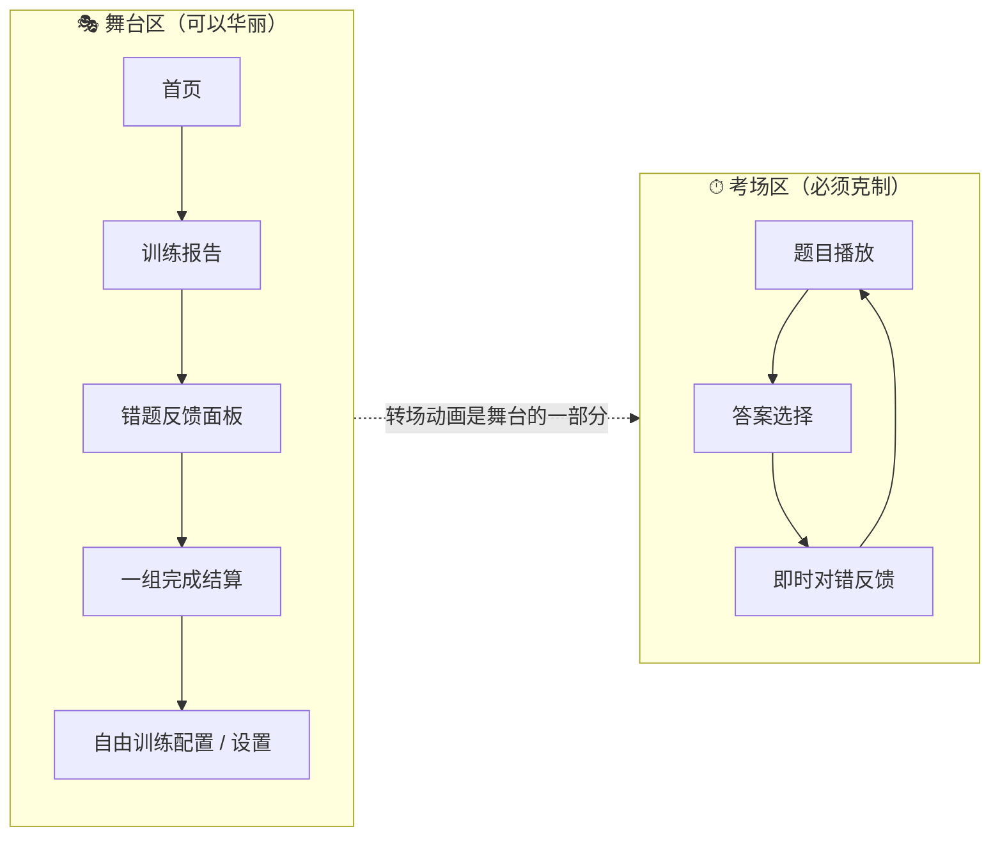

# 音程听辨训练 App —— 体验设计与交互规范 PRD（增量）

| 项 | 值 |
|---|---|
| 文档类型 | 增量 PRD（体验层），**不重复**原规范的功能需求 |
| 上游文档 | `docs/原始开发规范（PDF提取）.txt`（功能层等同 PRD，本文件不覆盖、不推翻） |
| 技术栈 | Flutter 3.x + Material 3 + 自定义 Design Token 层 |
| 目标平台 | Android / Windows / **macOS** / **iOS**（后两者为本次新增） |
| 文档版本 | v1.0 |
| 撰写人 | 许清楚（产品经理） |

> **阅读约定**
> 1. 本文所有数值均为**实现值**，工程师应直接落到 `theme.dart` / `motion.dart` / `tokens.dart`，不得自行"大概取个值"。
> 2. 与原规范冲突时，**原规范的功能约束优先**（尤其是"不影响训练效率""不泄露答案"）；本文只在其允许范围内定义表现层。
> 3. 所有 token 命名即代码常量名，请保持一致，便于后续 Review。

---

## 1. 产品定位与设计基调

面向 12 岁以上、有明确练耳目标的音乐学习者（琴童进阶、艺考生、音乐专业学生、成人自学者）。产品气质是 **"专业音频工具 × 年轻电子音乐视觉"**：深色为主场的低噪背景上，用高饱和渐变、流光与声波可视化制造活力，但**绝不使用卡通形象、拟人角色、儿童配色与游戏化奖励系统**。一句话基调：**像一台会发光的专业听觉仪器**。

### 1.1 关键张力与调和原则：**"舞台 / 考场"二分法**

用户要"极度精美、动效为重"，原规范要"专注、动画不得影响训练效率"。二者不是妥协关系，而是**分区**关系：



**硬性边界（可验收）：**

| 编号 | 规则 | 验收方式 |
|---|---|---|
| B-1 | **考场区**任何反馈动画的"阻塞时长" ≤ **300ms**；超出部分必须可被下一次用户输入立即打断 | 答对后 300ms 内点击「下一题」必须立即响应，动画就地取消 |
| B-2 | 考场区每帧渲染预算 **≤ 8ms**（120Hz 设备 ≤ 6ms），同屏最多 1 个 `BackdropFilter`、粒子上限 48 | DevTools Performance Overlay 无 jank 条 |
| B-3 | **舞台区**单次入场动画总时长 ≤ **1000ms**，且首个可交互元素在 **≤ 400ms** 内可点击 | 首页开始按钮 400ms 内可点 |
| B-4 | 考场区**答题前**不得出现任何与音高、方向、宽度相关的视觉信息（见 §3.1 防泄露约束） | 见 §3.1 检查清单 |
| B-5 | 「炫」的预算集中在：首页大卡渐变流动、播放可视化、错题对比条、报告页数据生长、页面共享元素转场，共 **5 处**。其余一律用标准 MD3 动效 | Code Review |

---

## 2. 设计系统 Design Tokens

### 2.1 基础色板（浅色 / 深色两套完整）

命名遵循 Material 3 `ColorScheme` 字段，额外扩展 `success / warning / uncertain` 三组语义色（通过 `ThemeExtension<AppSemanticColors>` 注入）。

#### 2.1.1 浅色主题 `AppColorScheme.light`

| Token | Hex | 用途 |
|---|---|---|
| `primary` | `#5B4BE0` | 品牌主色（电光靛）、主按钮、进度条起点 |
| `onPrimary` | `#FFFFFF` | |
| `primaryContainer` | `#E4E0FF` | 主色容器、选中态底 |
| `onPrimaryContainer` | `#150066` | |
| `secondary` | `#00B0A2` | 第二音标记、青绿活力色 |
| `onSecondary` | `#FFFFFF` | |
| `secondaryContainer` | `#AFF5EC` | |
| `onSecondaryContainer` | `#00201C` | |
| `tertiary` | `#E8467F` | 强调点缀（连击、今日练习卡渐变尾色） |
| `onTertiary` | `#FFFFFF` | |
| `tertiaryContainer` | `#FFD9E3` | |
| `onTertiaryContainer` | `#3E001D` | |
| `surface` | `#FCFBFF` | 页面底 |
| `surfaceDim` | `#DCD9E3` | |
| `surfaceBright` | `#FCFBFF` | |
| `surfaceContainerLowest` | `#FFFFFF` | |
| `surfaceContainerLow` | `#F6F3FC` | |
| `surfaceContainer` | `#F0EDF7` | 卡片默认底 |
| `surfaceContainerHigh` | `#EAE7F1` | 答案按钮默认底 |
| `surfaceContainerHighest` | `#E4E1EC` | 答案按钮 hover 底 |
| `onSurface` | `#1B1B21` | 正文 |
| `onSurfaceVariant` | `#47464F` | 次要文字 |
| `outline` | `#787680` | 描边 |
| `outlineVariant` | `#C8C5D0` | 分隔线、刻度点 |
| `scrim` | `#000000` | 遮罩基色（用 32% 透明度） |
| `inverseSurface` | `#302F36` | Snackbar |
| `onInverseSurface` | `#F3EFF7` | |

**语义色扩展（浅色）**

| Token | Hex | Container | onContainer |
|---|---|---|---|
| `success` | `#0E9F5B` | `#CFF5E1` | `#04482B` |
| `error` | `#D8353B` | `#FFDDDE` | `#5F0009` |
| `warning` | `#D97706` | `#FDEEC8` | `#5C2A05` |
| `uncertain`（中立） | `#6B7684` | `#E1E7EE` | `#28313A` |

#### 2.1.2 深色主题 `AppColorScheme.dark`（**推荐默认体验，视觉主战场**）

| Token | Hex | 用途 |
|---|---|---|
| `primary` | `#C6BFFF` | |
| `onPrimary` | `#2A1B8C` | |
| `primaryContainer` | `#4235C4` | |
| `onPrimaryContainer` | `#E4E0FF` | |
| `secondary` | `#4FE3D0` | |
| `onSecondary` | `#003731` | |
| `secondaryContainer` | `#00544B` | |
| `onSecondaryContainer` | `#AFF5EC` | |
| `tertiary` | `#FFB1C6` | |
| `onTertiary` | `#5E1133` | |
| `tertiaryContainer` | `#7D2949` | |
| `onTertiaryContainer` | `#FFD9E3` | |
| `surface` | `#0F0E13` | 页面底（近黑带紫调，非纯黑，防 OLED 拖影） |
| `surfaceDim` | `#0B0A0F` | |
| `surfaceBright` | `#35333B` | |
| `surfaceContainerLowest` | `#0A0910` | |
| `surfaceContainerLow` | `#17161D` | |
| `surfaceContainer` | `#1B1A22` | 卡片默认底 |
| `surfaceContainerHigh` | `#26242D` | 答案按钮默认底 |
| `surfaceContainerHighest` | `#312F38` | 答案按钮 hover 底 |
| `onSurface` | `#E5E1E9` | |
| `onSurfaceVariant` | `#C8C5D0` | |
| `outline` | `#928F9A` | |
| `outlineVariant` | `#47464F` | |
| `scrim` | `#000000` | 遮罩用 56% |
| `inverseSurface` | `#E5E1E9` | |
| `onInverseSurface` | `#1B1B21` | |

**语义色扩展（深色）**

| Token | Hex | Container | onContainer |
|---|---|---|---|
| `success` | `#3DDC84` | `#04482B` | `#CFF5E1` |
| `error` | `#FF7A80` | `#5F0009` | `#FFDDDE` |
| `warning` | `#FDB022` | `#5C2A05` | `#FDEEC8` |
| `uncertain` | `#9AA5B1` | `#28313A` | `#E1E7EE` |

#### 2.1.3 渐变 token

| Token | 定义 | 允许用于 |
|---|---|---|
| `gradientBrand` | `LinearGradient(begin: topLeft, end: bottomRight, colors: [#6C5BFF, #B44BE8])` | 主 CTA、进度条填充、交替对比播放按钮 |
| `gradientEnergy` | `LinearGradient(135°, [#FF6B9D, #FF9F6B])` | 首页「今日练习」大卡 |
| `gradientCalm` | `LinearGradient(135°, [#00B8A9, #2E7DF7])` | 报告页 KPI 卡、趋势图面积 |
| `gradientAmbientDark` | `RadialGradient(center: Alignment(0,-0.9), radius: 1.1, colors: [#241A5C, #0F0E13], stops: [0, 0.75])` | **仅**深色首页 / 报告页整页背景 |
| `gradientAmbientLight` | `RadialGradient(center: Alignment(0,-0.9), radius: 1.1, colors: [#EDE9FF, #FCFBFF], stops: [0, 0.75])` | 浅色首页 / 报告页整页背景 |

**禁止**：正文文字使用渐变；答案按钮默认态使用渐变（会干扰对错反馈的颜色语义）；同屏出现 3 个以上渐变面。

### 2.2 13 种音程专属标识色

**生成规则（可写成常量表，不要运行时计算）**：半音数 `n ∈ [0,12]` → 色相 `H = (255 + 27 × n) mod 360`。
- 浅色主题取 `HSL(H, 72%, 46%)`，深色主题取 `HSL(H, 78%, 68%)`。
- 步进 27° 使 13 色在色相环上近似均分；**纯一度(H=255) 与 纯八度(H=219) 色相相邻是刻意设计**，体现同名音关系。

| 半音 | 音程 | 简称 | H | 浅色 hex | 深色 hex | 形状 glyph |
|---:|---|---|---:|---|---|---|
| 0 | 纯一度 | P1 | 255 | `#4B21CA` | `#8E6EED` | ● 实心圆（小） |
| 1 | 小二度 | m2 | 282 | `#9721CA` | `#C76EED` | ◇ 空心菱形 |
| 2 | 大二度 | M2 | 309 | `#CA21B0` | `#ED6EDA` | ◆ 实心菱形 |
| 3 | 小三度 | m3 | 336 | `#CA2164` | `#ED6EA1` | ▢ 空心圆角方 |
| 4 | 大三度 | M3 | 3 | `#CA2921` | `#ED746E` | ▣ 实心圆角方 |
| 5 | 纯四度 | P4 | 30 | `#CA7521` | `#EDAD6E` | ○ 空心圆 |
| 6 | 增四/减五 | TT | 57 | `#CAC121` | `#EDE76E` | ⬡ 六边形（唯一） |
| 7 | 纯五度 | P5 | 84 | `#86CA21` | `#BAED6E` | ● 实心圆（大） |
| 8 | 小六度 | m6 | 111 | `#3ACA21` | `#81ED6E` | ▽ 空心三角 |
| 9 | 大六度 | M6 | 138 | `#21CA54` | `#6EED94` | ▼ 实心三角 |
| 10 | 小七度 | m7 | 165 | `#21CAA0` | `#6EEDCD` | ⬠ 空心五边形 |
| 11 | 大七度 | M7 | 192 | `#21A8CA` | `#6ED4ED` | ⬟ 实心五边形 |
| 12 | 纯八度 | P8 | 219 | `#215CCA` | `#6E9AED` | ◎ 双环 |

#### 2.2.1 色盲可辨强制规则（P0）

**任何**展示音程的组件，必须同时满足下列三条中的 **≥2 条**，且「半音数数字」为**必选项**：

1. **必选** — 显示半音数数字（`labelMedium`，tabular figures），置于色块右下或标签右侧。
2. 显示上表的形状 glyph（`CustomPainter` 绘制，尺寸 12/16/20 三档）。
3. 显示英文简称（P1/m2/M2…），受设置项 `showIntervalShorthand` 控制，**默认开启**。

> 附加规则：`#3ACA21`（小六度）与 success `#0E9F5B`/`#3DDC84` 色相接近。**禁止**在对错反馈同屏同时把小六度色块与 success 状态色并列展示；错题面板中的"正确答案条"统一使用 `success`，而"音程身份 chip"使用音程专属色 + glyph + 数字，二者在版式上上下分离（见 §4.4）。

### 2.3 字体层级

**字族**
- 拉丁与数字：`Inter`（内置 Latin 子集，约 120KB），开启 `FontFeature.tabularFigures()`。
- 中文：系统字体（iOS/macOS = PingFang SC，Android = Noto Sans CJK，Windows = Microsoft YaHei UI），通过 `fontFamilyFallback` 声明。
- **所有会变化的数字**（进度 8/20、计时、正确率、半音数、连击数）必须走 `AppText.numeric*`，强制 tabular，防止字宽跳动导致布局抖动。

| Token | size | height(行高倍数) | weight | letterSpacing | 用途 |
|---|---:|---:|---:|---:|---|
| `displayLarge` | 57 | 1.12 | 700 | -0.25 | 报告页首屏大数字 |
| `displayMedium` | 45 | 1.16 | 700 | 0 | 结算页正确率 |
| `displaySmall` | 36 | 1.22 | 700 | 0 | 首页问候语 |
| `headlineLarge` | 32 | 1.25 | 600 | 0 | 页面主标题 |
| `headlineMedium` | 28 | 1.29 | 600 | 0 | 错题面板标题 |
| `headlineSmall` | 24 | 1.33 | 600 | 0 | 卡片标题 |
| `titleLarge` | 22 | 1.27 | 600 | 0 | AppBar 标题 |
| `titleMedium` | 16 | 1.50 | 600 | +0.15 | 分区标题 |
| `titleSmall` | 14 | 1.43 | 600 | +0.10 | 列表项标题 |
| `bodyLarge` | 16 | 1.50 | 400 | +0.50 | 正文 |
| `bodyMedium` | 14 | 1.43 | 400 | +0.25 | 次要正文 |
| `bodySmall` | 12 | 1.33 | 400 | +0.40 | 辅助说明 |
| `labelLarge` | 14 | 1.43 | 600 | +0.10 | 按钮文字 |
| `labelMedium` | 12 | 1.33 | 600 | +0.50 | 角标、快捷键提示 |
| `labelSmall` | 11 | 1.45 | 600 | +0.50 | 最小标注 |
| `answerButtonLabel` | 20 | 1.20 | 600 | +0.20 | 多选答案按钮 |
| `answerButtonLabelXL` | 26 | 1.15 | 700 | +0.20 | 二选一大按钮 |
| `numericDisplay` | 48 | 1.10 | 700 | -1.00 | 报告 KPI 数字（tabular） |
| `numericLarge` | 32 | 1.12 | 700 | -0.50 | 连击数、结算数字（tabular） |
| `numericMedium` | 18 | 1.20 | 600 | 0 | 进度 8/20（tabular） |
| `numericSmall` | 13 | 1.25 | 600 | 0 | 半音数角标（tabular） |

**文字缩放**：`MediaQuery.textScaler` 上限 `clamp(1.0, 1.3)`。超过 1.15 时，多选答案按钮从 2 列降为 1 列（避免文字截断）。

### 2.4 间距体系

`AppSpacing`：`xxs=4 / xs=8 / sm=12 / md=16 / lg=24 / xl=32 / xxl=48 / xxxl=64`

- 页面水平内边距：compact `16`，medium `24`，expanded `32`
- 卡片内边距：`20`（大卡 `24`）
- 卡片之间垂直间距：`16`；分区之间：`32`
- 答案按钮网格 gap：`12`（compact）/ `16`（medium+）
- 触控目标最小 `48×48`（iOS 44 亦满足）；二选一大按钮 `≥ 140` 高

### 2.5 圆角体系

`AppRadius`：`xs=6 / sm=10 / md=14 / lg=20 / xl=28 / xxl=36 / full=999`

| 组件 | 圆角 |
|---|---|
| 普通卡片 | `20` |
| 首页大卡 / 报告 KPI 卡 | `28` |
| 多选答案按钮 | `20` |
| 二选一大按钮 | `24` |
| Chip / 标签 / 进度条 | `full` |
| 底部面板顶部 | `28`（左上、右上） |
| 对话框 | `28` |
| 输入框 / 下拉 | `14` |
| 图表柱条 | 顶部 `6` |

### 2.6 海拔与阴影

深浅两套策略不同：

**浅色主题**（彩色柔和阴影，非纯黑）
| Token | offset | blur | spread | color |
|---|---|---|---|---|
| `e0` | – | – | – | 无 |
| `e1` | `(0,2)` | 8 | 0 | `#5B4BE0` @ 8% |
| `e2` | `(0,4)` | 16 | 0 | `#5B4BE0` @ 10% |
| `e3` | `(0,8)` | 24 | -2 | `#5B4BE0` @ 12% |
| `e4` | `(0,12)` | 32 | -4 | `#5B4BE0` @ 14% |
| `e5` | `(0,20)` | 48 | -8 | `#5B4BE0` @ 16% |

**深色主题**：阴影几乎不可见，改用 **1px 内描边 + 表面提亮**
| Token | 表面色 | 内描边 |
|---|---|---|
| `e0` | `surfaceContainerLow` | 无 |
| `e1` | `surfaceContainer` | `#FFFFFF` @ 6% |
| `e2` | `surfaceContainerHigh` | `#FFFFFF` @ 8% |
| `e3` | `surfaceContainerHigh` | `#FFFFFF` @ 10% + 外阴影 `(0,8) blur24 #000 @ 40%` |
| `e4` | `surfaceContainerHighest` | `#FFFFFF` @ 12% + 外阴影 `(0,12) blur32 #000 @ 48%` |
| `e5` | `surfaceContainerHighest` | `#FFFFFF` @ 14% + 外阴影 `(0,20) blur48 #000 @ 56%` |

**发光（glow）**：仅用于播放可视化与连击徽章。`BoxShadow(color: X @ 45%, blur: 20, spread: 0)`，同屏最多 2 处。

### 2.7 玻璃拟态使用规则

| 项 | 规定 |
|---|---|
| 允许位置 | ① 训练页滚动后的顶部栏；② 错题反馈底部面板背板；③ 桌面端右侧统计栏；④ 对话框背板 |
| **禁止位置** | 列表项、可滚动内容内部、图表容器、答案按钮 |
| 参数（浅色） | `ImageFilter.blur(sigmaX:20, sigmaY:20)` + `surface @ 72%` + 内描边 `#FFFFFF @ 40%` 1px |
| 参数（深色） | `ImageFilter.blur(sigmaX:20, sigmaY:20)` + `surfaceContainer @ 60%` + 内描边 `#FFFFFF @ 8%` 1px |
| 数量上限 | **同一屏最多 1 个 `BackdropFilter`** |
| 移动端降级 | `sigma` 降为 16；性能降级触发时（§3.15）降为 0，改用不透明 `surfaceContainer @ 96%` |

---

## 3. 动效规范（Motion Spec）

### 3.0 时长与曲线 token

**时长 `AppDuration`**

| Token | ms | 用途 |
|---|---:|---|
| `instant` | 80 | 状态色切换、焦点环出现 |
| `micro` | 120 | 按压、hover 进入 |
| `fast` | 180 | hover 退出、小元素淡入 |
| `standard` | 260 | 常规组件出入场 |
| `emphasized` | 400 | 页面转场、面板入场 |
| `slow` | 600 | 大型强调（结算、报告 KPI） |
| `ambient` | 1800 | 循环呼吸 |
| `ambientSlow` | 4000 | 背景渐变流动 |

**曲线 `AppCurve`**

| Token | Flutter 值 | 用途 |
|---|---|---|
| `standard` | `Curves.easeOutCubic` | 默认 |
| `decelerate` | `Curves.easeOutQuart` | 入场、涟漪扩散 |
| `accelerate` | `Curves.easeInCubic` | 出场、消失 |
| `emphasized` | `Cubic(0.2, 0.0, 0.0, 1.0)` | 页面转场（MD3 emphasized） |
| `emphasizedDecelerate` | `Cubic(0.05, 0.7, 0.1, 1.0)` | 面板/卡片入场 |
| `emphasizedAccelerate` | `Cubic(0.3, 0.0, 0.8, 0.15)` | 面板/卡片退场 |
| `overshoot` | `Curves.easeOutBack`（默认 overshoot 1.70158，答案按钮处收敛为 1.2） | 按钮回弹、端点球 |
| `spring` | `Curves.elasticOut` | **全局限用**：仅「一组训练完成」结算徽章 1 处 |
| `linear` | `Curves.linear` | 进度、扫光、shimmer |
| `breath` | `Curves.easeInOut` | 呼吸循环 |

### 3.1 ⚠️ 防泄露可视化约束（P0，先于一切动效）

> 原规范第五章："出题时不能因为某种音程导致明显不同的固定音区，从而泄露答案"；第六章："作答前不要显示键盘或五线谱，避免用户依赖视觉计算"。**这条约束直接决定了播放可视化怎么做。**

**作答前（`QuestionPhase.playing / awaitingAnswer`）严禁：**

| 禁止项 | 原因 |
|---|---|
| 用音程专属色渲染任何元素 | 直接泄露答案 |
| 光环/波形的**尺寸、半径、高度**与 MIDI 音高挂钩 | 两音尺寸差 = 音程宽度 |
| 两个音在**垂直方向**上有位置差 | 泄露上行/下行方向（随机混合模式下方向是未知信息） |
| 显示频率数值、音名、五线谱、键盘 | 显式泄露 |
| 根据音程宽度改变动画时长/涟漪数量 | 隐式泄露 |

**作答前允许的差异化**：只能区分「第 1 个音 / 第 2 个音 / 和声同响」这一抽象事实。
- 第 1 个音（根音）→ `primary` 色 + 实线描边 2px
- 第 2 个音（目标音）→ `secondary` 色 + 虚线描边 2px（dash 6/4）
- 和声（同响）→ 两色沿圆周各占 180°，交界处 12px 渐变过渡
- 两者的几何尺寸、位置、时长曲线**完全一致**

**作答后（`QuestionPhase.feedback`）解锁**：音程专属色、真实音高映射（垂直位置按 MIDI 线性映射到轨道）、半音尺、音名与半音数。这是"奖励式信息释放"，也是核心教学时刻。

**验收清单**：截图对比两道半音数相差 11 的题目（如 m2 与 M7）在 `awaitingAnswer` 状态下的渲染，**逐像素应完全一致**（仅颜色随机相位可不同）。此项写成 golden test。

---

### 3.2 页面转场

#### `M-01 · transition.homeToTraining`（首页 → 训练页）

- **触发**：点击首页训练入口卡（今日练习 / 薄弱音程卡 / 自由训练"开始"）
- **形式**：**Container Transform**（卡片容器变形为整页）+ Hero 共享元素
- **时长**：进入 `420ms`，返回 `340ms`
- **曲线**：进入 `AppCurve.emphasized`；返回 `AppCurve.emphasizedAccelerate`
- **细节**
  - 卡片矩形 → 全屏矩形：`Rect.lerp`，圆角 `28 → 0`，同曲线
  - 卡片内标题使用 `Hero(tag: 'training-title-$sessionKey')`，`flightShuttleBuilder` 用 `Material(type: transparency)` 包裹防止字重跳变
  - 旧页面：`opacity 1 → 0`，区间 `0% – 35%`；`scale 1.0 → 0.96`
  - 新页面内容：`opacity 0 → 1`，区间 `25% – 70%`；`translateY 12 → 0`
  - 背景 scrim：`0 → 0.24`（浅色）/ `0 → 0.42`（深色），`240ms linear`
- **首题预取**：转场开始的同时并行执行"生成第一题 + 合成音频"，若 420ms 内未就绪，训练页显示 `M-26` 骨架，**不阻塞转场**

#### `M-02 · transition.trainingToReport`（训练完成 → 结算/报告）

- **前置"成绩汇聚"（240ms）**：训练页答题区所有元素 `opacity → 0`、`translateY → -16`，同时正确计数从进度条位置 `translate` 到屏幕中心，`240ms AppCurve.accelerate`
- **主转场**：Shared Axis Z —— 新页 `scale 0.92 → 1.0` + `opacity 0 → 1`，`480ms AppCurve.emphasizedDecelerate`；旧页 `scale 1.0 → 1.08` + `opacity 1 → 0`，`320ms`
- 结算徽章使用 `AppCurve.spring`（全局唯一一处 elasticOut），`scale 0 → 1`，`700ms`

#### `M-03 · transition.standardPush`（设置 / 自由配置 / 关于）

- Shared Axis X：新页 `translateX +30 → 0` + fade；旧页 `translateX 0 → -30` + fade
- `300ms AppCurve.emphasized`；返回同参数镜像
- **桌面端（expanded）** 不做 push，改为右侧内容区 Fade Through：出 `90ms accelerate` → 入 `210ms decelerate`

#### `M-04 · transition.modalSheet`（错题面板、确认弹窗）

见 `M-12`、`M-24`。

---

### 3.3 首页动效

#### `M-05 · home.cardStagger`（卡片交错入场）

- **触发**：首页首次挂载、从其他页返回时（返回时 stagger 步进减半）
- **单卡动画**：`opacity 0 → 1` + `translateY 24 → 0` + `scale 0.96 → 1.0`
- **单卡时长**：`380ms`，曲线 `AppCurve.emphasizedDecelerate`
- **delay 步进**：第 n 个元素 `delay = 60 × n` ms（n 从 0 起）

| n | 元素 | delay |
|---:|---|---:|
| 0 | 顶部问候 + 连续天数 | 0 |
| 1 | 今日练习大卡 | 60 |
| 2 | 「薄弱音程」分区标题 | 120 |
| 3 | 薄弱卡横向列表（整体） | 180 |
| 4 | 自由训练卡 | 240 |
| 5 | 训练报告卡 | 300 |

- **上限**：`delay` 封顶 `300ms`，第 6 个及以后的元素统一使用 `300ms`
- **首屏总入场** = 300 + 380 = `680ms`（满足 B-3）
- **可交互时机**：今日练习大卡在 `delay 60 + 120 = 180ms` 时即绑定点击（不等动画结束），满足 B-3 的 400ms

#### `M-06 · home.ambientFlow`（背景渐变流动）

- 整页 `gradientAmbientDark/Light` 的 `center` 在 `Alignment(-0.15, -0.9)` 与 `Alignment(0.15, -0.82)` 之间往返
- 周期 `4000ms`，曲线 `AppCurve.breath`，`repeat(reverse: true)`
- 同时「今日练习」大卡的 `gradientEnergy` 角度在 `135° → 175°` 往返，周期 `5000ms`
- **实现要求**：使用单个 `AnimationController` + `AnimatedBuilder` 只重建 `DecoratedBox`，禁止 `setState` 全页重建
- **停止条件**：`MotionLevel != full`、页面不可见（`TickerMode`）、电池低电量模式（`Platform` 可查时）

#### `M-07 · home.weakChipPulse`（薄弱音程卡强调）

- 掌握度 < 50% 的薄弱卡，其进度条尾端光点 `opacity 0.4 ↔ 1.0` 呼吸，周期 `2200ms breath`
- 同屏最多 **1 张**卡有此效果（取最弱的一张），避免视觉噪声

---

### 3.4 音频可视化（核心炫技点，两套方案并存）

**总原则**：可视化必须由 `AudioService` 的回调事件驱动（`onNoteStart(index, durationMs)` / `onNoteEnd(index)` / `onSequenceEnd`），**禁止用 `Timer` 猜时间**，否则跨平台音频延迟会导致视听不同步。

设置项 `visualizerStyle`：`halo`（呼吸光环，默认）/ `spectrum`（频谱粒子）/ `minimal`（极简圆点）。

#### 方案 A · `M-08 · viz.breathHalo`（呼吸光环）

```
              ╭ ─ ─ ─ ─ ─ ─ ╮      ← 涟漪环（动态生成，最多 4 层）
           ╭──┤   ╭─────╮   ├──╮
           │  │  ╱       ╲  │  │
           │  │ │    ◉    │ │  │   ← 中心核 d=112 (compact) / 144 (expanded)
           │  │  ╲       ╱  │  │
           ╰──┤   ╰─────╯   ├──╯
              ╰ ─ ─ ─ ─ ─ ─ ╯      ← 容器 d=176 / 224
```

| 阶段 | 参数 |
|---|---|
| 待机（awaiting play） | 中心核 `scale 1.0 ↔ 1.03`，周期 `2400ms breath`，颜色 `outlineVariant @ 40%` 描边，无填充 |
| 播放开始 | 中心核 `scale 1.0 → 1.06`，`160ms AppCurve.overshoot`；随后进入 ambient 循环 `1.0 ↔ 1.04`，周期 `1800ms breath` |
| 每个音起音（`onNoteStart`） | 生成一个涟漪环：`radius 56 → 123`（即 ×2.2），`strokeWidth 3 → 0`，`opacity 0.55 → 0`，`900ms AppCurve.decelerate` |
| 涟漪颜色 | 第 1 音 = `primary`，实线；第 2 音 = `secondary`，虚线 dash(6,4)；和声 = 两个环同时发出，一个顺时针旋转 `+6°`、一个 `-6°`（`900ms linear`） |
| 音符持续期间 | 中心核填充 `radialGradient(该音色 @ 22% → transparent)`，随包络（见下）缩放 `scale = 1.0 + 0.05 × envelope(t)` |
| 播放结束 | 中心核 `scale → 1.0`，`320ms decelerate`；填充淡出 `240ms` |

**包络函数 `envelope(t)`**（用于驱动所有可视化幅度，无需真实 FFT）：
- 键盘音色：`attack 12ms` 线性 0→1，随后 `exp(-t / 600ms)`
- 拨弦音色：`attack 6ms` 线性 0→1，随后 `exp(-t / 350ms)`
- 叠加抖动：`× (1 + 0.06 × sin(2π × 1.2Hz × t))`，让画面"活"起来

**与音高的联动**：**仅在作答后**开启。反馈阶段光环替换为 §4.4 的半音尺；若停留在训练页原地重听，则中心核内出现一条竖直轨道，根音与目标音各显示一个圆点，垂直位置 `y = lerp(bottom, top, (midi - 48) / 36)`（C3=48 → C6=84），根音点用中性灰 + 实心，目标音点用**音程专属色 + glyph**。

#### 方案 B · `M-09 · viz.spectrumParticles`（频谱条 + 粒子）

```
   ·   ˙  ·        ← 粒子（起音时喷发）
  ▁▃▅▇█▇▅▃▂▄▆█▆▄▂▁▃▅▇▅▃▁▂▄▆   ← 26 根竖条
```
| 项 | 参数 |
|---|---|
| 条数 | 26 根；条宽 `4px`，间距 `4px`（总宽 204px），圆角 `full` |
| 高度 | `4px ~ 64px`（compact）/ `4 ~ 88px`（expanded） |
| 高度算法 | `h_i = 4 + 60 × envelope(t) × w_i`，`w_i = 0.45 + 0.55 × |sin(π × (i+1)/27 + φ)|`，`φ` 每次播放随机（**注意：`φ` 必须与音程无关，禁止用半音数做种子**） |
| 帧率 | 60fps；**必须**用单个 `CustomPainter` 一次性绘制 26 根，禁止 26 个 `AnimatedContainer` |
| 颜色 | 第 1 音期：竖直渐变 `primary → primaryContainer`；第 2 音期：`secondary → secondaryContainer`；和声期：奇数条 `primary`、偶数条 `secondary` |
| 粒子 | 每次 `onNoteStart` 从条带中心喷发 12 个粒子：初速 `120–220 px/s`，发射角 `-60° ~ -120°`（向上扇形），重力 `+600 px/s²`，寿命 `700ms`，尺寸 `2–4px`，`opacity = 1 - t/lifetime` |
| 粒子上限 | 48（对象池复用）；性能降级时降为 16 |

#### 方案 C · `M-10 · viz.minimal`（极简，无障碍/低端设备）

两个圆点（d=16）水平排列，正在响的那个 `scale 1.0 → 1.25 → 1.0`（`180ms overshoot`）+ 描边高亮。无粒子、无涟漪、无循环动画。

---

### 3.5 答题按钮微交互

#### `M-11 · answer.press`（按下）

- `scale 1.0 → 0.965`，`90ms AppCurve.standard`
- `elevation e2 → e0`（浅色）/ 内描边亮度 8% → 4%（深色）
- 叠加 `onSurface @ 8%` 高亮层，`80ms linear`
- **松开**：`scale → 1.0`，`160ms AppCurve.overshoot`，overshoot 系数收敛为 `Cubic(0.34, 1.28, 0.64, 1.0)`（峰值 1.012，肉眼可感但不浮夸）
- 触觉：`HapticFeedback.selectionClick()`（按下瞬间，非松开）

#### `M-12 · answer.hover`（桌面端）

- 进入：`140ms AppCurve.standard` —— 底色 `surfaceContainerHigh → surfaceContainerHighest`；描边 `outlineVariant → primary @ 60%`；`translateY 0 → -2`；`e1 → e2`
- 退出：`180ms AppCurve.standard`，参数反向
- 光标：`SystemMouseCursors.click`
- **训练进行中**禁止 hover 造成布局位移以外的任何色彩语义变化（不得预示对错）

#### `M-13 · answer.focus`（键盘焦点）

- `2px primary` 描边 + 外扩 `3px primary @ 24%` 光晕环
- 出现 `120ms AppCurve.instant`，消失 `80ms`
- **不做位移**（焦点在按钮间移动时若有位移会产生抖动感）
- 焦点环使用 `FocusRing` 统一组件，与 hover 可叠加

#### `M-14 · answer.disabled`（播放中禁用/已作答）

- `opacity 1.0 → 0.38`，`160ms linear`；同时移除 hover 与点击响应
- **不使用灰度滤镜**（会破坏音程专属色的识别）

---

### 3.6 答题反馈动效（考场区，受 B-1 约束）

#### `M-15 · feedback.correct`（正确 —— 明确但不过度刺激）

**总视觉时长 620ms，但阻塞时长仅 180ms**（180ms 后用户点击「下一题」/按 Enter 立即生效，残余动画就地取消）。

| 时间轴 | 动作 |
|---:|---|
| `t=0` | 触觉 `lightImpact()`；反馈音（若开启，见 §5）；被点按钮描边 `outline → success`，`80ms linear` |
| `t=0–260ms` | **描边扩散环**：从按钮边界向外扩 `20px`，`strokeWidth 3 → 0`，`opacity 0.6 → 0`，`AppCurve.decelerate` |
| `t=60–360ms` | **对勾路径描边动画**：`PathMetrics` 提取对勾路径，`extractPath(0, len × p)`，`p: 0→1`，`300ms AppCurve.standard`；`strokeWidth 3`，`StrokeCap.round`，颜色 `success`；对勾容器 d=32，置于按钮右上角内侧 8px |
| `t=120–360ms` | 按钮 `scale 1.0 → 1.03 → 1.0`，`240ms AppCurve.overshoot` |
| `t=100–620ms` | **彩带粒子**（条件触发，见下） |
| `t=180ms` | ✅ **解除阻塞**，`nextQuestion()` 可被调用 |
| `t=520ms` | 若 `autoNext == true`，自动进入下一题（间隔可在设置中选 `0 / 300 / 600 / 1000ms`，默认 `600`） |

**彩带粒子触发规则（防疲劳，重要）**

| 当前连击数 | 粒子数 | 说明 |
|---:|---:|---|
| 1–2 | 0 | **不放礼花**。每题都庆祝 = 不是庆祝 |
| 3–4 | 8 | 小规模 |
| 5–9 | 14 | |
| ≥10 | 20 + 金色（`#FDB022`）占比 30% | |

粒子参数：从按钮中心向上 `60°` 扇形发射，初速 `180–320 px/s`，重力 `+900 px/s²`，自旋 `±720°/s`，尺寸 `3×6px` 圆角矩形，寿命 `520ms`，颜色从 `[primary, secondary, tertiary, success]` 随机。
设置项 `celebrationLevel`：`off / subtle（默认，即上表）/ rich（阈值全部下调 2 档、粒子数 ×1.6）`。

#### `M-16 · feedback.wrong`（错误 —— 对比学习，不是惩罚）

**严禁**：红色闪屏、全屏震动、下坠音效、"×"打叉盖章、扣分动画。

| 时间轴 | 动作 |
|---:|---|
| `t=0` | 触觉 `mediumImpact()`（可关）；反馈音为**中性单音**而非蜂鸣 |
| `t=0–160ms` | 用户所选按钮：描边 `→ error @ 70%`，**填充保持不变**（不刷红底，避免惩罚感）；`160ms linear` |
| `t=0–220ms` | 轻微抖动：`translateX: 0 → -3 → +3 → 0`，`220ms AppCurve.standard`。**幅度仅 3px**，不使用 `elasticOut` |
| `t=80–280ms` | 正确答案按钮描边 `→ success`，同时 `scale 1.0 → 1.04 → 1.0`（`200ms overshoot`）——引导注意力到"对的那个" |
| `t=120ms` | 错题反馈面板开始入场（`M-17`） |

#### `M-17 · wrongPanel.enter`（错题反馈面板入场）

**compact / medium（底部面板）**
- 面板 `translateY: 100% → 0`，`420ms AppCurve.emphasizedDecelerate`
- Scrim `opacity 0 → 0.32`（浅色）/ `0 → 0.56`（深色），`240ms linear`
- 顶部圆角 `28`；玻璃拟态 `sigma 20` + `surfaceContainerHigh @ 86%`
- **内部 stagger**（每项 `320ms`，`fade + translateY 12 → 0`，`AppCurve.emphasizedDecelerate`）

| delay | 内容 |
|---:|---|
| 80ms | 标题「再听一次差别」 |
| 140ms | 答案对照双 chip（你的答案 / 正确答案） |
| 200ms | **半音尺对比条**（`M-18`，其自身动画在此刻开始） |
| 280ms | 四个操作按钮 |

**expanded（桌面双栏）**：不使用底部面板，右栏**原地展开**——`AnimatedSize`（`340ms emphasizedDecelerate`）+ 内容 fade in，避免遮挡左侧答题区，用户可继续用键盘操作。

#### `M-18 · compare.semitoneRuler`（★ 核心教学动画：半音宽度对比）

> 这是整个 App 的价值高点。原规范要求"重点展示对比学习"，所以这里要把**抽象的音程宽度差**变成**可以一眼看穿的长度差**。

**静态结构**
```
        0  1  2  3  4  5  6  7  8  9 10 11 12
        ┊  ┊  ┊  ┊  ┊  ┊  ┊  ┊  ┊  ┊  ┊  ┊  ┊    ← 刻度点 d=4, outlineVariant
  你的 ●━━━━━━━━━━━━━━━━━━━━━━━━━━━━━◗              ← error 渐变条 h=14
  正确 ●━━━━━━━━━━━━━━━━━━━━━━━━━━━━━━━━◗          ← success 渐变条 h=14
                                     └─┘
                                    +1 半音          ← 差值高亮
```
- 尺宽 `W = 容器宽 - 32`；单半音步长 `step = W / 12`
- 刻度点 `d=4`，`outlineVariant`；0/6/12 处加粗为 `d=6` 并带 `labelSmall` 数字
- 条高 `14`，圆角 `full`；起点球 `d=10`，端点球 `d=14`
- 上条 = 用户答案：`LinearGradient([error @ 70%, error])`
- 下条 = 正确答案：`LinearGradient([success @ 70%, success])`
- 两条垂直间距 `20`；条左侧 `40px` 标签栏（`labelMedium`：「你的」「正确」）

**入场动画**
- 两条**同时**从左端开始生长：`width: 0 → semitones × step`
- 时长 = `clamp(semitones × 40ms, 320ms, 560ms)`，曲线 `AppCurve.emphasizedDecelerate`
- 关键设计：两条采用**相同的像素速度**而非相同时长 —— 半音数大的条会**多跑一段时间**，用户能"亲眼看到多出来的那一截"。实现：`durationOf(bar) = bar.semitones × 40ms`，两条同时 `t=0` 启动，各自按自己的时长结束
- 端点球抵达瞬间：`scale 1.0 → 1.35 → 1.0`，`180ms AppCurve.overshoot`，并向外扩一圈 `radius +8, opacity 0.5→0`（`300ms decelerate`）
- **差值高亮**：两条都完成后 `delay 120ms`，在较长条的"多出段"上淡入一个虚线包围框（`dash(4,3)`，`warning` 色，`1.5px`）+ 上方 `labelMedium` 文案「+N 半音」；`fade + scale 0.9→1.0`，`240ms AppCurve.overshoot`
- 若两者半音数相同（理论上不会出现在错题里，但"不确定"面板会复用此组件），只画一条，居中显示音程名

**与「交替对比播放」的视听同步（`M-19` 联动）**
- 播放序列为 `错 → 对 → 错 → 对`（原规范第六章），**同根音同音色**
- 正在发声的那条：`opacity 1.0`；另一条：`opacity 0.38`。切换用 `240ms crossfade`
- 正在发声的条内部有一道**扫光**：宽 `48px` 的 `white @ 28%` 高斯软边光带，从条左端扫到端点球，时长 = **该音符的实际时长**（由 `onNoteStart(durationMs)` 提供），`AppCurve.linear`
- 端点球在发声期间持续脉冲：`scale 1.0 ↔ 1.15`，周期 `900ms breath`
- 序列切换的时机**必须**由音频回调驱动；若音频引擎无回调，则必须先补齐回调（这是 P0 依赖，不接受 `Timer` 近似）
- 和声音程时：条两端同时脉冲，扫光改为整条 `opacity 0.6 → 1.0 → 0.6`（一次呼吸 = 一次发声）

#### `M-19 · compare.abButton`（交替对比播放按钮）

- 默认态：`gradientBrand` 填充，`h=56`，`r=full`，文案「⇄ m6 ↔ M6 交替对比」
- 点击后：文字淡出（`120ms`），按钮**内部**出现进度环——沿按钮边缘的 `RoundedRect` 路径描边 `0 → 1`，时长 = 整个序列总时长，`AppCurve.linear`
- 图标 `play → stop` 双图标 crossfade `160ms`
- 播放结束：进度环 `opacity → 0`（`200ms`），文字淡入（`180ms`）
- 再次点击 = 停止并重置（进度环 `180ms` 回退到 0）

#### `M-20 · feedback.uncertain`（不确定 —— 中性）

- 触觉 `selectionClick()`，**无反馈音**
- 「不确定」按钮描边 `→ uncertain`，`160ms`；**无对勾、无粒子、无抖动**
- 中心区出现「?」图标：`opacity 0→1` + `scale 0.8→1.0`，`220ms AppCurve.standard`，颜色 `uncertain`
- 面板复用错题面板结构，但：
  - 使用 `uncertain` 中立色系，**不显示「你的答案」行**
  - 半音尺只画正确答案一条
  - 按钮组去掉「听你选的音程」，保留「重听本题 / 再练一道 / 继续」
- 文案保持鼓励中立：「先记住这个宽度，下次就认得了」

---

### 3.7 进度 / 连击 / 章节推进

#### `M-21 · progress.bar`

- 高 `6`（compact）/ `8`（expanded），圆角 `full`，轨道 `outlineVariant @ 40%`
- 填充 `gradientBrand`；宽度变化 `320ms AppCurve.standard`
- 填充头部有一个 `d=8` 光点：`BoxShadow(primary @ 60%, blur 8)`
- **分段**：20 题按 `5 / 10 / 5`（热身 / 薄弱 / 混合检测）分三段，段间 `gap 3px`
- 答对时：当前段整体叠加 `white @ 30%` 高光，`opacity 0 → 0.3 → 0`，`200ms linear`
- 答错时：进度条**不做任何负面表现**（不变红、不回退）

#### `M-22 · combo.badge`（连击）

- **连击 ≥ 3 才出现**（低于 3 不显示徽章，避免噪声）
- 出现：`scale 0 → 1` + `opacity 0 → 1`，`320ms AppCurve.overshoot`，从进度条右端弹出
- 数字切换（数字滚轮）：旧数字 `translateY 0 → -100%` + fade out；新数字 `translateY +100% → 0` + fade in；`200ms AppCurve.standard`；使用 `numericLarge`（tabular）
- 连击 ≥ 5：徽章外圈增加一圈 `gradientBrand` 的 `SweepGradient` 旋转描边，`1600ms linear` 循环，`strokeWidth 2`
- 连击 ≥ 10：外圈色改为 `[#FDB022, #FF6B9D]`，旋转周期缩短至 `1200ms`
- **中断**：`scale 1 → 0` + fade，`180ms AppCurve.accelerate`。**不加任何负面音效、不加红色、不加"连击中断"文案**

#### `M-23 · chapter.advance`（阶段推进）

- 跨越 `5/15` 题边界时，顶部滑入一个 chip：「进入薄弱强化 · 10 题」
- 入场 `translateY -100% → 0` + fade，`300ms AppCurve.emphasizedDecelerate`
- 停留 `1600ms`
- 退场 `translateY 0 → -100%` + fade，`240ms AppCurve.emphasizedAccelerate`
- 同时进度条对应段的轨道底色 `lerp` 到 `primaryContainer`，`340ms AppCurve.standard`
- **不阻塞答题**：chip 显示期间可正常听题作答（chip 位于安全区，不遮挡）

---

### 3.8 报告页数据可视化入场

#### `M-24 · report.entrance`（整页 stagger）

| delay | 区块 |
|---:|---|
| 0ms | KPI 卡组（4 个，内部再 stagger 50ms） |
| 120ms | 近 7 天趋势折线 |
| 240ms | 各音程表现条形图 |
| 360ms | 混淆矩阵 |
| 480ms | 分类表现（方向/根音/音色） |

每区块自身 `fade + translateY 16 → 0`，`360ms AppCurve.emphasizedDecelerate`。

#### `M-25 · report.numberRoll`（数字滚动）

- `0 → target`，`900ms AppCurve.decelerate`；每帧 `value.round()`，`numericDisplay`（tabular）
- 百分比同时驱动同卡片的环形进度：`sweepAngle 0 → 2π × value`，同曲线同时长，`strokeWidth 8`，`StrokeCap.round`，`gradientCalm` 作 `SweepGradient`
- 目标值 0 时不做滚动，直接显示 `0`（并显示「还没有数据」引导）

#### `M-26 · report.chartGrow`（图表生长）

- **条形图**：每根柱 `height/width: 0 → h`，`520ms AppCurve.emphasizedDecelerate`；stagger `40ms/根`；13 根总计 `520 + 480 = 1000ms`（封顶）
- **折线图**：`PathMetrics` 描边 `0 → 1`，`800ms AppCurve.standard`；描边完成后面积渐变（`gradientCalm @ 0→28%`）`fade in 300ms`；数据点 `scale 0→1`，`180ms overshoot`，跟随描边进度依次出现
- **环形图**：`sweep 0 → value`，`700ms AppCurve.decelerate`

#### `M-27 · report.matrixReveal`（混淆矩阵逐格点亮）

- 顺序：**对角线波**，`delay = (row + col) × 22ms`
- 每格：`opacity 0 → 1` + `scale 0.86 → 1.0`，`260ms AppCurve.overshoot`（overshoot 收敛为 `Cubic(0.34,1.2,0.64,1)`）
- 总时长封顶 `900ms`：若 `maxWave × 22 + 260 > 900`，则把步进压缩为 `(900 - 260) / maxWave`
- 热力色：`Color.lerp(surfaceContainer, error, sqrt(count / maxCount))`；**每格必须叠加数字**（tabular，`labelSmall`），色盲用户靠数字读；`count == 0` 的格子不参与点亮动画（直接静态渲染，节省帧）
- 对角线（正确格）用 `success` 色系而非 `error`
- hover（桌面）：格子 `scale 1.0 → 1.08` + `e2` 阴影，`120ms`；同时高亮所在行列的表头

---

### 3.9 通用组件动效

| Token | 说明 |
|---|---|
| `M-28 · list.itemStagger` | 通用列表入场：**仅前 8 项**做 stagger（`40ms` 步进，`280ms fade + translateY 12→0`），第 9 项起直接渲染，保证长列表滚动性能 |
| `M-29 · chip.select` | 选中态：底色 `surfaceContainerHigh → primaryContainer`，`160ms standard`；勾选图标 `scale 0→1` `180ms overshoot`；宽度变化用 `AnimatedSize 160ms` |
| `M-30 · switch.toggle` | MD3 默认 Switch 动效 + `HapticFeedback.selectionClick()` |
| `M-31 · snackbar` | 从底部 `translateY 100%→0` + fade，`280ms emphasizedDecelerate`；停留 `3000ms`；退场 `200ms accelerate` |
| `M-32 · skeleton` | shimmer：`LinearGradient` 高光带宽 = 容器宽 `30%`，角度 `20°`，`1200ms linear` 循环。**若数据在 120ms 内就绪则不显示骨架**（防闪烁） |
| `M-33 · tooltip`（桌面） | hover 停留 `500ms` 后出现，`fade + scale 0.94→1.0`，`140ms standard` |
| `M-34 · dialog.enter` | `scale 0.92 → 1.0` + fade，`260ms emphasizedDecelerate`；scrim `0 → 0.32/0.56`，`200ms linear`；退场 `180ms accelerate` |

#### `M-35 · dialog.destructiveConfirm`（清空训练数据）

原规范要求"清空数据必须弹出二次确认"。本设计用**长按确认**替代双层弹窗，既更安全也更有质感：

- 对话框标题「清空全部训练记录？」+ 正文列出将被删除的数据量（如「3,412 次作答 · 47 天记录」，数字用 tabular）
- 主按钮为**长按型**：`h=52`，`r=full`，`error` 描边，文案「长按 0.8 秒确认清空」
- 长按开始：沿按钮边缘的进度环 `0 → 1`，`800ms AppCurve.linear`；按钮底色 `transparent → error @ 12%` 同步
- 中途松手：进度环 `→ 0`，`180ms AppCurve.accelerate`；无惩罚提示
- 完成：`heavyImpact()` 触觉 + 对话框 `M-34` 退场 + Snackbar「已清空，可在设置中重新开始」
- 键盘可达性：桌面端额外提供 `Tab` 到该按钮后**按住 Enter 0.8 秒**同样生效；并提供纯点击的备用路径（连点两次，第二次按钮文案变为「再点一次确认」，2 秒后复原）

---

### 3.10 降级策略（`MotionLevel`）

```dart
enum MotionLevel { full, reduced, off }
```

**来源优先级**
1. 设置页 `motionPreference`：`system（默认）/ full / reduced / off`
2. 当 `motionPreference == system` 时，取 `MediaQuery.of(context).disableAnimations ? reduced : full`
3. 性能看门狗可**临时**把 `full` 降为 `reduced`（见下），但不改写用户设置

**`reduced` 行为表**

| 类别 | 行为 |
|---|---|
| 所有 ambient 循环（`M-06/M-07`、光环呼吸、连击外圈旋转、`M-32` shimmer） | **完全停止**，取终态静帧 |
| 粒子系统（`M-09` 粒子、`M-15` 彩带） | **全部关闭** |
| 位移类（translate / scale） | 取消，只保留 `opacity` crossfade |
| 所有转场（`M-01/02/03`） | 统一改为 `FadeThrough`，`150ms AppCurve.linear` |
| 通用组件动效时长 | 统一压缩到 `120ms` |
| `M-25` 数字滚动 | 直接显示终值 |
| `M-26/M-27` 图表生长、矩阵点亮 | 直接显示终态 + 整体 `150ms fade in` |
| **`M-18` 半音尺对比条** | ⚠️ **保留**——这是**教学信息**不是装饰。改为：直接绘制终态两条 + `200ms fade in`；交替播放时的同步改用 `opacity 0.38 ↔ 1.0` 硬切换（`0ms`），扫光取消 |
| `M-19` 播放进度环 | 保留（是状态指示器，非装饰），但曲线固定 linear |
| 触觉反馈 | 不受 `MotionLevel` 影响，由独立设置项 `hapticsEnabled` 控制 |

**`off` 行为**：在 `reduced` 基础上，所有非状态指示类动画时长归 `0`；`M-18` 仍直接显示终态；`M-19`、`M-21` 进度类保留（无它们无法判断系统状态）。

**性能看门狗（`MotionGovernor`）**
- 采样 `SchedulerBinding.addTimingsCallback`，滑动窗口 60 帧
- 触发条件：连续 3 秒内 `p90 build+raster > 20ms`
- 降级动作（按序）：① 粒子上限 `48 → 16`；② `BackdropFilter sigma → 0`，改用 `surfaceContainer @ 96%` 不透明底；③ 可视化方案强制切到 `minimal`（`M-10`）；④ 整体降为 `reduced`
- 恢复：连续 10 秒 `p90 < 12ms` 后逐级回升；每级间隔 ≥ 30 秒防抖
- 全过程仅打 debug 日志，**不弹任何提示打扰用户**

---

## 4. 关键页面视觉与交互描述

> 每页给出：视觉稿级文字描述 + compact（移动单列）与 expanded（桌面双栏）两版布局示意。
> 示意图中的数字为 dp/px 逻辑像素。

### 4.1 首页 Home

**视觉描述**：深色主题下，整页铺 `gradientAmbientDark`——顶部一团靛紫辉光缓慢流动（`M-06`），像调音台的背光。顶部是问候语与连续天数，字重对比强烈（`displaySmall` 白 + `bodyMedium` 灰）。视觉焦点是「今日练习」大卡：`gradientEnergy`（品红→珊瑚橙）填充，`r=28`，`e3` 阴影，卡内右下角有一个半透明的巨大音符符号（`opacity 8%`，被卡片裁切），右侧是白色实心 pill 按钮「开始 ▸」。往下是横向可滚动的薄弱音程卡（每张带音程专属色的左侧 4px 竖条 + 两个 glyph + 掌握度进度条）。最下方两张等宽方卡：自由训练、训练报告，用 `surfaceContainer` 底 + 1px 内描边，图标用 `primary`。整页无边框线，靠海拔与间距分层。

**compact（<600）**
```
┌───────────────────────────────────┐ ← SafeArea top
│ ░░░ gradientAmbientDark 辉光 ░░░  │
│                                   │
│  晚上好                       ⚙   │  displaySmall / icon 24
│  连续练习 12 天 · 今日 0/20        │  bodyMedium, onSurfaceVariant
│                            ↕24    │
│ ┌───────────────────────────────┐ │
│ │ ◈ 今日练习              ♪     │ │ h=156 r=28 gradientEnergy
│ │   20 题 · 约 5 分钟            │ │ headlineSmall + bodyMedium
│ │   热身5 · 薄弱10 · 检测5       │ │ labelMedium @70%
│ │                    ┌────────┐ │ │
│ │                    │ 开始 ▸ │ │ │ h=44 r=full 白底
│ │                    └────────┘ │ │
│ └───────────────────────────────┘ │
│                            ↕32    │
│  薄弱音程              查看全部 ›  │ titleMedium / labelLarge
│ ┌──────────┐┌──────────┐┌────    │ 横向滚动，w=176 h=112 gap=12
│ │▏▽ m6 ↔ ▼ M6         ││▏○P4↔●P5 │ │ 左侧 4px 音程色竖条
│ │  8    9  ││          ││  5   7  │ │ glyph + 半音数
│ │ ▓▓▓▓▓░░░ 62%         ││ ▓▓▓░░ 48│ │ h=4 进度条
│ │ 需要加强 ││          ││ 不稳定   │ │ labelSmall + 状态色
│ └──────────┘└──────────┘└────    │
│                            ↕32    │
│ ┌──────────────┐┌───────────────┐ │
│ │  ⚙           ││  ▤            │ │ h=112 r=20
│ │  自由训练     ││  训练报告      │ │ surfaceContainer
│ │  自定义配置   ││  正确率 78%    │ │ titleSmall+bodySmall
│ └──────────────┘└───────────────┘ │
│                            ↕48    │
└───────────────────────────────────┘
  水平内边距 16
```

**expanded（>1024）**
```
┌──────────────────────────────────────────────────────────────┐
│ ♪ 音程听辨训练            今日 0/20   ◐主题  ⚙设置            │ h=56 玻璃拟态
├────────┬─────────────────────────────────────────────────────┤
│ ⌂ 首页 │  ░░░ ambient 辉光 ░░░                                │
│ ▶ 训练 │   晚上好 · 连续练习 12 天                             │
│ ▤ 报告 │  ┌────────────────────────┐┌───────────────────────┐│
│ ⚙ 设置 │  │ ◈ 今日练习              ││  近 7 天              ││
│        │  │ 20 题 · 约 5 分钟        ││  ╱╲    ╱╲            ││ mini 折线
│ rail   │  │ 热身5·薄弱10·检测5       ││ ╱  ╲__╱  ╲___        ││
│ w=88   │  │              [ 开始 ▸ ] ││  平均 78%             ││
│        │  └────────────────────────┘└───────────────────────┘│
│        │   薄弱音程                                查看全部 › │
│        │  ┌────────┐┌────────┐┌────────┐┌────────┐          │
│        │  │▽m6↔▼M6 ││○P4↔●P5 ││◇m2↔◆M2 ││▢m3↔▣M3 │          │
│        │  └────────┘└────────┘└────────┘└────────┘          │
│        │  ┌───────────────────┐┌───────────────────┐         │
│        │  │ ⚙ 自由训练         ││ ▤ 训练报告         │         │
│        │  └───────────────────┘└───────────────────┘         │
└────────┴─────────────────────────────────────────────────────┘
   内容区 maxWidth=1080 居中，左右内边距 32
```

- **medium（600–1024）**：NavigationRail 收起（`w=80`，仅图标），内容区 `maxWidth=640` 居中，薄弱卡 2 列网格而非横向滚动。

---

### 4.2 普通音程识别训练页

**视觉描述**：这是"考场"，视觉密度必须最低。整页 `surface` 纯色底（**不用 ambient 渐变**，避免干扰）。顶部一条极细的分段进度条，左侧关闭按钮，中间 `8 / 20`（tabular），右侧暂停。中央大片留白中只有一个发光的呼吸光环 + 下方一小段频谱条带——这是全页唯一的动态元素，也是"极度精美"的承载点。光环下是「再听一次」文字按钮，带一个小小的重播计数角标（`×2`，`uncertain` 色）。下半屏是答案按钮网格：`surfaceContainerHigh` 底、`r=20`、`1px outlineVariant` 描边、`h=64`，文字 `answerButtonLabel` 居中，右上角有 `labelMedium` 的快捷键数字角标（仅桌面显示）。最底部是全宽的「不确定」按钮，`uncertain` 描边 + 透明底，与答案按钮在视觉层级上明确区分。**作答前中心区没有任何音名、五线谱、键盘、频率数字。**

**compact**
```
┌───────────────────────────────────┐
│ ✕            8 / 20            ⏸  │ h=56, numericMedium
│ ▓▓▓▓▓│▓▓░░░░░░░░░│░░░░░           │ h=6 分段 5|10|5
├───────────────────────────────────┤
│                            ↕40    │
│              ╭ ─ ─ ─ ╮            │
│           ╭──┤ ╭───╮ ├──╮         │ 呼吸光环
│           │  │ │ ◉ │ │  │         │ 容器 d=176
│           ╰──┤ ╰───╯ ├──╯         │ 中心核 d=112
│              ╰ ─ ─ ─ ╯            │
│           ▁▃▅▇█▇▅▃▂▄▆▄▂           │ 频谱 w=204 h=64
│                            ↕24    │
│         ┌────────────────┐        │
│         │ ↻ 再听一次  ×2 │        │ h=44 r=full tonal
│         └────────────────┘        │
│                            ↕32    │
│ ┌───────────────┐┌──────────────┐ │
│ │ 小二度      1 ││ 大二度     2 │ │ h=64 r=20 gap=12
│ ├───────────────┤├──────────────┤ │
│ │ 小三度      3 ││ 大三度     4 │ │
│ ├───────────────┤├──────────────┤ │
│ │ 纯四度      5 ││ 纯五度     6 │ │
│ ├───────────────┤├──────────────┤ │
│ │ 小六度      7 ││ 大六度     8 │ │
│ └───────────────┘└──────────────┘ │
│ ┌───────────────────────────────┐ │
│ │          ?  不确定             │ │ h=52 r=20 uncertain 描边
│ └───────────────────────────────┘ │
│                            ↕16    │ + viewPadding.bottom
└───────────────────────────────────┘
```

**expanded（双栏）**
```
┌──────────────────────────────────────────────────────────────┐
│ ✕ 今日练习                8 / 20                          ⏸  │
│ ▓▓▓▓▓│▓▓░░░░░░░░░│░░░░░                                      │
├────────────────────────────────┬─────────────────────────────┤
│  答题区 maxWidth=720            │  实时侧栏 w=320              │
│                                │ ┌─────────────────────────┐ │
│            ╭ ─ ─ ─ ╮           │ │ 本组表现                 │ │
│         ╭──┤ ╭───╮ ├──╮        │ │ 正确 6 · 错 1 · 不确定 1 │ │
│         │  │ │ ◉ │ │  │        │ │ 连击 ▮4                 │ │
│         ╰──┤ ╰───╯ ├──╯        │ │ 平均用时 3.2s           │ │
│            ╰ ─ ─ ─ ╯           │ └─────────────────────────┘ │
│        ▁▃▅▇█▇▅▃▂▄▆▄▂           │ ┌─────────────────────────┐ │
│         [ ↻ 再听一次 ×2 ]  Space│ │ 快捷键                   │ │
│                                │ │ Space  重播              │ │
│ ┌────────┐┌────────┐┌────────┐ │ │ 1–9/0  选择答案          │ │
│ │小二度 1││大二度 2││小三度 3│ │ │ U      不确定            │ │
│ ├────────┤├────────┤├────────┤ │ │ Enter  下一题            │ │
│ │大三度 4││纯四度 5││纯五度 6│ │ │ Esc    返回/关闭面板     │ │
│ └────────┘└────────┘└────────┘ │ └─────────────────────────┘ │
│ ┌────────────────────────────┐ │                             │
│ │        ? 不确定    U        │ │  (答错后此栏原地展开        │
│ └────────────────────────────┘ │   错题反馈面板 M-17)        │
└────────────────────────────────┴─────────────────────────────┘
  答案按钮 3 列，单个宽度上限 280（不铺满超宽窗口）
```

---

### 4.3 ★ 二选一混淆训练页（核心）

**视觉描述**：这是 App 的招牌页面，也是最有"设计感"的考场。页面被明确分为三块：上部身份区、中部感知区、下部决策区。

- **身份区**：顶部进度条下方，一行居中的对抗式标题 —— 左边音程名（其专属色）、中间一个 `↔` 的 `outlineVariant` 符号、右边音程名（其专属色）。两侧名称下方各有一行 `labelMedium` 的「N 半音」。⚠️ 这里显示的是**本组训练的两个候选**，不泄露本题答案，允许使用专属色。
- **感知区**：呼吸光环放大版（`d=200`），因为二选一场景用户注意力更集中，视觉可以更"重"。频谱条带同步放大。
- **决策区**：两个巨型按钮左右并置，各占 `(W-16-12)/2` 宽、`h=160`。按钮内部从上到下：音程中文名（`answerButtonLabelXL`）、英文简称（`labelLarge`，`onSurfaceVariant`）、glyph + 半音数（`d=28` 图形 + `numericMedium`）。按钮左上角有一条 4px 高、宽度 40% 的音程专属色横条作为"色带标签"。桌面端左下角显示快捷键 `1` / `2`。
- 最下方是窄一些的「不确定」按钮，以及一行 `labelSmall` 的本组统计（正确/错误/连击），文字极淡（`onSurfaceVariant @ 70%`），不抢焦点。
- **平衡性提示**：若系统连续出了 3 次同一答案，界面**不做任何暗示**（出题算法内部保证平衡即可，UI 绝不能提示"该换另一个了"）。

**compact**
```
┌───────────────────────────────────┐
│ ✕           12 / 30            ⏸  │
│ ▓▓▓▓▓▓▓▓▓▓▓▓░░░░░░░░░░░░░░░░░     │
├───────────────────────────────────┤
│        小六度  ↔  大六度           │ titleLarge，各自专属色
│        8 半音     9 半音           │ labelMedium onSurfaceVariant
│                            ↕28    │
│             ╭ ─ ─ ─ ─ ╮           │
│          ╭──┤  ╭────╮ ├──╮        │ 光环 d=200
│          │  │  │ ◉  │ │  │        │
│          ╰──┤  ╰────╯ ├──╯        │
│             ╰ ─ ─ ─ ─ ╯           │
│          ▁▃▅▇█▇▅▃▂▄▆▄▂            │
│           [ ↻ 重播  ×1 ]          │
│                            ↕28    │
│ ┌───────────────┐┌──────────────┐ │
│ │▬▬▬            ││▬▬▬           │ │ ← 4px 专属色带
│ │               ││              │ │
│ │    小六度      ││    大六度     │ │ answerButtonLabelXL
│ │     m6        ││     M6       │ │ labelLarge
│ │               ││              │ │
│ │    ▽  8       ││    ▼  9      │ │ glyph d=28 + numericMedium
│ │  [1]          ││  [2]         │ │ 桌面才显示
│ └───────────────┘└──────────────┘ │ h=160 r=24
│                            ↕12    │
│ ┌───────────────────────────────┐ │
│ │          ?  不确定             │ │ h=48
│ └───────────────────────────────┘ │
│   本组  ✓9  ✗3  连击 ▮4           │ labelSmall @70%
└───────────────────────────────────┘
```

**expanded**
```
┌──────────────────────────────────────────────────────────────┐
│ ✕ 混淆训练 · 小六度 ↔ 大六度        12 / 30                ⏸ │
│ ▓▓▓▓▓▓▓▓▓▓▓▓░░░░░░░░░░░░░░░░░                                 │
├────────────────────────────────┬─────────────────────────────┤
│ 答题区 maxWidth=720             │ 侧栏 w=320                   │
│      小六度  ↔  大六度           │ ┌─────────────────────────┐ │
│      8 半音     9 半音           │ │ 本组混淆走势              │ │
│           ╭ ─ ─ ─ ╮             │ │  m6→M6 误判  ▁▃▂▁▁      │ │
│        ╭──┤ ╭───╮ ├──╮          │ │  M6→m6 误判  ▅▄▃▂▁      │ │
│        ╰──┤ ╰───╯ ├──╯          │ │  正在改善 ↗              │ │
│           ╰ ─ ─ ─ ╯             │ └─────────────────────────┘ │
│       ▁▃▅▇█▇▅▃▂▄▆▄▂             │ ┌─────────────────────────┐ │
│        [ ↻ 重播 Space ]          │ │ 答案分布（本组）          │ │
│ ┌──────────────┐┌─────────────┐ │ │ m6 ████████ 7           │ │
│ │▬▬▬           ││▬▬▬          │ │ │ M6 █████████ 8          │ │
│ │   小六度  m6  ││  大六度  M6  │ │ └─────────────────────────┘ │
│ │    ▽  8      ││   ▼  9      │ │ ┌─────────────────────────┐ │
│ │ [1]          ││ [2]         │ │ │ Space重播 1/2选择 U不确定│ │
│ └──────────────┘└─────────────┘ │ │ Enter下一题  Esc返回     │ │
│ ┌────────────────────────────┐  │ └─────────────────────────┘ │
│ │       ? 不确定   U          │  │                             │
│ └────────────────────────────┘  │                             │
└────────────────────────────────┴─────────────────────────────┘
  大按钮宽度上限 320，两按钮总宽不超过 672
```

---

### 4.4 ★ 错题反馈面板（核心，最细）

**设计立场**：这不是"错误提示"，而是**本 App 唯一的教学页面**。用户答错的那一刻是学习动机最强的时刻，所以这里要给最好的视觉、最清晰的信息、最方便的重听。整个面板的情绪是"来，我给你看看差在哪"，不是"你错了"。

**视觉描述**：面板从底部升起，顶部 `r=28` 圆角，玻璃拟态背板隐约透出下面的答案按钮。顶部一根 `36×4` 的 `outlineVariant` 拖拽条。标题「再听一次差别」用 `headlineMedium`，左对齐，**不使用红色**。下面是两行答案对照 chip：左侧标签「你的答案 / 正确答案」（`labelMedium`，`onSurfaceVariant`），右侧是音程 chip —— chip 由 [glyph d=16] + [中文名 `titleMedium`] + [英文简称 `labelMedium`] + [半音数徽标] 组成，chip 描边分别为 `error` 与 `success`，**填充为该音程专属色 @ 12%**。

再往下是本页的主角：**半音尺对比条**（`M-18`）。它占据面板 40% 的高度，两条渐变条在生长动画后并置，多出来的那一截被虚线框住并标注「+1 半音」。刻度线在最下方，0 / 6 / 12 处的数字加粗。

操作区分两行：第一行是两个次要按钮「↻ 重听本题」「▶ 听 m6」（tonal，`h=48`，`r=full`，各占一半）；第二行是主按钮「⇄ m6 ↔ M6 交替对比」（`gradientBrand`，`h=56`，全宽，`e2`）——这是最该被点的按钮，视觉最重。第三行「✎ 再练一道」（outlined，`h=48`）。最底部是「继续 ▸」文字按钮 + `Enter` 快捷键提示，右对齐。

**compact / medium（底部面板）**
```
        ░░░ scrim 0.56 ░░░
╭───────────────────────────────────╮ ← r=28 顶部，玻璃 sigma20
│              ▬▬▬▬                 │ 拖拽条 36×4，可下滑关闭
│                            ↕8     │
│  再听一次差别                      │ headlineMedium
│                            ↕20    │
│ ┌───────────────────────────────┐ │
│ │ 你的答案  ┃▽ 小六度  m6   [8]┃│ │ chip h=44 r=full
│ │           ┗━ error 描边 ━━━━━┛│ │ 填充 m6色@12%
│ │                          ↕10  │ │
│ │ 正确答案  ┃▼ 大六度  M6   [9]┃│ │ chip h=44
│ │           ┗━ success 描边 ━━━┛│ │ 填充 M6色@12%
│ └───────────────────────────────┘ │
│                            ↕24    │
│  半音宽度对比                      │ titleSmall
│                                   │
│  你的 ●━━━━━━━━━━━━━━━━━━◗        │ h=14 error 渐变
│                            ↕20    │
│  正确 ●━━━━━━━━━━━━━━━━━━━━◗      │ h=14 success 渐变
│       ┊ ┊ ┊ ┊ ┊ ┊ ┊ ┊ ┊ ┊┊┊┊    │ 刻度 d=4
│       0        6           12     │ labelSmall
│                        ┌╌╌╌┐      │ 虚线框 warning
│                        ╎+1 ╎      │ labelMedium
│                        └╌╌╌┘      │
│                            ↕24    │
│ ┌──────────────┐┌───────────────┐ │
│ │ ↻ 重听本题    ││ ▶ 听 小六度    │ │ h=48 tonal
│ └──────────────┘└───────────────┘ │
│ ┌───────────────────────────────┐ │
│ │   ⇄  小六度 ↔ 大六度  交替对比  │ │ h=56 gradientBrand
│ └───────────────────────────────┘ │
│ ┌───────────────────────────────┐ │
│ │   ✎  再练一道                   │ │ h=48 outlined
│ └───────────────────────────────┘ │
│                        继续 ▸ ⏎   │ labelLarge，右对齐
╰───────────────────────────────────╯
  面板高度自适应，上限 88% 屏高；超出则内部可滚动（对比条区域固定不滚）
```

**expanded（右栏原地展开，不遮挡答题区）**
```
┌────────────────────────────────┬─────────────────────────────┐
│ 答题区（保持可见，按钮已 disabled）│ 侧栏 → 变身为反馈面板         │
│                                │ ┌─────────────────────────┐ │
│  ┌──────────────┐┌───────────┐ │ │ 再听一次差别             │ │
│  │  小六度 m6    ││ 大六度 M6 │ │ │                         │ │
│  │  ▽ 8         ││  ▼ 9      │ │ │ 你的 ┃▽小六度 m6  8┃    │ │
│  │  ━ error 描边 ││ ━ success │ │ │ 正确 ┃▼大六度 M6  9┃    │ │
│  └──────────────┘└───────────┘ │ │                         │ │
│                                │ │ 半音宽度对比             │ │
│  （对勾/描边保持，光环停在终态）  │ │ 你 ●━━━━━━━━◗          │ │
│                                │ │ 对 ●━━━━━━━━━◗         │ │
│                                │ │   ┊┊┊┊┊┊┊┊┊┊┊┊┊        │ │
│                                │ │   0     6      12       │ │
│                                │ │            [+1 半音]     │ │
│                                │ │ ┌─────────┐┌──────────┐ │ │
│                                │ │ │↻重听 R  ││▶听m6  W  │ │ │
│                                │ │ └─────────┘└──────────┘ │ │
│                                │ │ ┌─────────────────────┐ │ │
│                                │ │ │ ⇄ 交替对比      A    │ │ │
│                                │ │ └─────────────────────┘ │ │
│                                │ │ ┌─────────────────────┐ │ │
│                                │ │ │ ✎ 再练一道           │ │ │
│                                │ │ └─────────────────────┘ │ │
│                                │ │          继续 ▸  ⏎      │ │
│                                │ └─────────────────────────┘ │
└────────────────────────────────┴─────────────────────────────┘
   AnimatedSize 340ms 展开；Esc 关闭面板（原规范要求）
```

**交互细则**

| 项 | 规定 |
|---|---|
| 关闭方式 | ① 「继续 ▸」；② `Enter`；③ `Esc`；④ compact 下向下滑动（速度 > 400px/s 或位移 > 40% 面板高）；⑤ 点击 scrim |
| 关闭动效 | `translateY 0 → 100%`，`280ms AppCurve.emphasizedAccelerate`；scrim `→ 0`，`200ms` |
| 播放中关闭 | 立即 `stopAll()`；不留后台音 |
| 「再练一道」 | 立即插入一道同混淆对的题目到队列头部；面板关闭后直接播放；此题**不计入**原定题数（`totalQuestions` 不变，`extraDrillCount++`） |
| 「听 m6」按钮 | 播放**用户所选**音程，使用与本题**完全相同的根音、音色、方向、音符间隔** |
| 「交替对比」 | 序列 `错 → 对 → 错 → 对`，音符间用 `noteGap` 的 1.5 倍作为对之间的间隔（听觉上更易分组）；期间禁用其他播放按钮 |
| 键盘（桌面） | `R` 重听本题、`W` 听你的答案、`A` 交替对比、`D` 再练一道、`Enter` 继续、`Esc` 关闭 |
| 焦点管理 | 面板打开时焦点自动移到「交替对比」主按钮；`FocusScope` 内循环 Tab，不逃逸到背后答题区 |
| 无障碍 | 面板 `Semantics(liveRegion: true, label: '答错。正确答案大六度 9 个半音，你的答案小六度 8 个半音，相差 1 个半音')` |
| 计时 | 面板停留时长记录为 `feedbackDwellMs`（可选统计，用于判断用户是否认真复盘），不影响 `responseDuration` |

---

### 4.5 训练报告页

**视觉描述**：`gradientAmbientLight/Dark` 背景回归（这里是"舞台"）。顶部四张 KPI 卡（2×2 于 compact，1×4 于 expanded）：`gradientCalm` 描边光 + `surfaceContainer` 底，每张一个大数字（`numericDisplay`，滚动入场）+ 标签 + 一个环形/迷你走势。往下是「近 7 天」折线图（描边生长 + 面积渐变）。再往下是「各音程表现」水平条形图 —— 每根柱用**该音程专属色**，柱右侧标注百分比，柱左侧是 glyph + 中文名 + 半音数；点击某根柱展开该音程的详情（总正确率 / 首次播放正确率 / 平均重播 / 最常误选）。最后是混淆矩阵。

- **混淆矩阵 compact**：不画大表格，改为「误判 TOP 列表」——每行 `实际音程 chip → 用户答案 chip  ×12 次  [去训练]`，按次数降序，最多 8 行，热力用行左侧 4px 竖条的透明度表示。
- **混淆矩阵 expanded**：完整 13×13 表格，格宽 `40`，格高 `36`，`gap 2`，`r=6`；行列表头 sticky；对角线用 `success` 色系；hover 高亮行列（`M-27`）。

```
compact                            expanded
┌───────────────────────┐  ┌────────────────────────────────────┐
│ ‹ 训练报告        ⤓导出│  │ ‹ 训练报告                   ⤓ 导出│
│┌─────────┐┌──────────┐│  │┌────┐┌────┐┌────┐┌────┐            │
││ 3,412   ││   78%    ││  ││3412││78% ││65% ││ 47 │  KPI ×4     │
││ 总题数   ││ 总正确率 ││  │└────┘└────┘└────┘└────┘            │
│└─────────┘└──────────┘│  │┌──────────────┐┌─────────────────┐ │
│┌─────────┐┌──────────┐│  ││ 近7天趋势     ││ 分类表现         │ │
││  65%    ││   47     ││  ││ ╱╲  ╱╲       ││ 上行 82% ▓▓▓▓░  │ │
││首播正确率││ 连续天数 ││  ││╱  ╲╱  ╲__    ││ 下行 71% ▓▓▓░░  │ │
│└─────────┘└──────────┘│  ││              ││ 和声 64% ▓▓░░░  │ │
│┌─────────────────────┐│  │└──────────────┘└─────────────────┘ │
││ 近 7 天              ││  │ 各音程表现                          │
││ ╱╲    ╱╲            ││  │ ▽m6 8 ███████░░ 71%   最常误选 M6  │
││╱  ╲__╱  ╲___        ││  │ ▼M6 9 ████████░ 82%   最常误选 m6  │
│└─────────────────────┘│  │ ○P4 5 █████████ 91%                │
│ 各音程表现             │  │ 混淆矩阵                            │
│ ▽m6 8 ███████░ 71% ›  │  │      P1 m2 M2 m3 M3 P4 TT P5 …     │
│ ▼M6 9 ████████ 82% ›  │  │  P1 ▓98 ·2  ·   ·  ·  ·  ·  ·      │
│ ○P4 5 █████████91% ›  │  │  m2 ·3 ▓88 ·6  ·  ·  ·  ·  ·      │
│ 常见混淆               │  │  M2 ·  ·7 ▓85 ·4  ·  ·  ·  ·      │
│ ┃▽m6 → ▼M6  12次 [练] │  │  …  格 40×36 r=6 gap=2 hover 高亮   │
│ ┃○P4 → ●P5   9次 [练] │  │                                    │
└───────────────────────┘  └────────────────────────────────────┘
```

**空态**：无数据时，KPI 区显示插画式的静态波形图形 + 「还没有训练记录」+ 主按钮「开始今日练习」。空态**不做**入场动画（避免"精心动画一个空页面"的荒诞感）。

---

### 4.6 自由训练配置页

**视觉描述**：分组表单，每组一张 `surfaceContainer` 卡。最重要的是「参与训练的音程」——用 13 个 chip 的 wrap 网格，每个 chip 内含 glyph + 中文名 + 半音数，选中时填充该音程专属色 `@ 18%` + 该色 `1.5px` 描边 + 右上角勾选点。顶部提供课程预设快捷 chip 行（基础音程 / 大小三度 / 大小二度 / 四度与五度 / 大小六度 / 大小七度 / 全部音程），点击即批量勾选（`M-29` 逐个 `20ms` stagger 亮起，这是个很爽的小动效）。底部固定一条 `e3` 的操作栏：左侧「已选 8 个音程 · 预计 4 分钟」，右侧「开始训练 ▸」主按钮。

```
compact                                expanded
┌───────────────────────────┐   ┌─────────────────────────────────────┐
│ ‹ 自由训练                 │   │ ‹ 自由训练                           │
│ 课程预设                   │   │ 左栏 音程选择 (flex 3) │右栏 参数(2) │
│ [基础][三度][二度][四五度] │   │ 课程预设 [基础][三度][二度][四五]…  │
│ [六度][七度][全部]         │   │ ┌──┐┌──┐┌──┐┌──┐┌──┐┌──┐┌──┐      │
│ 参与音程            8/13   │   │ │●P1││◇m2││◆M2││▢m3││▣M3││○P4││⬡TT│ │
│ ┌────┐┌────┐┌────┐┌────┐  │   │ └──┘└──┘└──┘└──┘└──┘└──┘└──┘      │
│ │●P1 ││◇m2 ││◆M2 ││▢m3 │  │   │ ┌──┐┌──┐┌──┐┌──┐┌──┐┌──┐          │
│ │ 0  ││ 1  ││ 2  ││ 3  │  │   │ │●P5││▽m6││▼M6││⬠m7││⬟M7││◎P8│    │
│ └────┘└────┘└────┘└────┘  │   │ └──┘└──┘└──┘└──┘└──┘└──┘          │
│ ┌────┐┌────┐┌────┐┌────┐  │   │                        │播放方向    │
│ │▣M3 ││○P4 ││⬡TT ││●P5 │  │   │                        │[上][下]    │
│ └────┘└────┘└────┘└────┘  │   │                        │[和声][随机]│
│ 播放方向                   │   │                        │根音模式    │
│ [上行][下行][和声][随机]   │   │                        │[固定C4]    │
│ 根音模式                   │   │                        │[有限随机]  │
│ [固定 C4][有限随机][全随机]│   │                        │[完全随机]  │
│ 音色  [合成键盘][合成拨弦] │   │                        │音色        │
│ 每组题数     ─●───── 20    │   │                        │题数 ─●─ 20 │
│ 音符间隔     ──●──── 600ms │   │                        │间隔 ─●─600 │
│ 允许重播          ●━━      │   │                        │重播  ●━━   │
│ 答案模式  [全部13][仅已选] │   │                        │答案模式    │
├───────────────────────────┤   ├────────────────────────┴────────────┤
│ 已选8个·约4分钟 [开始 ▸]  │   │ 已选 8 个音程 · 约 4 分钟  [开始 ▸] │
└───────────────────────────┘   └─────────────────────────────────────┘
```

- 校验：已选 < 2 个音程时，「开始训练」`disabled`（`opacity 0.38`），底部栏文案变为「至少选择 2 个音程」（`warning` 色，`180ms` crossfade，**不弹 toast**）
- 滑块拖动：实时更新右侧数值（tabular，不跳动）；`HapticFeedback.selectionClick()` 每跨一个刻度触发一次
- 「预计时长」= `题数 × (音符间隔 × 2 + 平均作答 3s + 反馈 1.5s)`，向上取整到分钟，随配置实时 `AnimatedSwitcher 180ms` 更新

---

### 4.7 设置页

**视觉描述**：标准分组列表，`surfaceContainer` 卡分组，组标题 `titleSmall` + `primary` 色。危险操作（清空训练记录）单独一组置底，文字与图标用 `error`，与其它组之间留 `48` 间距，避免误触。

```
compact                             expanded
┌───────────────────────────┐  ┌──────────────────────────────────┐
│ ‹ 设置                     │  │ ‹ 设置        内容区 maxWidth=720 │
│ 音频                       │  │  音频              外观           │
│  默认音色   合成键盘 ›     │  │  默认音色 合成键盘› 主题 跟随系统›│
│  默认音符间隔      600ms › │  │  间隔 ─●─── 600ms   动效 跟随系统›│
│  音量        ────●──  80%  │  │  音量 ────●─ 80%    可视化 光环 ›│
│  答题反馈音          ●━━   │  │  反馈音    ●━━      庆祝效果 克制›│
│ 训练                       │  │  训练              无障碍         │
│  自动播放下一题      ●━━   │  │  自动下一题 ●━━     震动反馈 ●━━ │
│  自动间隔          600ms › │  │  显示半音数 ●━━     文字大小 标准›│
│  显示半音数          ●━━   │  │  显示英文简称 ●━━                │
│  显示英文简称        ●━━   │  │  数据                            │
│ 外观                       │  │  导出训练记录 ›  关于本应用 ›     │
│  主题        跟随系统 ›    │  │                                  │
│  动效        跟随系统 ›    │  │  ┌────────────────────────────┐  │
│  播放可视化    呼吸光环 ›  │  │  │ ⚠ 清空训练记录（error）     │  │
│  庆祝效果        克制 ›    │  │  └────────────────────────────┘  │
│ 无障碍                     │  └──────────────────────────────────┘
│  震动反馈            ●━━   │
│  减弱动态效果  跟随系统 ›  │
│ 数据                       │
│  导出训练记录 ›            │
│  关于本应用 ›              │
│                    ↕48     │
│ ┌───────────────────────┐ │
│ │ ⚠ 清空训练记录          │ │ error 文字 + error 描边
│ └───────────────────────┘ │
└───────────────────────────┘
```

- 「震动反馈」项在 Windows / macOS 上**隐藏**（无触觉硬件）
- 「播放可视化」提供实时预览：选择时下方展开一个 `h=120` 的预览区，点一下就能听到并看到效果
- 「动效」三档 + 跟随系统；选择后**立即生效**，无需重启
- 导出成功后 Snackbar「已导出到 …/interval_training_export_20250803.json」+「打开所在文件夹」（桌面）/「分享」（移动）

---

## 5. 互动反馈矩阵

### 5.1 触觉档位定义

| 场景强度 | Flutter API | 使用场合 |
|---|---|---|
| 极轻 | `HapticFeedback.selectionClick()` | 按钮按下、chip 切换、滑块跨刻度、开关 |
| 轻 | `HapticFeedback.lightImpact()` | 播放开始、答对、重播 |
| 中 | `HapticFeedback.mediumImpact()` | 答错、连击达成（3/5/10） |
| 重 | `HapticFeedback.heavyImpact()` | 一组训练完成、清空数据确认成功 |
| 禁用 | `HapticFeedback.vibrate()` | ❌ 全局禁止（过重、体感突兀） |

- Android / iOS 均调用同一 API（iOS 映射到 Taptic Engine，Android 映射到 `HapticFeedbackConstants`）
- Windows / macOS 无触觉硬件 → 统一走 `AppHaptics` 包装类，内部 `if (!isMobile) return;` 空实现，**不得**在桌面端抛异常或产生日志噪声
- 设置项 `hapticsEnabled`（默认 `true`，桌面端隐藏该项）；关闭后 `AppHaptics` 全部 no-op
- iOS 系统「减弱动态效果」不影响触觉；仅受本 App 设置控制

### 5.2 反馈音定义

全部由现有合成引擎生成（无需新增音频资源），采样率与训练音一致，**独立音量通道**（固定为主音量 × 0.55）。

| 名称 | 内容 | 时长 |
|---|---|---|
| `sfxCorrect` | C6 → E6 两音上行，键盘音色 | 2 × 60ms |
| `sfxWrong` | A3 单音，键盘音色，**中性不刺耳**（无下行滑音、无失谐） | 120ms |
| `sfxComplete` | C5-E5-G5 上行琶音 | 3 × 90ms |
| `sfxUncertain` | 无 | — |

**互斥规则（P0）**：训练音频播放期间**不得**播放反馈音；若冲突，反馈音延后至 `onSequenceEnd + 80ms`，若此时已切到下一题则直接丢弃。由 `AudioService` 统一排队，UI 层不得自行 `play()`。

### 5.3 完整反馈矩阵

| # | 交互事件 | 视觉反馈 | 音频反馈 | 触觉反馈 | 时长 / 备注 |
|---:|---|---|---|---|---|
| 1 | 播放开始 | `M-08` 光环 `scale→1.06` + 首个涟漪；答案按钮 `M-14` 变 38% 不可点 | 训练音（题目本身） | `lightImpact` | 160ms 起手；播放全程按钮禁用 |
| 2 | 单音起音 | 新涟漪 / 频谱条跳动 / 粒子喷发 | — | — | 900ms 涟漪；由 `onNoteStart` 驱动 |
| 3 | 播放结束 | 光环回 `scale 1.0`，填充淡出；答案按钮恢复可点（`opacity→1.0`，160ms） | — | — | 320ms；同时开始计 `responseDuration` |
| 4 | 点击「重播」 | 按钮 `M-11` 按压；计数角标 `×N` 数字滚轮 200ms；旧涟漪即刻清空 | 训练音重放（先 `stop()` 再 `play()`） | `lightImpact` | `replayCount++`；重播不重置 `responseDuration` 起点 |
| 5 | 悬停答案按钮（桌面） | `M-12`：底色提亮、描边转 primary@60%、`translateY -2`、`e1→e2` | — | — | 进入 140ms / 退出 180ms |
| 6 | 键盘聚焦答案按钮 | `M-13`：2px primary 描边 + 3px 光晕 | — | — | 120ms，无位移 |
| 7 | **答对** | `M-15`：success 描边 → 扩散环 → 对勾描边 → 按钮 `scale 1.03` →（连击≥3）彩带粒子 | `sfxCorrect` | `lightImpact` | 视觉 620ms / **阻塞 180ms** |
| 8 | **答错** | `M-16`：所选按钮 error 描边 + 3px 抖动；正确按钮 success 描边 + `scale 1.04`；`M-17` 面板升起 | `sfxWrong`（中性单音） | `mediumImpact` | 220ms 抖动；面板 420ms |
| 9 | **不确定** | `M-20`：uncertain 描边 + 「?」淡入；中性面板 | 无 | `selectionClick` | 220ms |
| 10 | 点击「交替对比」 | `M-19` 进度环 + `M-18` 两条交替点亮 & 扫光同步 | 错→对→错→对（同根音同音色） | 起播 `lightImpact` | 序列总时长由音频决定 |
| 11 | 点击「听你的答案」 | 上条 `opacity 1.0`、下条 0.38；扫光 | 用户所选音程 | `lightImpact` | — |
| 12 | 关闭反馈面板 | 面板下滑 280ms + scrim 淡出 200ms | 立即 `stopAll()` | — | Esc / Enter / 下滑 / 点 scrim |
| 13 | 连击达成（3 / 5 / 10） | `M-22` 徽章弹出或换档；≥5 加旋转描边 | 无（**不加音效，避免打断听觉训练**） | `mediumImpact` | 320ms |
| 14 | 连击中断 | 徽章 `scale→0` 淡出 180ms | 无 | 无 | 无负面表现 |
| 15 | 阶段推进（5/15 题） | `M-23` 顶部 chip 滑入停留 1600ms 滑出；进度条段变色 340ms | 无 | 无 | 不阻塞答题 |
| 16 | **一组训练完成** | `M-02` 成绩汇聚 240ms → 结算页 480ms → 徽章 `elasticOut` 700ms → KPI 数字滚动 900ms | `sfxComplete` | `heavyImpact` | 总计约 2.3s，可点击跳过 |
| 17 | 切换设置开关 | MD3 Switch 200ms | 无 | `selectionClick` | 立即持久化，无「保存」按钮 |
| 18 | 拖动滑块跨刻度 | 数值 tabular 实时更新 | 无 | `selectionClick`（每刻度一次） | — |
| 19 | 选中/取消音程 chip | `M-29` 底色 160ms + 勾选 `scale 0→1` 180ms | 无 | `selectionClick` | 批量预设时 20ms stagger |
| 20 | **清空数据确认** | `M-35` 长按 0.8s 进度环沿边缘填充；完成后对话框退场 + Snackbar | 无 | 长按完成 `heavyImpact` | 中途松手 180ms 回退 |
| 21 | 导出成功 | Snackbar 280ms 升起，含「打开文件夹 / 分享」动作 | 无 | `selectionClick` | 停留 4000ms（含操作按钮时延长） |
| 22 | 音频初始化失败 | 顶部 `warning` 色 banner（非 Dialog），文案「音频设备不可用，请检查系统音频输出」+「重试」 | 无 | 无 | 常驻直到恢复；**不阻断 UI** |
| 23 | 数据文件损坏恢复 | 首启 Snackbar「检测到部分记录损坏，已恢复 3,380 条」 | 无 | 无 | 只提示一次 |
| 24 | 返回键 / Esc（训练中） | 弹出 `M-34` 确认对话框「退出本组训练？已完成 8 题会被保存」 | 立即 `stopAll()` | 无 | 双选项：继续训练 / 退出并保存 |

---

## 6. 多平台适配要求

### 6.1 断点定义

```dart
enum Breakpoint { compact, medium, expanded }
// width  < 600            → compact
// 600 <= width <= 1024    → medium
// width  > 1024           → expanded
```

| 项 | compact | medium | expanded |
|---|---|---|---|
| 导航 | 底部 `NavigationBar`（首页 / 报告 / 设置） | `NavigationRail` 收起 `w=80` | `NavigationRail` 展开 `w=88`（图标+文字）或 `220`（宽窗） |
| 内容最大宽度 | 全宽 - 32 | 640 居中 | 1080 居中 |
| 页面水平内边距 | 16 | 24 | 32 |
| 多选答案按钮列数 | 2（文字缩放 >1.15 时降为 1） | 3 | 3，单按钮宽度上限 **280** |
| 二选一大按钮 | 左右各半，`h=160` | 左右各半，`h=180` | 左右各半，单个宽度上限 **320** |
| 训练页布局 | 单列 | 单列 | **双栏**：答题区 `maxWidth 720` + 侧栏 `320`，`gap 24` |
| 错题反馈 | 底部面板 | 底部面板 | 右栏原地展开 |
| 混淆矩阵 | TOP 误判列表（≤8 行） | TOP 误判列表（≤12 行） | 完整 13×13 表格 |
| 报告 KPI | 2×2 | 2×2 | 1×4 |

### 6.2 桌面端通用（Windows + macOS）

| 项 | 规定 |
|---|---|
| 最小窗口 | `900 × 640`（通过 `window_manager` 的 `setMinimumSize` 强制） |
| 默认窗口 | `1200 × 800`，居中；记忆上次窗口尺寸与位置（存 settings） |
| 光标 | 所有可点击元素 `SystemMouseCursors.click`；滑块 `resizeLeftRight`；不可点 disabled 元素 `basic` |
| Hover | 见 `M-12`、`M-33`；训练中 hover 不得暗示对错 |
| 键盘焦点 | 全局 `FocusTraversalGroup(policy: OrderedTraversalPolicy())`。训练页 Tab 顺序：重播 → 答案 1..n → 不确定 → 下一题/继续 |
| 焦点可见性 | 仅在**键盘操作**后显示焦点环（`FocusManager.instance.highlightMode == traditional`），鼠标点击不显示，避免视觉噪声 |
| 快捷键实现 | `Shortcuts` + `Actions` + `Intent`；`Intent` 与鼠标点击调用**同一个 Cubit 方法**（原规范硬性要求，不得复制两套逻辑） |
| 文本框冲突 | 训练快捷键包在 `Focus(onKeyEvent:)` 中，先判断 `FocusManager.instance.primaryFocus?.context?.widget is EditableText`，是则 `KeyEventResult.ignored` |
| 快捷键提示 | expanded 断点在右侧栏常驻展示；medium 断点在按钮角标显示 |
| 音量/系统集成 | 不接管媒体键；不注册全局热键（仅窗口内生效） |

**快捷键表**

| 功能 | Windows | macOS |
|---|---|---|
| 重播 | `Space` | `Space` |
| 选择答案 1–9 | `1`–`9` | `1`–`9` |
| 选择第 10 个答案 | `0` | `0` |
| 不确定 | `U` | `U` |
| 下一题 / 继续 | `Enter` | `Enter` |
| 返回 / 关闭面板 | `Esc` | `Esc` |
| 重听本题（面板内） | `R` | `R` |
| 听你的答案（面板内） | `W` | `W` |
| 交替对比（面板内） | `A` | `A` |
| 再练一道（面板内） | `D` | `D` |
| 开始今日练习 | `Ctrl + R` | `⌘ + R` |
| 打开设置 | `Ctrl + ,` | `⌘ + ,` |
| 导出数据 | `Ctrl + E` | `⌘ + E` |
| 关闭窗口 | `Alt + F4` | `⌘ + W` |

> 修饰键由 `defaultTargetPlatform` 决定：`isMacOS ? LogicalKeyboardKey.meta : LogicalKeyboardKey.control`，封装为 `AppShortcuts.primaryModifier`。

### 6.3 macOS 专项

| 项 | 规定 |
|---|---|
| 标题栏 | `TitleBarStyle.hidden` + 自定义 `h=56` 顶栏；**左侧预留 `78px`** 给红绿灯按钮；顶栏整体可拖拽（`DragToMoveArea`） |
| 顶栏内容 | 左：应用名 / 页面标题；中：训练进度（训练中）；右：主题切换 + 设置 |
| 全屏 | 支持原生全屏；全屏时顶栏左侧 padding 从 78 降为 24（红绿灯隐藏） |
| 菜单栏 | 使用 `PlatformMenuBar`，四个菜单： |
| — 文件 | 导出训练记录 `⌘E` / 关闭窗口 `⌘W` |
| — 训练 | 开始今日练习 `⌘R` / 重播 `Space` / 下一题 `⏎` / 退出本组 `Esc` |
| — 视图 | 浅色 / 深色 / 跟随系统（单选）；减弱动效（勾选） |
| — 帮助 | 关于音程听辨训练 |
| Entitlements | `DebugProfile.entitlements` 与 `Release.entitlements` 中**移除** `com.apple.security.network.client/server`；**不申请** `com.apple.security.device.audio-input`（麦克风）；保留 `app-sandbox` + `files.user-selected.read-write`（用于导出） |
| 音频 | 使用与 Windows/iOS 相同的跨平台音频引擎；应用失焦**不停止**播放（桌面惯例），但窗口关闭立即 `stopAll()` |
| 图标 | `AppIcon.appiconset` 提供 16/32/64/128/256/512/1024 全尺寸 @1x @2x |
| 应用名 | `Info.plist` 的 `CFBundleDisplayName` = `音程听辨训练`；`CFBundleName` = `IntervalEar` |
| 深浅色 | 跟随系统 `NSAppearance`，Flutter 侧用 `MediaQuery.platformBrightness` |
| 打包 | `flutter build macos --release` 必须通过；产物 `build/macos/Build/Products/Release/*.app`。提供 `scripts/build_macos.sh`（含 `flutter clean → pub get → build → 输出路径提示`）。签名与公证**本期不做**，脚本中留 `CODESIGN_IDENTITY` 环境变量占位 |

### 6.4 iOS 专项

| 项 | 规定 |
|---|---|
| 安全区 | 顶部 `SafeArea(top: true)`；底部答案按钮组距 home indicator = `viewPadding.bottom + 8`，且底部按钮组不得被 home indicator 遮挡 |
| 手势返回 | 训练进行中：`PopScope(canPop: false, onPopInvokedWithResult:)` 拦截边缘滑动，弹出 §5.3-#24 确认对话框；非训练页正常允许 |
| 错题面板 | 支持向下滑动关闭（`DraggableScrollableSheet`），阈值：速度 > 400px/s 或位移 > 面板高 40% |
| 动态字体 | 支持 Dynamic Type，`textScaler` `clamp(1.0, 1.3)`；超 1.15 时多选答案降为 1 列 |
| 减弱动态效果 | 读取 `MediaQuery.disableAnimations`（对应 iOS 辅助功能「减弱动态效果」），驱动 `MotionLevel`（§3.10） |
| 音频会话 | `AVAudioSession.category = playback`，`options: [.duckOthers]`；来电 / 后台 / 耳机拔出 → 立即 `stopAll()` 并暂停训练计时 |
| 静音开关 | `playback` category 下静音键**不会**静音——这是正确行为（练耳 App 必须出声），但首次启动引导中提示「请调高媒体音量」 |
| 后台 | **不申请** `UIBackgroundModes.audio`（无后台播放需求，避免审核问题） |
| 权限 | `Info.plist` 中**不得**出现 `NSMicrophoneUsageDescription`、任何网络相关声明 |
| 屏幕方向 | iPhone 锁定竖屏；iPad 支持竖屏 + 横屏（横屏走 medium/expanded 布局） |
| 状态栏 | 深色主题 `SystemUiOverlayStyle.light`，浅色主题 `.dark`，随主题切换 |
| 触觉 | Taptic Engine，档位见 §5.1 |
| 图标 | `AppIcon.appiconset` 全尺寸；`CFBundleDisplayName` = `音程听辨` |
| 打包 | `flutter build ios --release --no-codesign` 必须通过；提供 `scripts/build_ios.sh`（含 `--no-codesign` 默认、`TEAM_ID` 环境变量占位、可选 `flutter build ipa`）。真机签名与 TestFlight **本期不做** |

### 6.5 Android / Windows 补充（原规范已覆盖，此处只补体验层）

| 平台 | 补充要求 |
|---|---|
| Android | 系统返回键与 iOS 手势返回走同一 `PopScope` 逻辑；支持 Material You 动态取色**关闭**（本 App 有强品牌色，不跟随壁纸取色）；边到边显示（`edgeToEdge`）+ 透明系统栏；触摸目标 ≥ 48dp |
| Windows | 最小窗口 `900×640`；亚克力/Mica 效果**不使用**（跨版本不稳定），改用本文的玻璃拟态方案；高 DPI 缩放跟随系统；关闭窗口前 `stopAll()` + flush 数据 |

### 6.6 无障碍（全平台）

| 项 | 规定 |
|---|---|
| 语义标签 | 所有答案按钮 `Semantics(button: true, label: '大六度，9 个半音，按 8 选择')` |
| 对比度 | 正文文字对背景 ≥ 4.5:1；大字号（≥18/24bold）≥ 3:1；音程专属色仅作**辅助**编码，不承载唯一信息（§2.2.1） |
| 触控尺寸 | ≥ 48×48（iOS 44×44 亦满足） |
| 屏幕阅读器 | 反馈面板 `liveRegion: true`；播放状态变化通过 `SemanticsService.announce('正在播放第 1 个音')` 播报（可在设置中关闭） |
| 焦点顺序 | 严格线性，无跳跃；面板打开时 `FocusScope` 内循环 |
| 动效 | 尊重系统「减弱动态效果」（§3.10） |

---

## 7. 待确认问题（附默认推荐方案，可先按推荐开工）

> 以下 5 条不阻塞开发。工程师**直接按「默认推荐」实现**，若用户后续有异议再调整。

| # | 问题 | 默认推荐方案（立即采用） | 影响面 |
|---:|---|---|---|
| 1 | **默认主题**：浅色 / 深色 / 跟随系统？本 App 的视觉冲击力在深色下明显更强（辉光、渐变、发光光环） | **跟随系统**。两套色板均完整实现、同等打磨。首次启动引导第 3 屏给一个开关「深色模式更适合专注练耳」，**默认不勾选**，尊重系统 | 主题层，改动成本低 |
| 2 | **庆祝效果强度**：用户要"互动反馈极度优秀"，但每题都放礼花会疲劳且违反 B-1 | 设置项 `celebrationLevel` 三档，**默认 `subtle`**：连击 <3 无粒子、3–4 放 8 粒、5–9 放 14 粒、≥10 放 20 粒+金色（§3.6）。`rich` 档把阈值全部下调 2 档 | 仅 `M-15`，可配置 |
| 3 | **播放可视化默认方案**：呼吸光环 vs 频谱粒子 | **默认 `halo`（呼吸光环）**。理由：更安静、不抢注意力、更符合"专注"基调；`spectrum` 作为可选项放在设置中，`minimal` 作为低端设备/无障碍降级。三套都实现（工作量可控，共用同一 `envelope()` 与回调） | 三套 CustomPainter |
| 4 | **iOS / macOS 是否需要真机签名、公证与上架** | **本期仅保证构建通过**：`flutter build macos --release`、`flutter build ios --release --no-codesign`。提供 `scripts/build_macos.sh` 与 `scripts/build_ios.sh`，签名信息用环境变量占位（`CODESIGN_IDENTITY` / `TEAM_ID`）。若本机缺 Xcode 工具链，**必须如实报告，禁止伪造构建成功**（原规范第十六章硬性要求） | 工程配置 |
| 5 | **字体是否内置**：完整内置 Inter + 思源黑体约 +6MB 包体 | **只内置 Inter 的 Latin 子集**（数字 + 基本拉丁 + 音程简称所需字符，约 120KB），开启 tabular figures；**中文全部使用系统字体**（PingFang SC / Noto Sans CJK / Microsoft YaHei UI）通过 `fontFamilyFallback` 声明。包体几乎无增长，且中文在各平台都是原生最佳观感 | `pubspec.yaml` + `theme.dart` |

### 7.1 已由本文档直接拍板、无需再确认的争议点

| 争议 | 结论 |
|---|---|
| "极度精美的动效" vs "不影响训练效率" | **舞台/考场二分法**（§1.1），考场区阻塞 ≤300ms 为硬指标 |
| 播放可视化是否与音高联动 | **作答前绝不联动**（会泄露答案，§3.1）；**作答后**解锁真实音高映射与音程专属色 |
| 错误反馈是否要"惩罚感" | **不要**。无红屏、无打叉、无扣分音效；重心全部放在半音尺对比（`M-18`） |
| 13 种音程配色如何避免色盲问题 | 三重编码：**半音数数字（必选）** + 形状 glyph + 英文简称（§2.2.1） |
| 清空数据的"二次确认" | 用**长按 0.8 秒**（`M-35`）替代双层弹窗，更安全也更有质感；桌面端提供键盘与双击备用路径 |
| 是否做游戏化（体力/排行榜/角色） | **不做**（原规范明令禁止）。活力感靠**视觉与动效**表达，不靠游戏机制 |

---

## 附录 A · 动效 Token 速查表

| Token | 名称 | 时长 | 曲线 | 分区 |
|---|---|---:|---|---|
| `M-01` | `transition.homeToTraining` | 420 / 340 | `emphasized` / `emphasizedAccelerate` | 转场 |
| `M-02` | `transition.trainingToReport` | 240 + 480 | `accelerate` + `emphasizedDecelerate` | 转场 |
| `M-03` | `transition.standardPush` | 300 | `emphasized` | 转场 |
| `M-04` | `transition.modalSheet` | 见 M-12/M-24 | — | 转场 |
| `M-05` | `home.cardStagger` | 380，步进 60，封顶 300 | `emphasizedDecelerate` | 首页 |
| `M-06` | `home.ambientFlow` | 4000 循环 | `breath` | 首页 |
| `M-07` | `home.weakChipPulse` | 2200 循环 | `breath` | 首页 |
| `M-08` | `viz.breathHalo` | 起手160 / 循环1800 / 涟漪900 | `overshoot` / `breath` / `decelerate` | 可视化 |
| `M-09` | `viz.spectrumParticles` | 60fps / 粒子 700 | `linear` | 可视化 |
| `M-10` | `viz.minimal` | 180 | `overshoot` | 可视化 |
| `M-11` | `answer.press` | 90 / 160 | `standard` / `overshoot` | 按钮 |
| `M-12` | `answer.hover` | 140 / 180 | `standard` | 按钮 |
| `M-13` | `answer.focus` | 120 / 80 | `instant` | 按钮 |
| `M-14` | `answer.disabled` | 160 | `linear` | 按钮 |
| `M-15` | `feedback.correct` | 620（阻塞 180） | 组合 | 反馈 |
| `M-16` | `feedback.wrong` | 220 + 面板 | `standard` | 反馈 |
| `M-17` | `wrongPanel.enter` | 420 + stagger 80/140/200/280 | `emphasizedDecelerate` | 反馈 |
| `M-18` | `compare.semitoneRuler` ★ | `semitones×40`（320–560） | `emphasizedDecelerate` | 反馈 |
| `M-19` | `compare.abButton` | 序列时长 | `linear` | 反馈 |
| `M-20` | `feedback.uncertain` | 220 | `standard` | 反馈 |
| `M-21` | `progress.bar` | 320 | `standard` | 进度 |
| `M-22` | `combo.badge` | 320 / 数字 200 / 旋转 1600 | `overshoot` / `standard` / `linear` | 进度 |
| `M-23` | `chapter.advance` | 300 + 1600 + 240 | `emphasizedDecelerate/Accelerate` | 进度 |
| `M-24` | `report.entrance` | 360，步进 120 | `emphasizedDecelerate` | 报告 |
| `M-25` | `report.numberRoll` | 900 | `decelerate` | 报告 |
| `M-26` | `report.chartGrow` | 柱 520 步进 40 / 线 800 | `emphasizedDecelerate` / `standard` | 报告 |
| `M-27` | `report.matrixReveal` | 260，波步进 22，封顶 900 | `overshoot` | 报告 |
| `M-28` | `list.itemStagger` | 280，步进 40，仅前 8 项 | `emphasizedDecelerate` | 通用 |
| `M-29` | `chip.select` | 160 / 180 | `standard` / `overshoot` | 通用 |
| `M-30` | `switch.toggle` | MD3 默认 | — | 通用 |
| `M-31` | `snackbar` | 280 / 停留 3000 / 200 | `emphasizedDecelerate` | 通用 |
| `M-32` | `skeleton` | 1200 循环（<120ms 不显示） | `linear` | 通用 |
| `M-33` | `tooltip` | 延迟 500 + 140 | `standard` | 桌面 |
| `M-34` | `dialog.enter` | 260 / 180 | `emphasizedDecelerate` / `accelerate` | 通用 |
| `M-35` | `dialog.destructiveConfirm` | 长按 800 / 回退 180 | `linear` / `accelerate` | 通用 |

## 附录 B · 体验层验收清单

| # | 验收项 | 通过标准 |
|---:|---|---|
| A1 | 考场区阻塞时长 | 答对后 180ms 内可触发下一题；答错面板 420ms 内完成入场 |
| A2 | 防泄露 golden test | `awaitingAnswer` 状态下 m2 与 M7 两题渲染逐像素一致 |
| A3 | 帧率 | 训练页连续 20 题，`p90 build+raster ≤ 8ms`（120Hz 设备 ≤ 6ms） |
| A4 | 减弱动效 | 开启系统「减弱动态效果」后：无循环动画、无粒子、转场为 150ms fade；**半音尺仍显示终态** |
| A5 | 色盲可辨 | 用 Deuteranopia 滤镜截图，13 个音程 chip 仍可通过数字 + 形状区分 |
| A6 | 触觉可关 | 关闭 `hapticsEnabled` 后全流程无任何振动；桌面端无该设置项且不报错 |
| A7 | 桌面最小窗口 | 缩到 900×640 时无溢出、无 `RenderFlex overflow` 警告 |
| A8 | 键盘全流程 | 不碰鼠标完成一整组 20 题训练（含错题面板全部操作） |
| A9 | 文字缩放 | `textScaler = 1.3` 下无文字截断；答案按钮自动降列 |
| A10 | iOS 安全区 | iPhone 有刘海/灵动岛机型上，底部按钮不被 home indicator 遮挡 |
| A11 | macOS 标题栏 | 红绿灯按钮不与自定义顶栏内容重叠；顶栏可拖拽移动窗口 |
| A12 | 构建 | `flutter analyze` / `flutter test` 通过；`build macos --release`、`build ios --release --no-codesign`、`build windows`、`build apk --debug` 通过或**如实报告缺失工具链** |

---

**文档结束。** 本文只定义表现层规范，不涉及代码实现；功能层请以 `docs/原始开发规范（PDF提取）.txt` 为准。

